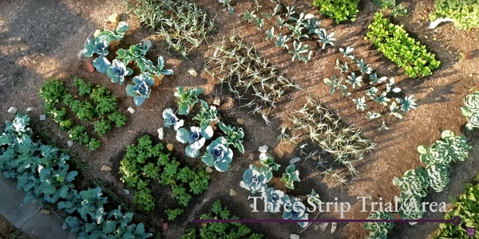
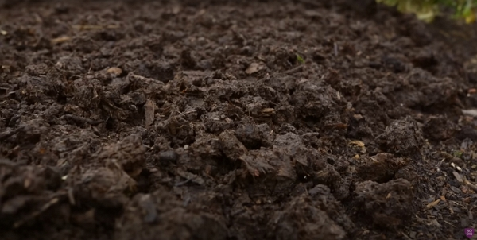
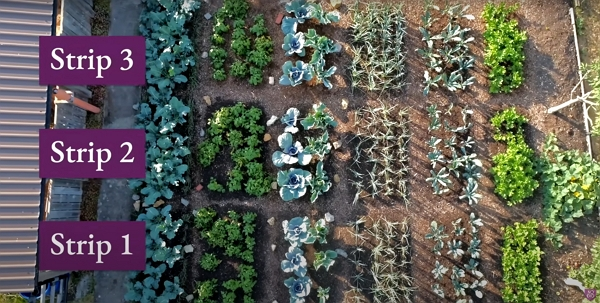
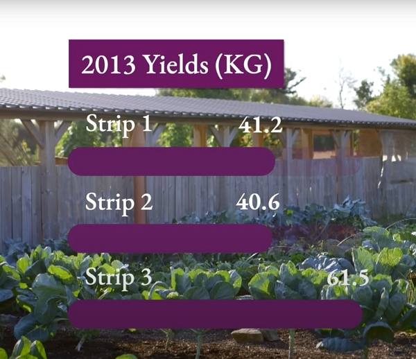
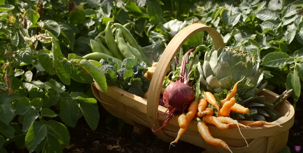
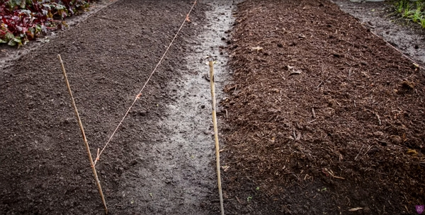
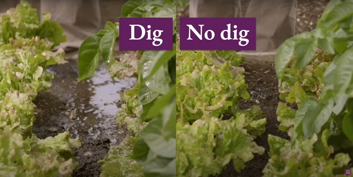
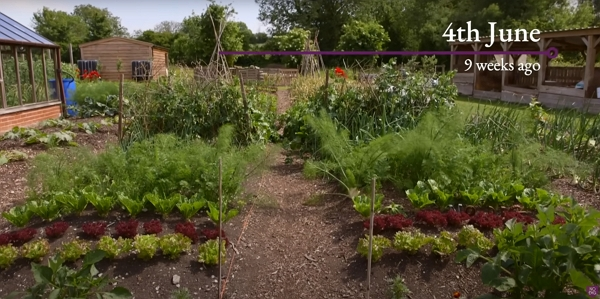
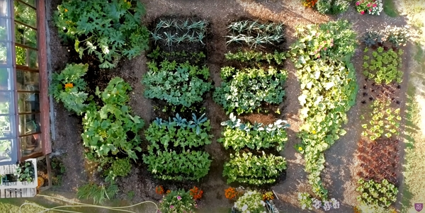

Compost is a key element to grow great vegetables. But how much or how little is a question that Charles Dowding will answer for us.

This article represents my notes from his vlog.

Thanks to Charles Dowding for sharing his wisdom and knowledge!
I wrote the following notes watching the video published on Charles Dowding's channel.
You can watch it using [this YouTube link](https://www.youtube.com/watch?v=4APqcvo-gqE).

<!-- more -->

## Introduction

With no dig, you need less compost (this is from 10 years of experience).

But the sure thing is that you will need descent compost. And if you use a good compost, you will need very little, especially with No Dig.

## Clarification of the meaning of compost

When we talk about compost, we talk about organic material, not fertilizers and synthetic feeds.

Compost is anything decomposed. It does not need to be perfect, e.g., it can have some piece of wood.

At first, you may need to buy some compost. But after a while, if you look after your soil, you won't need as much and you can find materials to make your own from local waste.

Charles explains his 3-strip trial:

- Strip 1

  - It was the strip where the soil was dug and he used no compost.

- Strip 2

  - It was the strip where the soil was not dug and no compost was used.

- Strip 3
  - It was the strip where the soil was not dug **AND** some compost was used (5-6 cm of well-rotted compost).

On all strips were planted the same crops.

After the 2013 harvest, the yields were as follows:

- Strip 1 yielded 41.2 kg of produce,
- Strip 2 yielded 40.6 kg of produce
- Strip 3 yielded 61.5 kg of produce.

This is 50 % more yields: the strip 3 method is definitely interesting.

And the same amount of work is performed. Watering is needed a bit less, thanks to compost.

## Modification of trial and results in 2014

This time, Charles and his team applied the following trial:

- Strip 1: forked with 2-3 cm of compost each year.
  - The soil is loosened, before applying compost .
- Strip 2: no dig with 2-3 cm of compost each year.
- Strip 3: no dig with 2-3 cm of well-rotted cow manure each year.

For strips 1 and 2, the compost is green waste compost purchased combined with homemade compost.

And here are the yield results in 2014 compared to 2013:

| Strip | 2013    | 2014    |
| ----- | ------- | ------- |
| 1     | 41.2 kg | 68.0 kg |
| 2     | 40.6 kg | 79.0 kg |
| 3     | 61.5 kg | 75.0 kg |

## Progress of 2015

By that year, the yields went up to 100 kg per strip!

Each year, the amount of compost applied is about 3 to 5 cm, spread in February.

:::tip How to cover the pathways
Use well rotter woodchips.
:::

Digging or not digging, compost is a must. Period.

More on the strip trial in [this vlog](https://www.youtube.com/watch?v=XA4VdUaJR7w).

## Another trial running since 2012 to compare dig and no dig

The big differences between each bed are:

- That the no dig bed requires a lot of less work not digging since you just need to cover the soil.
- The dig bed is more difficult to water (water flows more).

  

- The dig bed has a lot more leaves.

In 9 years,

- The dig bed yielded 855 kg of produce.
- The no-dig bed yielded 953 kg of produce, **just about 10%** more.

Again, here, we can take home that the use of compost makes a big difference.

And it is applied once a year in the change of years.

Here is more information about [dig vs no dig methods](https://www.youtube.com/watch?v=Ba0qPjF_wNI).

## Easy sucession planting in the dig and no dig beds

In such a bed, we can plant more than one set of crops.

The most difference between dig and no dig happens in the late spring harvest.

## Overall benefits of using compost

It might feel like a lot of work in the beginning, using a wheelbarrow to bring the compost on the beds, but it is really worth it.

Using compost and no dig yield the best result!

See the beds of Charles from an aerial view:

If you want a big resource on the No Dig method, Checkout Charles’s book (use the link according to your location: [in France](https://amzn.to/3ELjByW), [in the US](https://amzn.to/3SROzJm) or [in the UK](https://amzn.to/3Nlrpd1)) for more details.

Any comments? [Leave them on Substack!](https://iamjeremie.substack.com/p/how-much-how-little-compost-do-you)

And to support my work, consider signing up to my newsletter.

<!-- markdownlint-disable MD033 -->

<iframe class="newsletter-embed" src="https://iamjeremie.substack.com/embed" frameborder="0" scrolling="no"></iframe>

