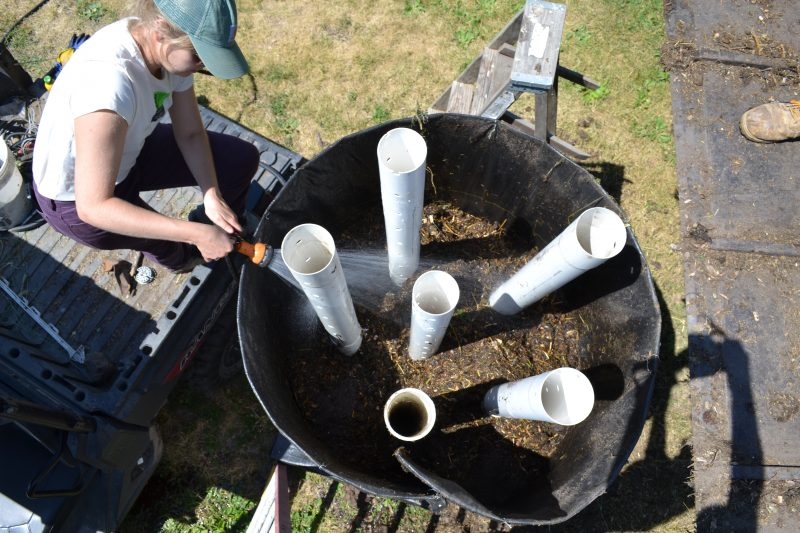

Woodchips can be useful for the garden but breaking them down take ages. With a few tips, Charles explains us how to speed up the process to obtain a rich compost material.

Thanks to Charles Dowding for sharing his wisdom and knowledge!
I wrote the following notes watching the video published on Charles Dowding’s channel.
You can watch it using [this YouTube link](https://www.youtube.com/watch?v=qhBvEG_Pg8Y).

<!-- markdownlint-disable MD033 -->

<iframe class="newsletter-embed" src="https://iamjeremie.substack.com/embed" frameborder="0" scrolling="no"></iframe>

## How to break down woodchips

### Johnson-Su bioreactor

Credits: _[Land Stewardship Project](https://landstewardshipproject.org/getting-a-bio-reaction-from-soil/)_

It’s used to decompose the woodchips by using this system and making sure the woodchips are properly watered.

:::tip Personal note
I’m planning to build one to experiment.

I’ll use the resources found [in this Google search](https://www.google.com/search?q=Johnson-Su+bioreactor) to get started.

Check out the image tab in the search.
:::

:::warning Don’t burry woodchip
Since Charles is the no-dig advocate, he doesn’t bury the woodchips and he warms us that if you dig and burry the woodchips.

They will suck the nitrogen out of the rooting zone and it will deprive your plants and vegetables of what they need.

On the surface, it’s fine because the plants and vegetables will set their root under the woodchips.
:::

After breaking down a pile of woodchip compost from a bioreactor, you get the following.

Later in the vlog, Charles explains more about the pipes in the bioreactor.

It’s supposed to help maintaining air in the heap. But is it necessary?

Woodchip by its natural structure will allow air to be present, hence why we can add it to the compost heap to give the greener material _a breath_ and prevent sludge.

In that other bioreactor, Charles added chicken manure and the temperature is consequently higher than the uncovered pile described below.

### Uncovered pile of fresh fragmented woodchips

With fresh fragmented fresh wood (which is what Charles presented, not the dry woodchips), you will get some activity.

Also, there is no problem with conifer wood, in Charles’s experience.
He feels that the pH level with that kind of wood, once well decomposed, isn’t an issue.
I have found that to be true as well for the few years I used them from a source of Douglas wood.

Again, with a pile, you will need to water it if you don’t get enough rain.

The more green the material you get in the woodchip, the faster they will decompose. It isn’t more true in the summer.

Charles used a lawnmower to the breakdown of the woodchips after 4–6 months of winter decomposing.

Green material will decompose faster than the wood pieces, and after 9 months, Charles found out that there are a lot of woodchips left.

### Uncovered pile of regular woodchips

When I say _regular_ woodchips, it means with no green, in particular the ones you can get in the sawmill.

It decomposes slower, but it will provide some useful materials with time.

Here a microscope comparison of the Johnson-Su bioreactor and the regular woodchips.

### Patience is key

You can get the woodchip to a pure humus state.

Even if you can use water and moisture to speed up the process, you will need significantly more time to decompose woodchips.

When you reach the humus state, then you have a very good addition for the garden.

:::tip Personal note
From what I saw, it seems that the bioreactor setup speed up the decomposition, very likely because you have got a managed structure.

With a pile lying on the ground, you can’t keep the moisture has easily. And watering the pile may use more water than the bioreactor contained environment.
:::

## How to use woodchips

Charles uses woodchips in 4 ways:

1. pathways
2. woody material for compost heap (when it’s a few months old and already decomposing)
3. burning it
4. filling a bed

### Pathways

Woodchips on pathways has several advantages :

- it keeps your boots clean
- it will eventually provide a source of food for your plants
- it helps to keep the soil firm, not compact.

### Filling a bed with 2-year-old woodchips

To finish, how does it compare to grow vegetables in 2-year-old woodchips “_compost_” to regular homemade compost?

:::warning Big pieces of wood and slugs
Be careful of the large wood piece that can shelter slugs…
:::

What Charles experienced was a very poor start, with a lot of yellow leaves for 6 weeks.

After 6 weeks, Charles thinks that the roots got through the layer of woodchips and it ended to be successful, even if less productive.

## Conclusion

Try it yourself.

Try to get the smallest sized woodchips, if you can. But it’s hard to _choose_ what you get.

Otherwise, use the lawnmower technique.

:::center
⏬⏬⏬
:::

<!-- markdownlint-disable MD033 -->

<iframe class="newsletter-embed" src="https://iamjeremie.substack.com/embed" frameborder="0" scrolling="no"></iframe>

