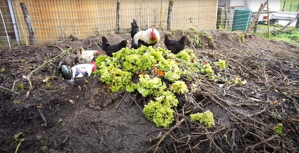
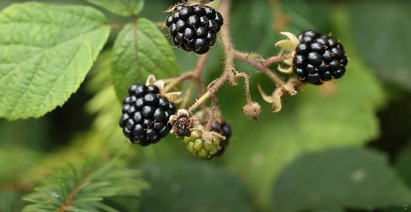
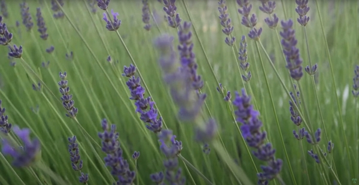
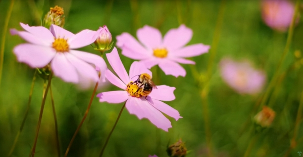

What does a day in January look like? The Dutch Farmer will detail it to us.

Thanks to Moreno for sharing his wisdom and knowledge!
I wrote the following notes watching the video published on The Dutch Farmer’s channel.

<!-- more -->

You can watch it using [this YouTube link](https://www.youtube.com/watch?v=ScBleHwOkgA).

<!-- markdownlint-disable MD033 -->

<iframe class="newsletter-embed" src="https://iamjeremie.substack.com/embed" frameborder="0" scrolling="no"></iframe>

It’s a slow and relax month when we can:

- reflect on the past year,
- analyze the data from the past year of harvest,
- and plan accordingly for the coming year.

The days are gray usually in January but the days are lengthening and that means more sun.

Even if January is a slow and relax month, you can still do a lot in the garden.

## Harvest of the remaining crops

At this time of the year (and in the south of France as it’s where Moreno shot this vlog), you can still have the following crops to harvest:

- spinach
- kale
- parsley
- Swiss chard
- winter carrots
- beets

## Cleaning

Also, anything not harvested, or that didn't make it with the first frost, needs to be cleaned up.

You can use those wastes for the next compost.

Also, you can give away those old crops to the chicken if you have any.

Then, you finish preparing the beds with a fresh layer ready compost to fertilize the soil for spring.

## Diversify the farm's income streams

To create a resilient farm, you need multiple income streams.

What does it include?

- producing various types of crops to sell on markets
- dedicate an area to perennials and create a plant nursery:

  - including berries like currants, black berries

  

  - and medicinal plants like rosemary, thyme, lavender and sage

  

- sell vegetable transplants for the community
- produce microgreens
- grow mushrooms if you have the place and resources for it.

## Small farm market gardening: a good business

The initial investment is relatively low compared to the traditional farming process.

Moreno made [a vlog about the tools you need to get started](https://www.youtube.com/watch?v=yUFr0C1FJjE).

It’s possible to do such an activity on a rented land.

So, producing various types of crops to sell on markets is the first income stream and the first goal to start a farming business.

You need to focus and give everything within your abilities to make this business functional as soon as possible. Once you reach the functional stage, then you can venture out into creating other income streams.

Start to make a living then play around and experiment.

Moreno transformed a very grassy land into a very productive farm using no dig. He details [the process in this vlog](https://www.youtube.com/watch?v=g2DDQ-uuLl0).

## Pruning trees and bushes

Clearing bushes will give the plant the opportunity to give new growth as the spring arrives.

Pruning trees will provide more energy to the branches you need to keep produce the next year's fruits. Those branches will bloom with new flowers and leaves more efficiently.

Also, cleaning the garden, especially bushes, makes it less inviting to the slugs.

## Increase biodiversity

If your soil isn’t frozen, plant bulb flowers, like tulips and amaryllis, that will provide beauty in the garden and early food to the pollinators.

After a long winter, it’s very nice to hear the bees buzzing on the first flowers.

It’s our job as caretakers of the land we use to provide food sources to the wildlife.

Another example is to hang up bird feeders and housing for them as they’re your allies to eat the insects you want them to take of.

If your land is welcoming, wildlife will come to it.

## Propagate shrubs

When they lose their leaves, the shrubs become dormant until spring.

You can then multiply them using the cutting or division technique.

Either way, you prune a branch of what you want to multiply. You should prune a pencil-thick branch so it can work successfully.

Then, cut them into 10 cm to 25 cm pieces before placing them in pots filled with compost.

This technique works great for:

- roses
- blackcurrants
- redcurrants
- blackberries
- grapes
- figs

For example, Morena once created 7 new trees from a single branch. Similarly with 2 blackcurrant stalks, he creates 10 new blackcurrant plants.

Another multiplication that you can do is dividing a root into several pieces.

For example, with rhubarb, you create 12 new plants with one mother root. You just need to make sure each piece contains a crown.

:::tip Personal note
I'm sure I will find a vlog that explains this in detail.
:::

## Early sowing

Do this only if you have a polytunnel or a greenhouse to start sowing lettuces or spinach, for example.

Otherwise, you should wait until March.

## Work on projects and planning

Since the garden needs less time from you, you can design, build or repair what you need for the coming year.

Planning is crucial so you have enough seeds to create seedlings that will produce the vegetables to sell.

The technique is to start with the goal in mind.

How much do you need to earn to live your chosen lifestyle, pay the bills and save. Moreno goes into more details [on this vlog untitled _How to Start a Farm From Scratch (Beginner's Guide to Growing Vegetables for Profit)_](https://www.youtube.com/watch?v=fRlUhUWS0Hk).

As always, stay tuned as I take more notes about Moreno and his vlog on his Dutch Farmer channel.

:::center
⏬⏬⏬
:::

<!-- markdownlint-disable MD033 -->

<iframe class="newsletter-embed" src="https://iamjeremie.substack.com/embed" frameborder="0" scrolling="no"></iframe>

