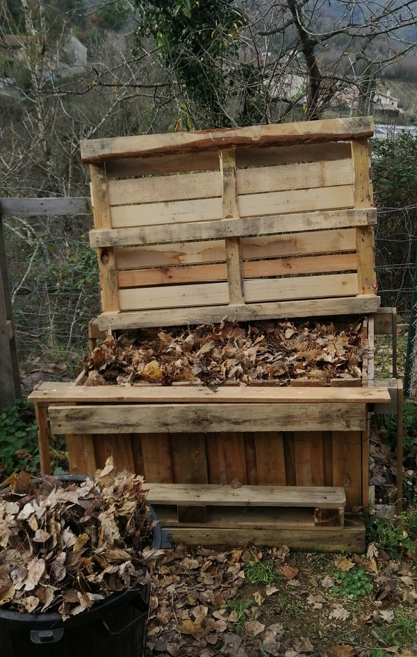

Thanks to Huw Richards for sharing his wisdom and knowledge!
I wrote the following notes watching the video published on Huw Richards’s channel.

<!-- more -->

You can watch the original vlogs using the following links:

- [Composting tips: Easy composting at home](https://www.youtube.com/watch?v=KLzzRBj-7s0),
- [A look on Building Pallet Compost Bins](https://www.youtube.com/watch?v=lUvc1Bc3bWU),
- [Adding Weeds to the Compost - Do’s and Don’ts](https://www.youtube.com/watch?v=uQ2INj2LA8g),
- [Adding sand to compost](https://www.youtube.com/watch?v=7RvCnES5kos).

## Composting tips

I’ll put here only what Huw hasn’t already shared in more recent vlogs.

One tip that he hasn’t talked about a lot regarding nitrogen rich material: it’s urine. Of course, you will need to dilute it.

At least, Huw is consistent between 2013 and 2022: he has been consistently saying to put 1 part green for 2 parts brown material in the compost bin.
Also, he suggests again not to compost meat and dairy to keep the rats away.

Next, it isn’t a good idea to compost pet manure, from cats and dogs, for example.

- First, I find that they really stink...
- Second, Huw mentioned they contain microorganisms that you don’t want because of the diet of those pets (most carnivores).

However, mostly vegetarian pets like guinea pigs and chicken can work fine.

The interesting fact is that the tip about to keep the compost bin warm. It makes me think of the tip from [Charles Dowding](../../../tag/charles-dowding). He builds his compost bin fully closed on the side.

:::tip Personal note
I have made 2 compost bins lately and I did make them fully closed, making sure to layer well the green and the brown to always oxygen to stay present.

:::

One thing he insists on is to keep too much rain away in the compost. Charles Dowding recommends the same. I therefore made some tops for my compost bins.

Finally, similarly to Charles Dowding: he recommends to ask around to gather more nitrogen-rich material, as it will be the resource that you will struggle to obtain in sufficient quantity (unless, you have a huge lawn 😅).

## Building pallet compost

Huw is building his compost bins from pallets without making sure the sides are full. See above for the model I’ve made.

## Adding weeds in the compost

You can, but as long as the weeds haven’t gone to seed.

You can put the weeds with seeds if you can build up a compost bin with a lot of heat. Above 55 °C, the seeds won’t survive.

## Sand in compost

The advantage of sand would be to help with:

- drainage on clay soil.
- root vegetables to grow nice and big because of the smooth texture.

However, a soil that drains too much means a poorer water retention, which means you will need to water more often.

So maybe, I’d suggest to use it on the first 10 cm max, but always mixed with soil.

Huw didn’t put much anyways.
