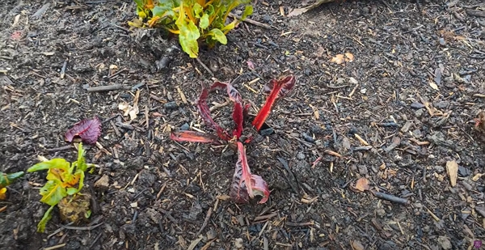
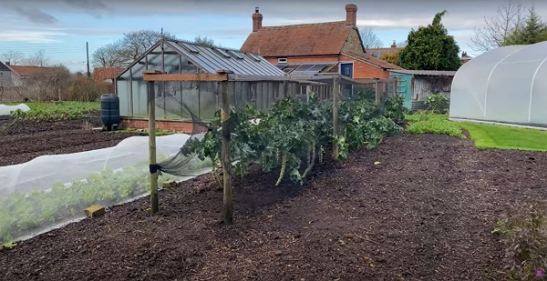
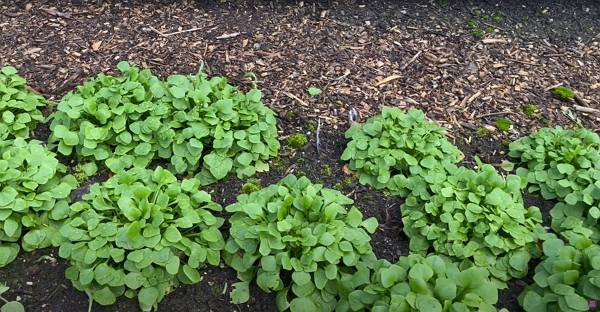
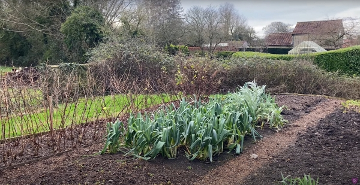
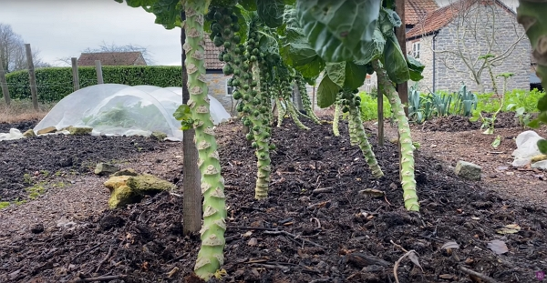
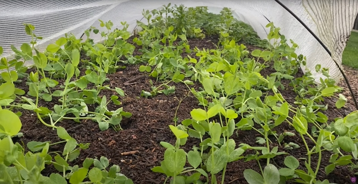

In January, Charles explains what he does and what grows in his garden.

Thanks to Charles Dowding for sharing his wisdom and knowledge! I wrote the following notes watching the video published on Charles Dowding's channel.

<!-- more -->

You can watch it using [this YouTube link](https://www.youtube.com/watch?v=nY32M39jQ1k).

<!-- markdownlint-disable MD033 -->

<iframe class="newsletter-embed" src="https://iamjeremie.substack.com/embed" frameborder="0" scrolling="no"></iframe>

## New garden area: how is it going

Charles created [a playlist](https://www.youtube.com/watch?v=rA66WaH6Cu0&t=0s) of how this area progressed through the month, starting a year ago (January 2021; the vlog was shot in January 2022.).

## Pigeon, deer and rabbit damage

The wildlife will come to your garden, especially in the country side.

Pigeons [peck the leaves](https://youtu.be/nY32M39jQ1k?t=96), leaving the veins of the plants.

You can use some protection like a meshed tunnel.

Also, with a simple wood structure and a net, you will keep the bird away from the crops you are still harvest from.

## Cover crop

Charles uses broad beans quite a lot to cover the areas not used during the winter.

Then he cuts them off in early may and put them on the compost heap.

## Broccoli and birds

To protect the broccoli from the birds, you can build a simple structure the one below, made of some wood and a bird net.

The net doesn't have to go all the way to the ground.

It depends on your birds.

Also, it helps a bit with the wind.

## Spinach

## Claytonia _winter purslane_ salad

It looks very productive for January.

I'm wondering where I could find some seeds.

The seedlings were planted in October.

## Raspberries

It will be time to cut off the stems as the new shoots will grow from the base in the spring.

## Leaks

Still in the ground in January, they’re going strong and will provide food up to April.

## No dig Brussels sprouts

I'd love to grow some!

Charles protects them with a bird net from being pecked.

Brussels sprouts are sown in March, planted in June.

## Pea shoots

Charles grows peas in January for the shoots, which you can eat in salads.

He planted them in November.

To harvest the shoots, you pick the top and there will be more new shoots coming from the base.

It could produce shoot up until may. It depends on the winter harshness.

## Making your own potting compost

You have dry compost? Sift it to 4 mm.

Getting good potting compost from the gardening supermarket can yield surprising results, not always providing the same growth year over year.

## Dedicate an area for aromatic herbs

Having thyme, rosemary, sage, fennel and mints add flavor to the garden and the meals.

Once planted, you will need to add some woodchip yearly as the old ones break down.

Those plants don't need a highly nutritious soil.

See how it looked back in June 2021 [in this vlog](https://www.youtube.com/watch?v=qrwy4U7kjtI&t=0s).

:::center ⏬⏬⏬ :::

<!-- markdownlint-disable MD033 -->

<iframe class="newsletter-embed" src="https://iamjeremie.substack.com/embed" frameborder="0" scrolling="no"></iframe>

