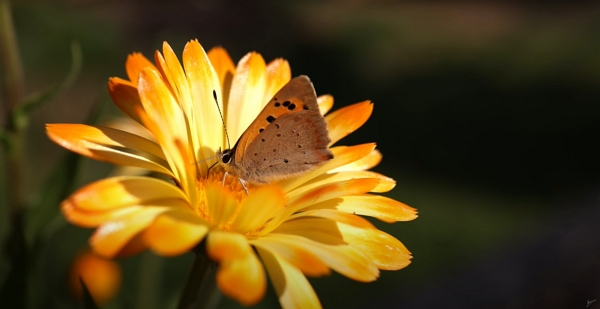
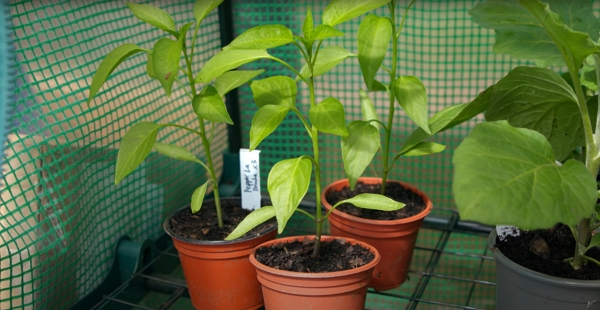

Even if you know it might be a little too early, it’s hard to resist starting sowing seeds. Huw shares with us what we can sow in February.

Thanks to Huw Richards for sharing his wisdom and knowledge!
I wrote the following notes watching the video published on Huw Richards’ channel.

<!-- more -->

You can watch it using [this YouTube link](https://www.youtube.com/watch?v=sWDEiSft6aU).

<!-- markdownlint-disable MD033 -->

<iframe class="newsletter-embed" src="https://iamjeremie.substack.com/embed" frameborder="0" scrolling="no"></iframe>

So what can we sow in February safely enough?

## Jerusalem artichoke

:::tip Personal note
Before I begin with Huw's notes, I have to say these are the only vegetables I hate because the smell and taste really put me out. Growing up, we had some (thankfully not too often) but every single time I had to eat some, I almost threw up.

I know it was what replaced regular potatoes during the last great war, but I'd prefer eating wild plants than this...
:::

They’re easy to grow and they grow in the same space year after year.

They do spread and unless you have got limited space, it won't become an issue.

:::tip Personal note
Even I hate the taste, when I look at the outer plant, I see 2 purposes this crop can:

- produce green material for composting
- provide food for pollinators as its big yellow is filled with juicy nectar.

:::

It’s impossible to plant Jerusalem artichoke without digging a trench 30 cm deep.

Apply a 4 cm layer of well broken-down compost and set each seed 30 cm apart (same for rows).

To eat them, Huw roasts them a pan with salt... Maybe that's the trick to start liking them?

## Calendula or pot marigold

It can come back on its own if the weather is a little warmer. It will give you an early flourish in may when you transplant them.

You can use the petals as a safran-alternative in cooking or refreshing summer drinks. I wonder [how this summer drink is made](https://www.youtube.com/watch?v=Us3VENwEqNU).

## Humble pea

Starting early in February **under cover** will provide you with crops for a long period.

The ambassador variety yields good result usually.

Growing them under a polytunnel will extend the growing season and provide us with an early harvest.

## Broad beans

You enjoy them in the late spring and early summer.

They’re easy to grow, hardy and super productive.

You can eat the shoots, meaning the top of the plant that is tender than the rest.

You need to know that bread bean send out a deep root, so if you sow them in modules, you will deep-cell modules.

:::tip About field beans
They’re like a smaller version of a broad bean.

They’re also very productive and delicious.
:::

:::tip Personal note
I’m not sure what is _Fèves_ in English. I’m currently growing some, sow last November and again a few weeks ago.

The November ones are out since the end of December and I covered them with a winter cover. See [my gardening journal 2022-2023](../../09/gardening-in-2022-2023/README.md#broad-beans)
:::

## Alium family

We'll talk about two: onions and shallots

Even if you can start from seeds, Huw prefers starting from sets, e.g., these:

You plant them in modules like shown above.

Whatever method you use, pick the one you like and prefer and enjoy the process.

## Potato

:::warning Potatoes don't like frost
So make sure you can quickly shelter them if needed.
:::

Huw grows them in containers to start with. He uses a container of 50 liters so it’s more manageable.

He usually plants them in mid-February and the harvest comes, weather dependent, in May or early June.

After harvest, he reuses the compost for beans or squash

:::tip Personal note
I will plant some this month and since it’s still quite cool outside, I don't expect them to be out before April or May.

Plus, I cover my beds with a 15-20 cm layer of a small dead leaves so they have got a blanket to keep warm.
:::

## Peppers

They need a warm base to help the germination.

They need more to grow and now, in February, is ==the time== to start the seedlings.

## Conclusion

So, are you ready to kick-start the growing season?

I sure am in action already.

My next actions are:

- onions
- potatoes

To finish, please consider signing up to my newsletter to receive all the new articles each week.

:::center
⏬⏬⏬
:::

<!-- markdownlint-disable MD033 -->

<iframe class="newsletter-embed" src="https://iamjeremie.substack.com/embed" frameborder="0" scrolling="no"></iframe>

