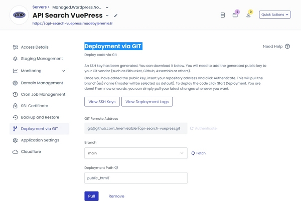
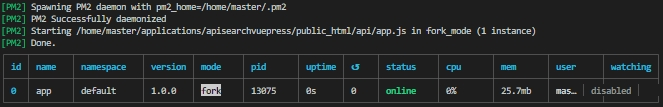

I am developping a custom search API from VuePress static websites and I needed to host it.

Since I have a Cloudways VPS, let's see how to run the REST API.

<!-- more -->

## What do you need

- Create an account [on Cloudways](https://www.cloudways.com/en/?id=174912).
- [Provision a VPS](https://unified.cloudways.com/server/create) (the smallest is fine for my REST API).
- Create a custom PHP app.


## Important file to include in your repository

Make sure to add a `.htaccess` containing the following:

```sh
# To make the index.php work
DirectoryIndex
# Redirect traffic to your port 3000
RewriteEngine On
RewriteBase /
RewriteRule ^(.*)?$ http://127.0.0.1:3000/$1 [P,L]
```

## Deploying the REST API

You can use the "_Deployment via GIT_" that allow you to pull the code from you repository.



:::warning For updates You will need to use the `pull` button under the Cloudways application.

Doing a `git pull` in `applications/your_rest_api/public_html/` will not work.

:::

## Asking Cloudways support to enable `mod_proxy`

This might not be enabled, so do check with the support Team if you get errors about this.

## Install `pm2` package

This enables you to launch the REST API and have it run without stopping.

Running `node app.js` is not sufficient and the application will stop after a few hours.

To enable PM2, run the following via SSH and your master user:

```sh
cd  && echo "export PATH='$PATH:/home/master/bin/npm'" >> .bash_aliases
cd ~ && echo "export NODE_PATH='$NODE_PATH:/home/master/bin/npm/lib/node_modules'" >> .bash_aliases
npm config set prefix "/home/master/bin/npm/lib/node_modules"
cd  && echo "alias pm2='/home/master/bin/npm/lib/node_modules/bin/pm2'" >> .bash_aliases
npm install pm2@latest -g
```

Restart the shell by exiting and reconnecting.

Then run on the root directory of the serve (where you land once connected):

```sh
pm2 applications/your_rest_api/public_html/app.js
```

You should get:



:::center ⏬⏬⏬

:::

<!-- markdownlint-disable MD033 -->
<p class="newsletter-wrapper"><iframe class="newsletter-embed" src="https://iamjeremie.substack.com/embed" frameborder="0" scrolling="no"></iframe></p>

## Credits

Thanks to the CloudKeeper for his articles :

- [https://www.thecloudkeeper.io/how-to-host-a-nodejs-app-on-cloudways/](https://www.thecloudkeeper.io/how-to-host-a-nodejs-app-on-cloudways/)
- [https://www.thecloudkeeper.io/how-to-install-node-modules-on-cloudways-via-npm/](https://www.thecloudkeeper.io/how-to-install-node-modules-on-cloudways-via-npm/)
