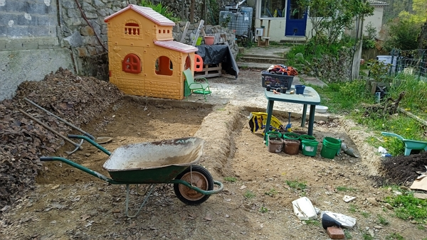
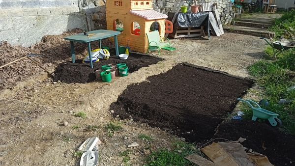

[< Back to the table of contents](./README.md) | [Go to March](2023-03.md) | [Go to May >](2023-05.md)

## April 2nd

The lettuces are not looking great, but the sweet peas are growing by the day.

I am not sure the lettuce will survive the transplantation.
But it is OK, sweet peas will produce well.

Garlic is getting larger and larger.

## April 9th

I transplanted the red mesclun which sprouted very quickly (ready in 2 weeks). It was a lot easier to get the seedlings out compared to the the 4 seasons lettuce and the sweet peas.

I set them in the bed where I had planted the sweet peas. I also finished transplating the 4 seasons lettuces in the leftover space.

Since the garden was running low, I added a 5 cm of the dark compost, I bought 2 weeks earlier, to cover the bed and provide a good protection from the sun heating more and more each passing day.

I suspect that the mesclun was **planted in a thicker and more densed compost**. Therefore, when I pushed each module, they all popped out easily. That's one lesson learnt for the first year I use those tiny greenhouses

Today, I also harvested 110 g of garlic (I couldn't resiste). The 4 four garlics I harvested were as thick as my index finger and it tastes so good. I ate it raw in a salad with gratted carrots, an avocado and some wild smoked fish.

I watered well the new transplant and the existing ones, as well as the potatoes beds.

Speaking of potatoes, I am going to try growing some in 200 liters blue barels. I used Damien Dekarz's technique (I have got a french article on the topic under [Damien Dekarz's tag](../../../fr/tag/damien-dekarz/).

I have made a single 16mm hole at the bottom, 20 cm up the base to keep the water in.

Then I applied stones around it to prevent the hole to be sealed from the dirt.

I applied a 40 cm layer of hay, added 10 cm of dirt mixed with the dark compost.

I set the potatoes whole or halves (5 per barrel) and added 15 cm of the dirt and compost mix.

Finally, I added 10cm of hay and 20 liters of water.

Another experimentation: yesterday, I prepared some roasted potatoes and I purposefully cutting the sproutings from the potatoes I cooked to see if they would grow in the one year and a half old compost at the north of the garden.

The compost is cool and moist and very soft. Plus, we still have plenty of autumn leaves on top, making it is a perfect place to grow vegetables.

We'll see how it turns out.

## April 10th

I dug continue the former area where we had the guest house.

I think I have completed half of it.

The debris removed are still mainly sand and little rock mixed with some durt.

I left a pathway to walk on.

## April 13th

I bought and applied 2 trailers of compost onto the dug areas.

This is about 700 kg of compost with quite a little bit of woody parts. It cost me 34 euros and 2h of my time to go to get it and empty it.

I have observed that it works fine for the sweet peas and mesclun I planted. Also, it seems that the slugs aren't coming over it since I haven't seen any attack on the peas and mesclun so far.

At the end of the day, I tried to install the second watering pipe that runs from the network water pipe in the basement.

I went to purchase the different pieces to connect the existing pipe that I used last year.

The new pipe will help to have water at the other end of the garden. It isn't completed yet, with a few connection to adjust beacause they are leaking a little.

These pipes will be used over the summer time to water the garden, once the seven 1000-liters water tanks will be empty.

[< Back to the table of contents](./README.md) | [Go to March](2023-03.md) | [Go to May >](2023-05.md)
