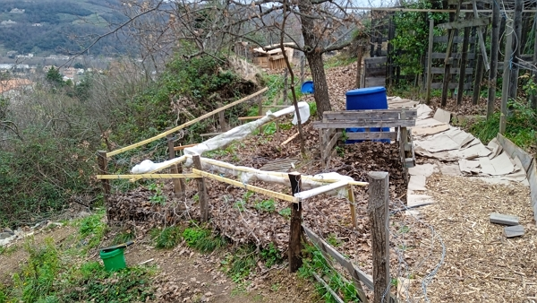
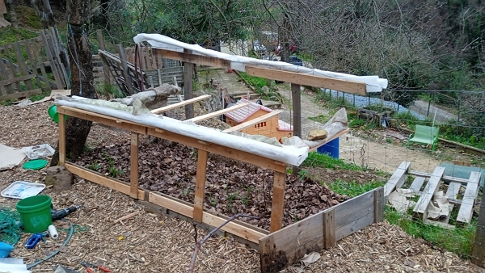

## Organisation and design

==January 8th, 2023==

I have purchased a subscription from [Terra Potager](#), a french web application that helps you organize and track your sowing planning and design your garden beds.

Given the setup of my garden, it will take some time to get started.

It contains what other gardeners do in France. So maybe, I'll use their suggestions on when and what to plan in my garden.

==March 5th, 2023==

I haven't use _Terra Potager_ much so far, because I need to mesure the garden beds.

However, I've built a new bed small bed under the oak tree which welcomes some garlic.

I also installed today some of the old windows to build some kind of greenhouse for the radishes and sweet peas.

## Helping the garden

### Compost heaps

I made 2 heaps:

- one for the compost toilets
- one for the kitchen and garden wastes

==January 1st, 2023==

I made a second kitchen and garden wastes heap because the first one was full

I took 2h30 to build it from recycled pallets.

See how I made them [in this article](../../../posts/2022-12-14-how-to-make-a-compost-bin-from-pallets-huw-richards/README.md)

==March 5th, 2023==

The bins are pretty full, but it is lacking some rain!

Also I have came to discover a place 10 min from home where they sale ready-to-use bulk compost for 45 euros a ton. It is twice as expensive as the one in Lavilledieu, but it is much closer and I won't need to rent a truck. Or at least, I won't need to rent it as long.

### Autumn leaf harvest

==October 30th and 31st, 2022==

- I picked up 4 trailers full of plane tree (_Platanus Platanos_)
- The girls liked emptying the trailer, they loved rolling into the stack of leaves afterwards ;)

==November 27th, 2022==

- I picked up 2 trailers full of some small leaves tree (???) in Saint-Jean-De-Muzols
- We, the twins and I,
  - applied more cardboard to the patways.
  - added some large borage (_Borago officinalis_) to the kitchen compost

==December 11th, 2022==

- I picked up 2 trailers full of some small leaves (???) in Saint-Jean-De-Muzols.
- I finished filling up the kitchen compost with borage as all the plants had been _cooked_ by the -5° C that weekend.
  - I need to build up another compost bin!

==December 18th, 2022==

- We picked with the twins some nice small leaves that we have found on the usual hiking route.
  - It filled about a trailer full of leaves
- We topped it up with the leaves of Saint-Jean-De-Muzols's park.

==December 25th, 2022==

- We set out to gather leaves in Saint-Jean-De-Muzols's park, but we had a surprise.
  - The city-hired gardeners to shred branches and they left a huge pile of fragmented wood!
  - We manage to get 2 trailers full of it.
  - It is just what I needed to cover the garden alleys.
  - Hopefully, I can get another trailer before it is gone.
  - I need about 3 trailers to cover all the alleys with a 5 cm layer of wood chips.
  - In this case, it will break down much fast

==January 1st, 2023==

- I picked another trailer-full of dead leaves. It'll probably be the last round next week.

==January 8th, 2023==

- Today was the last pickup of those abundant dead leaves, which in total I gathered 12 trailer-full, equivalent to 12 meters cube of leaves.
- We will see how I use it apart from covering the beds for winter, adding brown material in the compost and composting toilet wastes.

### Fragmented wood and woodchips

Two years ago, I applied woodchips in the alleys of the garden.

At the end of 2022, they are pretty much gone. And the weeds have taken over once more.

The prerequisite is the layer of cardboard so I can make sure few weeds grow back. I started to apply it early november and almost all the alleys and non-cultivated areas have been covered.

==December 25th, 2022==

As we went out to pick leaves, we managed to pick 2 trailers full of fragmented wood, which was enough to cover two third of the alleys.

==January 1st, 2023==

Unfortunately, the remaining pile of fragmented wood was picked up during the past week.
Still I managed to recover a good 15 bags of the remaining scraps (the bags were the pellet bags that usually contains 15 kg of pellets).

So, I'd say it was about half a trailer worth of fragmented wood.

I will need to complete the alley covering when I find time to go buy woodchips at the local sawmill.

==February 19th, 2023==

Awesome! Tons (I mean at least 3 trailers full) of fragmented wood is available at Saint-Jean-de-Muzols's park. I already picked up 1 trailer. Tomorrow, I'll pick as much as available and we will complete the alleys 😊

==February 20th, 2023==

Finally, I picked up 4 trailer full of this fragmented wood, which helped me finish covering the alleys I needed.

I have got the equivalent of 2 trailers left to use. I'm sure I'll find a use for them.

### Shelter for the winter

==January 8th, 2023==

As I describe in the garlic and broad bean section, I planted them early novembre, but with the mild winter we are having, they sprouted easily.

As I am sure how they will handle frost, I've build some kind of tunnel to deploy and fold whenever I need so the frost doesn't kill the plan if it comes in the next months.

I made it so it can fold and deploy easily.

I use [this winter garden cover](https://amzn.to/3Cwfuoo) which I bought already 2 years ago.
It is a goood quality product and it doesn't tare easily, even after 2 years. I recommend.

I need a good amount so the 48 m² of this option leaves me with some left for the kiwai and the beds I haven't work on today.

Here are a few pictures of the build:

::: tabs

@tab active title View of garlic and broad beans beds

@tab title View of another bed with echinacea and garlic

:::

It has worked well so far, especially for the broad beans when the temperatures went down to -4°C.

It is easy fold and unfold. Aurélie would love it to disappear when folded, but it stapped to the wood structure. And it is much easier to have it I need it...

## Vegetable gardening

### Garlic

==October 31st, 2022==

- I planted about 130 garlic seeds (equivalent to 821 grams) in various areas of the garden in order to evaluate what the garlic likes most.
- The garlic seeds was purchased from our main organic food store, because it was cheap and available.

==November 20th, 2022==

- I see garlic coming out! Too early, isn't it?

==December 11th, 2022==

- The garlic that has come out is resisting the frost. Will it last?
  - I still need to plant planting some more (where the tomatoes usually go)

==December 25th, 2022==

- The garlic keeps coming out.
- What was already out 2 weeks ago is still there and has survived the frost.

==January 1st, 2023==

Here is the picture of the growing garlic.

I'm still not sure they will survive.

So I am planning to plant some more in the gaps between the ones growing and in the beds where I usually plant the tomatoes.

Just to make sure, in case of severe frost, that I will have something.

However, I think I will delay next year the planting to mid december.
We'll see how it goes.

And BTW, the same goes for the broad beans.

==January 22th, 2023==

- With the girls, we planted about a few garlic cloves where we usually have the tomatoes

==January 29th, 2023==

- With the girls, we planted about 50-60 garlic cloves a little bit everywhere I could think of.

==February 12th, 2023==

- The last few days were quite cold (down to -4 °C) and the garlic, even the ones not covered, are doing well.

==February 19th, 2023==

- Garlic is coming out where we usually plant the tomatoes. Great news!

==March 5th, 2023==

- All the garlic has come out or is coming out and it looks good and healthy.
- The fact we planted some in November and some in January means we will have a spread harvest,
  - some to pick as green garlic to eat in the spring
  - and some mature garlic to dry and eat during the year.

:::warning Add pic for march 5th
:::

### Broad beans

==November 13th, 2022==

- We planted them along the fancing where the Kury squash grew this year.
- My goal is to use the fence to hold the broad beans in the spring.

==December 11th, 2022==

- The top of the bean are out... Is it a problem with frost? I'm going to wait and see.
- Meanwhile, I will plant more in the bed where we planted the climbing beans 2 years ago.

==December 25th, 2022==

- The temperatures are much nicer (around 10 °C or more during the day and not lower than 5 °C during the night)
- So the beans have really come out

==January 1st, 2023==

Here is the picture of the growing broad beans.

See the comment [in the garlic's section](#garlic) about the early rising of the plants.

==January 22th, 2023==

- With the girls, we planted about two rows of broad beans where we usually have the tomatoes

==January 29th, 2023==

- With the girls, we planted a couple of seeds in a new bed I made on this day.

==February 12th, 2023==

- The last few days were quite cold (down to -4 °C) and this sunday morning, the beans are not doing great despite the fleece.
- However, with the warmth of the afternoon, they regained some strength.
- Fingers crossed, they will survive.

==March 5th, 2023==

- So far so good: the plants are getting taller by the day and I see flowers appearing.

:::warning Add pictures
:::

### Strawberries

==November 6th, 2022==

- We planted them in the well-nurished compost under the oak tree.

==March 5th, 2023==

- Nothing major to say, the plants are still there. They probably need some warmth to grow more.

### Sweet peas

==March 5th, 2023==

- We sowed 48 modules with 1 seed in potting compost
- The kind is **to replace** and is a crop that produce a lot.
- We tried in 2021, but the badgers challenged us and we didn't get a lot as we had to replant 3 times the peas!
- They are installed under the old windows to offer double protection until that are tall enought to transplant.

### Radishes

- I used 4 15-slot egg box to sow very old radish seeds.
- I'm not sure it will work since the seed are over 8 year old!

### Swiss chards

==March 7th, 2023==

- Aurélie and the girls sowed 2 seed of a colored swiss chard in medium module (about 10)

### Lettuces

==March 6th, 2023==

- Aurélie and the girls sowed 48 modules with 1 seed in potting compost
- We used the little greenhouses I bought in 2021.
- They are installed under the old windows to offer double protection.

:::warning Add pic
:::

## Berries and trees

==Sometimes before the end of the end of 2022==

- I planted one apple tree, grown from a seed, with the raspberries.
- It is a strong one and it will provide some shape in the future
- The soil is rich there, so, with proper watering this summer, it should survive. It will be important to water it well because it's a young one.

==February 12th, 2023==

- We planted a cherry tree, grown from seed also, where we used to have a raised bed.
  - I dug deep, so, like the apple tree, with proper watering this summer, it should survive.

:::warning Add picture from March 5th
:::

- We planted a kiwi vine (_Issai_) where we tried to grow a female kiwi vine in 2018.
  - This one is self-reproducing so maybe, we will have fruits soon.
- Finally, we planted a thornfree blackberry vine near the almond tree. The girls are excited!

==March 5th, 2023==

- The kiwai vines have a lot of bugs, even the newly planted one.
- It will be critical to water them enough to preserve them.
- The cherry tree shows beautiful buds :) Watering is critical, especially because it is located where the sun will hit hard.
  - Maybe, I'll build a pergola structure to provide some shade.

:::warning Add pic for march 5th
:::

## Wild plants

### Nettles

==October 3rd==

- I used some leaves and roots to prepare a tincture.

==November 13th, 2022==

- I had to clean up the nettles as they were very numerous.
- I tooks some of the roots out and put it on the compost heap.

==January 1st, 2023==

It is clearly over until the spring. Can't wait to pick those tender nettle for drying and soups.

==March 5th, 2023==

- New plants are appearing slowly. We can wait because of all I've written about the nettle in French from the vlogs of _Le Chemin de la Nature_, _Altheaprovence_ and more. If you read french, [see the article here](../../../fr/tag/ortie).

### Dandelions

==March 5th, 2023==

- The same bed is showing the new dandelions growing. Within a month, we'll lharvest the first leaves to eat in salads.

:::warning Add pic for march 5th
:::
