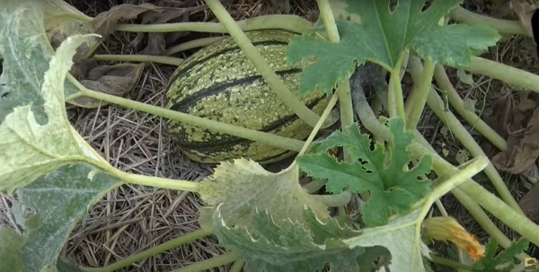
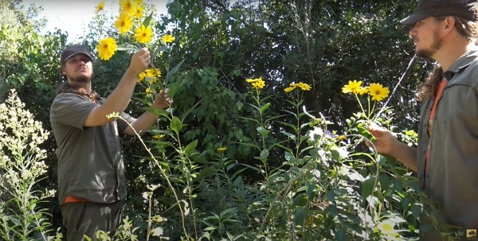
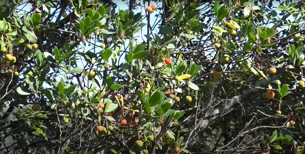
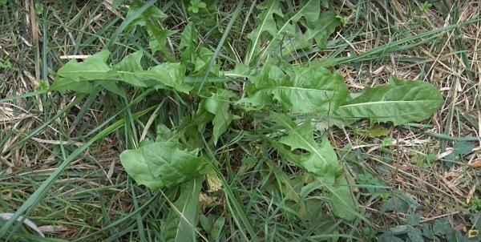
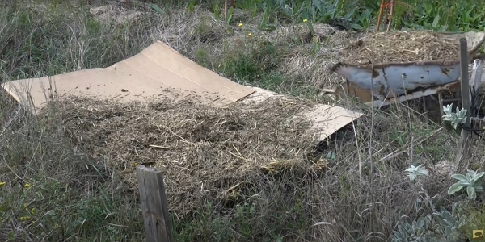
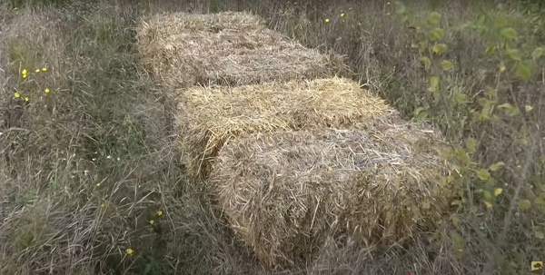
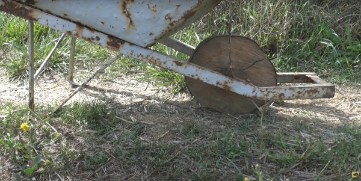

_Credits : image extraite du vlog de Damien_

Merci à Damien pour le partage de son savoir !
Cet article résume mes notes du vlog réalisé par Permaculture, agroécologie, etc.
Vous pouvez retrouver [la vidéo sur YouTube]().

Retrouvez [la liste de mes notes sur les autres vidéos de Damien](../2022-09-12-toutes-mes-notes-sur-les-videos-de-Permaculture-agroecologie-etc) pour apprendre davantage.

## Rappel du mois de septembre

Ce qui est valable en septembre l'est encore en octobre. Voir [ce vlog de Damien](https://www.youtube.com/watch?v=con-c2_o9uc).

## Les arbres fruitiers

Au début, de l'automne, il est intéressant de penser aux arbres que l'on va planter en fin d'automne et en hiver.

:::tip Astuce de Damien
Dans le choix des arbres, pensez à la fructification sur une année. Certains produisent tôt, d'autres tard.

On peut avoir une production sur toute l'année.
:::

Par exemple, en hiver, on peut récolter des fruits de :

- Plaqueminier ou "Kaki",
- Néflier d'Allemagne,
- Goumi du japon,
- Asiminier (qui résiste à -25°C),
- Feijoa ou "Goyavier du Brésil", utile pour des haies avec le bonus de produire des fruits délicieux et qui résiste à -12°C,
- Kumquat (qui résiste à -12°C et garde aussi son feuillage en hiver),
- Actinidia ou "Kiwi,
- Goji : c'est facile à planter et à bouturer.

:::tip Note personnelle
Je me demande si l'on démarre des gojis à partir des graines qu'on achète en magasin bio.

ça fait un moment que je pense à essayer.
:::

## Les semis et plantations

On peut encore réaliser certains semis :

- sous abris : choux de printemps, radis, poireaux, laitues, etc.
- en plein air : Fèves, petits pois, Blés, Seigles, etc.
- en plantations : Poireaux, Laitues, Choux, Aix, Oignons, etc.

:::tip Astuce de Damien
Semer des céréales permet d'atteindre 2 objectifs :

1. obtenir du paillage pour le sol.
2. obtenir de la nourriture des éventuelles poules.

:::

## Les courges

Damien attend que les plants de courges soient morts avant de récolter les fruits.

Pourquoi ? Parce que le goût s'en trouve meilleur et la plante donnera tout le reste de son énergie dans les graines.

## La fin des tomates

Si les plants fleurissent encore, il peut être bien de supprimer les fleurs pour que le plant donne son énergie aux tomates déjà formées., mais qui sont encore vertes.

Par exemple :

_Credits : image extraite du vlog de Damien_

## L'automne, c'est sympa

Pour les abeilles, car certaines fleurs s'épanouissent à ce moment, ce qui donne de la nourriture à nos butineuses.

## Les sauvages

L'arbousier, ou arbre à fraises est très intéressant pour ces fruits remplis de vitamine C.

_Credits : image extraite du vlog de Damien_

Aussi, s'il y a eu assez de pluie, on peut trouver des pissenlits pour les salades :

_Credits : image extraite du vlog de Damien_

## Le potager

En automne, on commence à avoir moins à faire au potager.

Mais cela ne veut pas dire qu'on ne fait rien : on peut déjà préparer le potager du printemps prochain.

Voici quelques techniques de Damien pour ne pas travailler le sol, et qui plus est, sont simples à mettre en œuvre :

### Le carton marron sans encre

- posé à même le sol, sans enlever les herbes.
- puis recouvert de paille, fumier, diverses matières organiques à disposition

L'avantage de cette technique est qu'en 6 mois, la zone sera complètement libérée des mauvaises herbes et cela, sans aucun effort.

_Credits : image extraite du vlog de Damien_

### Les bottes de paille

Elles sont simplement posées sur les zones à cultiver le printemps prochain.

_Credits : image extraite du vlog de Damien_

### Les planches posées

Si vous avez des planches de récupération (**non traitées**), on peut aussi les positionner sur le sol et hop, la zone de culture sera prête le printemps suivant.

Bien sûr, cela peut varier selon l'essence du bois de ces planches. On évitera les essences de bois trop riches en tanins.

:::tip Conseil de Damien
Utiliser toujours les outils les plus modernes !

_Credits : image extraite du vlog de Damien_
:::

## Les champignons

Ils sont très utiles dans le jardin pour la création d'humus, l'autonomie des plantes et tout ce qui est vie du sol.

Pour obtenir des champignons, il faut :

- utiliser beaucoup de matières comme le broyat, bois et autres matières ligneuses
- ne pas traiter ses cultures

Voir le vlog de Damien pour savoir [comment cultiver en sol vivant](https://www.youtube.com/watch?v=WApK6d1ucz4) (je prendrai des notes sur le sujet très bientôt).
