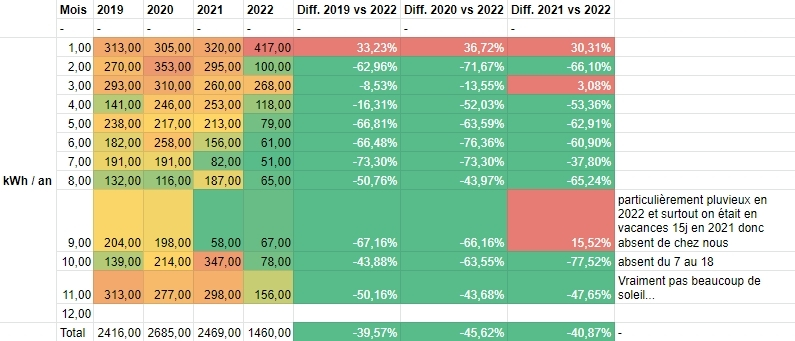

En cet hiver 2022-2023, il devait de plus en plus intéressant de produire sa propre électricité. Mais quand est-il vraiment. Dans ce article, je présente les chiffres de 9 mois de fonctionnement de notre installation photovoltaïque.

<!-- more -->

## Quelques rappels

En mars, nous avons mis en service l'installation photovoltaïque sur ma propriété.

Elle est composée de :

- huit panneaux _EGVNG_ de 190 Wc.


- un micro onduleur APS QS1 4 MPPT (Voir [les spécifications détaillés de l'onduleur](https://emea.apsystems.com/wp-content/uploads/2018/10/APsystems-Microinverter-QS1-For-EMEA-User-manual_10.18_French.pdf)).
- un [routeur solaire de Robin Emley](https://mk2pvrouter.co.uk/) (son auto-entreprise a été repris par [un couple français fin 2022](https://mk2pvrouter.com/)).
- et quelques éléments électriques indispensables pour une installation photovoltaïque.

Le tout a couté 2057 euros pour :

- la prestation d'Ervann de Solairethic
- les matériaux fournis par Ervann
- le routeur solaire envoyé du Royaume-Uni par Robin Emley et monté par Anthony, le Profes'solaire.
- les quelques éléments pour organiser l'alimentation en sortie du routeur et pour le contrôle du cumulus.

## Bilan de consommation totale cumulée du printemps, été et automne

### Consommation : les chiffres

La consommation mois par mois montre une réduction claire d'avril à octobre :

| Mois  | 2019    | 2020    | 2021    | 2022        |
| ----- | ------- | ------- | ------- | ----------- |
| 1     | 313,00  | 305,00  | 320,00  | 417,00      |
| 2     | 270,00  | 353,00  | 295,00  | 100,00      |
| 3     | 293,00  | 310,00  | 260,00  | 268,00      |
| 4     | 141,00  | 246,00  | 253,00  | 118,00      |
| 5     | 238,00  | 217,00  | 213,00  | **79,00**   |
| 6     | 182,00  | 258,00  | 156,00  | **61,00**   |
| 7     | 191,00  | 191,00  | 82,00   | **51,00**   |
| 8     | 132,00  | 116,00  | 187,00  | **65,00**   |
| 9     | 204,00  | 198,00  | 58,00   | **67,00**   |
| 10    | 139,00  | 214,00  | 347,00  | **78,00**   |
| 11    | 313,00  | 277,00  | 298,00  | 177,00      |
| 12    | 382,00  | 334,00  | 369,00  | 228,00      |
| Total | 2798,00 | 3019,00 | 2838,00 | **1709,00** |

### Comparasion des 4 dernières années

Et si l'on compare la consommation en 2019, 2020 et 2021 à celle de 2022, on voit que la consommation a diminué 41 % en moyenne :



:::tip Remarques sur janvier, février et mars 2022
En janvier 2022, on a eu notre plus grosse consommation sur les 4 années comparées.

En février et début mars 2022, nous étions à Siwa.

Il faudra attendre encore 3 mois pour voir comment l'installation aide à diminuer la consommation sur ces mois d'hiver.
:::

### Conclusion

- L'installation solaire a vraiment aidé à diminuer la consommation du réseau.
- J'avais un objectif à passer sous les 2000 kWh consommés sur le réseau. Objectif : atteint avec 9 mois !

==Et la consommation électrique globable ?==

C'est bien de réduire la consommation électrique du réseau, mais quand est-il de la réduction de la consommation électrique globale, c'est-à-dire en provenance du réseau et de l'installation photovoltaïque ?

Dans la réalité, nous n'avons pas réduit la consommation.

| Month | 2019    | 2020    | 2021    | 2022    |
| ----- | ------- | ------- | ------- | ------- |
| 1     | 313,00  | 305,00  | 320,00  | 417,00  |
| 2     | 270,00  | 353,00  | 295,00  | 100,00  |
| 3     | 293,00  | 310,00  | 260,00  | 275,30  |
| 4     | 141,00  | 246,00  | 253,00  | 265,60  |
| 5     | 238,00  | 217,00  | 213,00  | 265,40  |
| 6     | 182,00  | 258,00  | 156,00  | 244,30  |
| 7     | 191,00  | 191,00  | 82,00   | 255,40  |
| 8     | 132,00  | 116,00  | 187,00  | 219,70  |
| 9     | 204,00  | 198,00  | 58,00   | 214,90  |
| 10    | 139,00  | 214,00  | 347,00  | 186,30  |
| 11    | 313,00  | 277,00  | 298,00  | 238,60  |
| 12    | 382,00  | 334,00  | 369,00  | 263,30  |
| Total | 2798,00 | 3019,00 | 2838,00 | 2945,80 |

Nous ne l'avons pas augmenté non plus de façon significative.

La consommation optimisée de la production montre en été une consommation plus élevé, principalement dû à l'ECS et le déshydrateur.


On se peut ainsi se demander si nous avons fait une affaire.

Toutefois :

- en Juillet, j'ai utilisé tous les jours le déshydrateur pour sècher des abricots, des poires et de la verveine.
- en Septembre, nous avons consommé 7 % de plus que 2019 et 2020 (sachant qu'en 2021, nous étions absents la mois du mois)
- en Mai, Juin et Août, on peut dire que la production a été stocké dans les 200 litres d'eau chaude.
- d'Octobre à Décembre, la différence est claire, mais cela a à voir plus avec la gestion du cumulus vu l'absence de soleil, surtout les 2 derniers mois.
- Enfin, l'utilisation en journée de la plaque à induction au lieu de la cuisinière à gaz augmente la consommation électrique. Mais en été, c'est normal.

On va continuer à apprendre.

## Consommation pour l'ECS

:::note Définition de "ECS"

Il s'agit de l'Eau Chaude Sanitaire, dans notre cas, chauffée par une résistance de 2400 W dans un cumulus de 200 litres.

:::

| Mois  | 2020   | 2021   | 2022   |
| ----- | ------ | ------ | ------ |
| 1     | 117,00 | 120,00 | 138,00 |
| 2     | 109,00 | 106,00 | 60,00  |
| 3     | 112,00 | 93,00  | 46,00  |
| 4     | 88,00  | 83,00  | 31,00  |
| 5     | 73,00  | 81,00  | 0,00   |
| 6     | 84,00  | 35,00  | 0,00   |
| 7     | 44,00  | 8,00   | 0,00   |
| 8     | 18,00  | 48,00  | 0,00   |
| 9     | 53,00  | 12,00  | 0,00   |
| 10    | 64,00  | 122,00 | 14,00  |
| 11    | 107,00 | 120,00 | 78,80  |
| 12    | 118,00 | 129,00 | 124,50 |
| Total | 987,00 | 957,00 | 492,30 |

### La conclusion

- La consommation depuis de le réseau Enedis a disparu de Mai à Septembre, même avec le mauvais temps d'Août et Septembre.
- En effet, j'ai remarqué que si le routeur solaire fournissait au moins 2kWh au cumulus chaque jour, on n'avait pas besoin de faire l'appoint avec le réseau.
- A partir d'octobre et surtout en novembre et décembre, la météo fut si grise qu'on a produit en moyenne 2.08 kWh par jour en novembre et à peine plus d'un kWh en décembre... :(

## La production

### Les chiffres mois par mois

::: echarts La production de l'installation sur 9 mois

```json
{
  "xAxis": {
    "type": "category",
    "data": [
      "Jan",
      "Fév",
      "Mar",
      "Avr",
      "Mai",
      "Jun",
      "Jul",
      "Aou",
      "Sep",
      "Oct",
      "Nov",
      "Dec"
    ]
  },
  "yAxis": {
    "type": "value"
  },
  "series": [
    {
      "data": [
        0, 0, 17.3, 160.6, 210.4, 204.3, 225.4, 192.7, 150.9, 109.3, 62.6, 36.3
      ],
      "type": "line"
    },
    {
      "data": [0, 0, 10, 13, 24, 21, 21, 38, 3, 1, 1, 1],
      "type": "bar"
    },
    {
      "data": [
        0, 0, 7.3, 147.6, 186.4, 183.3, 204.4, 154.7, 147.9, 108.3, 61.6, 35.3
      ],
      "type": "line"
    }
  ]
}
```

:::

- En bleu, il s'agit de la production totale.
- En jaune, il s'agit de l'autoconsommation.
- En vert, il s'agit du surplus offert au réseau, sûrement nos plus proches voisins.

### Quelle économie sur 9 mois

Si je prends le coût réel du kWh incluant l'abonnement mois par mois (variant de 19 centimes à 27 centimes d'euros), j'arrive à un peu plus de 300 euros en 9 mois. Cela rentabilise déjà le routeur solaire.

Nous sommes: ce n'est toutefois pas aussi simple, et certains me diront qu'il faut calculer autrement ou que le routeur est un achat superful.

Vu la performance des deux derniers mois, je ne suis pas sûr qu'il y ait un gain important dans les trois à venir avec le routeur. Cependant, de mars à octobre, ça vaut le coup.

| Month | Coût kWh acheté | Montant économisé |
| ----- | --------------- | ----------------- |
| 1     | N/A             | N/A               |
| 2     | N/A             | N/A               |
| 3     | 0,23 €          | 1,67 €            |
| 4     | 0,23 €          | 33,83 €           |
| 5     | 0,23 €          | 43,28 €           |
| 6     | 0,23 €          | 42,56 €           |
| 7     | 0,25 €          | 50,94 €           |
| 8     | 0,25 €          | 38,55 €           |
| 9     | 0,27 €          | 40,23 €           |
| 10    | 0,27 €          | 29,46 €           |
| 11    | 0,27 €          | 16,76 €           |
| 12    | 0,19 € [^first] | 6,60 €            |
| Total |                 | 303,88 €          |

[^first]: En décembre 2022, nous sommes passés à EDF au lieu d'Engie... J'aurai dû faire le changement il y a bien longtemps. Mais la hausse de 25% sur le renouvellement du contrat annuel 2022-2023 d'Engie m'a permis de comprendre qu'EDF est bien moins cher, même avec l'augmentation prévue en février 2023.

## Retour sur investissement

Ce sujet risque d'être controversé auprès de certains qui ne seront pas d'accord avec ma méthode de calcul.

### Les données théoriques PVG

Pour commencer, je me suis rendu sur [le site PVG](https://re.jrc.ec.europa.eu/pvg_tools/fr/#PVP) pour estimer la production théorique, hors météo et ombre de la végétation, avec les entrées suivantes :

- Emplacement [Lat/Lon] : 45.063,4.807
- Horizon : Calculé
- Base de données : PVGIS-SARAH2
- Technologie PV : Silicium cristallin
- PV installée [kWp] : 1.52
- Pertes du système [%] : 14,00

Le résultat m'a donné ceci :

| Mois          | Production théorique (kWh/mois) | Angle |
| ------------- | ------------------------------- | ----- |
| 1             | 83,37                           | 60°   |
| 2             | 121,58                          | 60°   |
| 3             | 180,82                          | 60°   |
| 4             | 189,12                          | 60°   |
| 5             | 220,47                          | 35°   |
| 6             | 234,06                          | 35°   |
| 7             | 242,60                          | 35°   |
| 8             | 227,92                          | 35°   |
| 9             | 193,91                          | 35°   |
| 10            | 147,54                          | 60°   |
| 11            | 92,21                           | 60°   |
| 12            | 69,44                           | 60°   |
| Total général | 2003,04                         | -     |

Ce qui donne cette courbe :

::: echarts La production théorique sur l'année

```json
{
  "xAxis": {
    "type": "category",
    "data": [
      "Jan",
      "Fév",
      "Mar",
      "Avr",
      "Mai",
      "Jun",
      "Jul",
      "Aou",
      "Sep",
      "Oct",
      "Nov",
      "Dec"
    ]
  },
  "yAxis": {
    "type": "value"
  },
  "series": [
    {
      "data": [
        83.37, 121.58, 180.82, 189.12, 220.47, 234.06, 242.6, 227.92, 193.91,
        147.54, 92.21, 69.44
      ],
      "type": "line"
    }
  ]
}
```

:::

Je peux déjà vous annoncer que je suis constamment 15 à 25 % en dessous de la théorie, voire même 33 % et 48 % en novembre et en décembre respectivement.

### Mon calcul

Je ne sais pas quel calcul sera le plus juste. Je pars donc sur les données réelles d'avril à décembre et sur une estimation pour janvier à mars [^fourth] pour calculer :

- La production mensuel
- Le taux d'autoconsommation
- Le taux de production

:::tip Définitions

- Taux d'autoconsommation : correspond à la production consommée moins le rejet sur le réseau.
- Taux de production : correspond à la Production réelle divisée par la Production théorique.

:::

Cela donne :

| Mois | Taux d'autoconsommation | Taux de production | Production (kWh)   | Production autoconsommée |
| ---- | ----------------------- | ------------------ | ------------------ | ------------------------ |
| 1    | 98,00% [^second]        | 60,00% [^second]   | 50,02 [^second]    | 49,02 [^second]          |
| 2    | 98,00% [^second]        | 70,00% [^second]   | 85,11 [^second]    | 83,40 [^second]          |
| 3    | 98,00% [^second]        | 80,00% [^second]   | 144,66 [^second]   | 141,76 [^second]         |
| 4    | 91,91%                  | 84,92%             | 160,60             | 147,60                   |
| 5    | 88,59%                  | 95,43%             | 210,40             | 186,40                   |
| 6    | 89,72%                  | 87,29%             | 204,30             | 183,30                   |
| 7    | 90,68%                  | 92,91%             | 225,40             | 204,40                   |
| 8    | 80,28%                  | 84,55%             | 192,70             | 154,70                   |
| 9    | 98,01%                  | 77,82%             | 150,90             | 147,90                   |
| 10   | 99,09%                  | 74,08%             | 109,30             | 108,30                   |
| 11   | 98,40%                  | 67,89%             | 62,60              | 61,60                    |
| 12   | 97,25%                  | 52,28%             | 36,30              | 35,30                    |
| -    | -                       | -                  | Soit un total de : | 1503,69 [^second]        |

[^second]: Les valeurs sont estimées

Soit un total de 1503.69 kWh annuel autoconsommée.

Avec une augmentation annuelle du prix du kWh acheté à EDF à 8 % [^third], ce qui me semble relativement optimiste vu la situation début 2023, l'installation devient rentable au bout de **===5 ans et 2 mois environ===**.

[^third]: 8 % correspond au taux d'augmentation _moyen_ du prix du kWh chaque année en 2014 et 2022, 4 à 20 % en réalité.

| Année | Production annuelle | Prix du kWh | Economie annuelle | Cumul         |
| ----- | ------------------- | ----------- | ----------------- | ------------- |
| 1     | 1503,69             | 0,23 €      | 345,85 €          | 345,85 €      |
| 2     | 1503,69             | 0,25 €      | 373,52 €          | 719,36 €      |
| 3     | 1503,69             | 0,27 €      | 403,40 €          | 1122,76 €     |
| 4     | 1503,69             | 0,29 €      | 435,67 €          | 1558,43 €     |
| 5     | 1503,69             | 0,31 €      | 470,52 €          | 2028,95 €     |
| 6     | 100,00              | 0,34 €      | 33,79 €           | **2062,75 €** |

## Quelle est la suite

- J'aimerai trouver un moyen d'utiliser le déhydrateur sans chauffer la maison l'été 😂

  - Je pense à une rallonge qui courait de la sortie 2 du routeur jusqu'à la véranda.
  - Pour y arriver, il y a de la distance à parcourir et il faut réfléchir comme y arriver sans pertuber l'intérieur de la maison.
  - Cela permettrait néanmoins d'amener une alimentation issue du routeur solaire à un endroit utile.

- Réduire la résistant du chauffe-eau en fonction de ce que l'hiver nous apprendra

  - Quelle sera la durée optimale de chauffe de l'ECS tout en gardant l'option de faire tourner une lessive ou le lave-vaisselle la même nuit, sachant qu'il faudra éviter que deux tournent ensemble.
  - Il faut que cette modification soit simple pour permettre l'ajustement entre 800 W, 1600 W et 2400 W de puissance

- J'ai aussi penser à augmenter de 480 Wc la puissance de l'installation
  - En effet, sur 120 m de câble en 6 mm², je peux ajouter environ cette puissance sans dépasser la limite où le câble surchaufferait.
  - Toutefois, les finances sont limitées en ce moment. Certes, grâce à Solair'ethic, je peux me fournir en panneaux peu chers (50 euros pour un panneau recyclé de 240 Wc par exemple), mais il faut débourser plus de 200 euros pour un micro-onduleur.
  - Je ne suis pas sûr que l'investissement nous permettent de gagner beaucoup.

## Conclusion :)

J'espère que vous avez trouvé cela utile. Je sais que cela fait beaucoup de chiffres.

Mais, dans mon expérience, pour prendre des bonnes décisions, il faut des données, des mesures, sinon, c'est plus du hasard.

Je sais aussi que certains ont sûrement fait autrement ou qu'ils trouveront des défauts à mes calculs ou ma réflexion.

Partagez vos avis de façon constructive. Avant tout, ce n'est pas d'avoir raison à 100 % qui compte, c'est de réaliser un petit effort chez soi pour réduire la pression économique sur nos foyers.

En attendant, ==merci pour votre soutien !==

:::center
⏬⏬⏬
:::

<!-- markdownlint-disable MD033 -->
<p class="newsletter-wrapper"><iframe class="newsletter-embed" src="https://thetooltip.substack.com/embed" frameborder="0" scrolling="no"></iframe></p>
