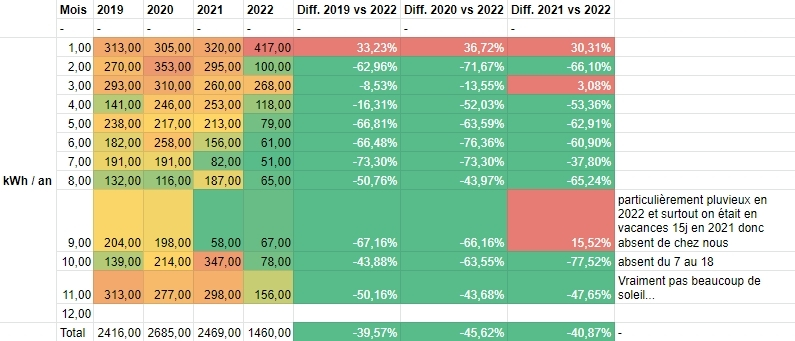

## Quelques rappels

En mars, j'ai mis en service l'installation photovoltaïque sur ma propriété.

Elle est composée de :

- huit panneaux _EGVNG_ de 190 Wc
- un micro onduleur APS QS1 4 MPPT
- un routeur solaire de Robin Emley (repris par un couple français)
- et quelques éléments électriques indispensables pour une installation photovoltaïque

Le tout a couté 2057 euros, tout compris.

## Bilan de consommation totale cumulée du printemps, été et automne

### Consommation : les chiffres

La consommation mois par mois montre une chute claire d'avril et octobre :

| Mois  | 2019    | 2020    | 2021    | 2022    |
| ----- | ------- | ------- | ------- | ------- |
| 1     | 313,00  | 305,00  | 320,00  | 417,00  |
| 2     | 270,00  | 353,00  | 295,00  | 100,00  |
| 3     | 293,00  | 310,00  | 260,00  | 268,00  |
| 4     | 141,00  | 246,00  | 253,00  | 118,00  |
| 5     | 238,00  | 217,00  | 213,00  | 79,00   |
| 6     | 182,00  | 258,00  | 156,00  | 61,00   |
| 7     | 191,00  | 191,00  | 82,00   | 51,00   |
| 8     | 132,00  | 116,00  | 187,00  | 65,00   |
| 9     | 204,00  | 198,00  | 58,00   | 67,00   |
| 10    | 139,00  | 214,00  | 347,00  | 78,00   |
| 11    | 313,00  | 277,00  | 298,00  | 177,00  |
| 12    | 382,00  | 334,00  | 369,00  | 37,00   |
| Total | 2798,00 | 3019,00 | 2838,00 | 1518,00 |

### Comparasion des 4 dernières années

Et si l'on compare la consommation en 2019, 2020 et 2021 à celle de 2022, on voit que la consommation a diminué 42% en moyenne :

:::tip Remarque sur janvier et février 2022
En janvier 2022, on a eu notre plus grosse consommation sur les 4 années comparées.

En février 2022, nous étions à Siwa.

Il faudra attendre encore 2 mois pour voir comment l'installation aide à diminuer la consommation.
:::

### Conclusion

- L'installation solaire a vraiment aidé à diminuer la consommation.
- J'avais un objectif à passer sous les 2000 kWh consommés annuels. Objectif : atteint avec 9 mois !
-

## Consommation pour l'ECS

:::note ECS
Il s'agit de l'Eau Chaude Sanitaire, dans notre cas, chauffée par un cumulus de 200 litres.
:::

### Les données

| Mois  | 2020   | 2021   | 2022   |
| ----- | ------ | ------ | ------ |
| 1     | 117,00 | 120,00 | 138,00 |
| 2     | 109,00 | 106,00 | 60,00  |
| 3     | 112,00 | 93,00  | 46,00  |
| 4     | 88,00  | 83,00  | 31,00  |
| 5     | 73,00  | 81,00  | 0,00   |
| 6     | 84,00  | 35,00  | 0,00   |
| 7     | 44,00  | 8,00   | 0,00   |
| 8     | 18,00  | 48,00  | 0,00   |
| 9     | 53,00  | 12,00  | 0,00   |
| 10    | 64     | 122    | 14     |
| 11    | 107    | 120    | 78,8   |
| 12    | 118    | 129    | 33,5   |
| Total | 987    | 957    | 401,3  |

### La conclusion

- La consommation depuis de le réseau Enedis a disparu de Mai à Septembre, même avec le mauvais temps d'Août et Septembre.
- En effet, j'ai remarqué que si le routeur solaire fournissait au moins 2kWh au cumulus chaque jour, on n'avait pas besoin de faire l'appoint
- A partir d'octobre et surtout en novembre et décembre, le temps fut si gris qu'on a produit en moyenne seulement 2.08 kWh...

## Ajustements extérieurs de l'installation

### Orientation des champs

J'ai changé 3 fois l'inclinaison des champs :

- fin juin :
  - j'ai mis le champ Sud à 30 °
  - j'ai abaissé un peu les champs Sud-Est et Sud-Ouest, mais j'étais limité et donc ils n'étaient pas aussi bas.
- fin août, j'ai remonté le champ Sud à 45 °
- fin novembre, j'ai remonté tous les champs à au moins 60 °

### Nettoyage des panneaux

J'ai réalisé un nettoyage mensuel.

Ayant pas mal de chats autour de la propriété, j'ai vu que certains sont venus marchés sur les panneaux, mais heureusement, les moutons s'en sont abstenus.

## Ajustements intérieurs de l'installation

### Réorganisation du tableau _Routeur solaire_

### Branchement du cumulus

Au départ, j'ai branché le cumulus de la mauvaise façon. Je ne pouvais pas laisser le disjoncteur historique dans le garage et le disjoncteur de la sortie 1 du routeur actifs tous les deux.

Sinon, ça sautait.

Après plus de réflexion, j'ai réussi à brancher les deux avec le contrôle au niveau du tableau du routeur.

Sur la sortie routeur, j'ai enlevé les compteurs d'énergie mécaniques, car le comptage était faux. Je pense que cela est causé par le routeur et la façon dont il laisse passer le courant par impulsion.

Ayant le compteur d'énergie numérique sur le tableau de la sortie solaire, cela m'importait peu de ne pas avoir l'information précise de la consommation sur le routeur.

Le routeur indique le comptage journalier et celui-ci est réinitialisé chaque jour. Je me satisfais de ce que je peux noter chaque jour.

Par contre, j'ai mis :

- un programmateur horaire à pins
  - pour contrôler le temps d'utilisation du réseau la nuit.
- un compteur d'énergie mécanique
  - pour compter le nombre de kWh consommés du réseau
- un disjoncteur derrière le programmateur.
  - pour contrôler la possibilité de complétement désactiver l'utilisation du réseau pour chauffer l'eau.

## Optimisation de la production

### Avec le cumulus

En octobre, j'ai dû activer le chauffage de l'ECS par le réseau. A ce moment-là, 1.5 h de chauffe était largement suffisant pour les 5 jours où cela fut nécessaire.

En novembre, on a laissé le réseau preque tous les jours dû à la très mauvaise météo...

### Avec le déhydrateur

### Avec le lave-vaisselle

### Avec le lave-linge

### Avec la plaque à induction portable

## Point sur le rejet de production

Globalement, on s'en sort très bien avec un taux d'autoconsommation de plus de 90% sur neuf mois.

Cet été, on a rejeté bien plus qu'au printemps
