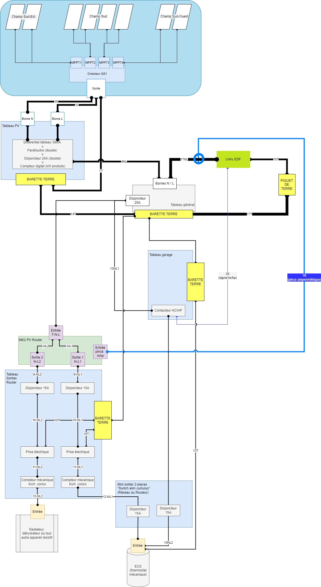
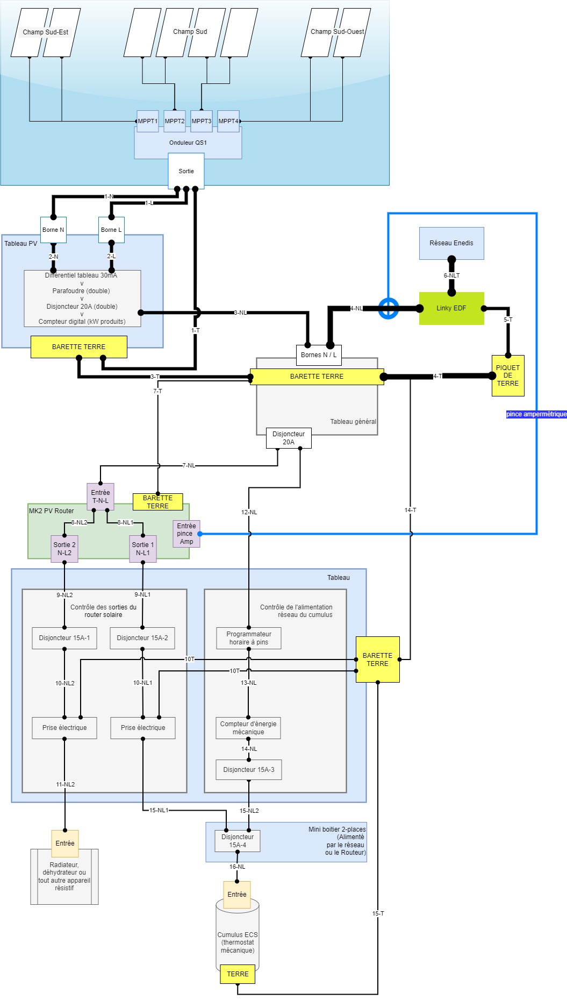

## Quelques rappels

En mars, j'ai mis en service l'installation photovoltaïque sur ma propriété.

Elle est composée de :

- huit panneaux _EGVNG_ de 190 Wc
- un micro onduleur APS QS1 4 MPPT
- un routeur solaire de Robin Emley (repris par un couple français)
- et quelques éléments électriques indispensables pour une installation photovoltaïque

Le tout a couté 2057 euros, tout compris.

## Bilan de consommation totale cumulée du printemps, été et automne

### Consommation : les chiffres

La consommation mois par mois montre une réduction claire d'avril à octobre :

| Mois  | 2019    | 2020    | 2021    | 2022      |
| ----- | ------- | ------- | ------- | --------- |
| 1     | 313,00  | 305,00  | 320,00  | 417,00    |
| 2     | 270,00  | 353,00  | 295,00  | 100,00    |
| 3     | 293,00  | 310,00  | 260,00  | 268,00    |
| 4     | 141,00  | 246,00  | 253,00  | 118,00    |
| 5     | 238,00  | 217,00  | 213,00  | **79,00** |
| 6     | 182,00  | 258,00  | 156,00  | **61,00** |
| 7     | 191,00  | 191,00  | 82,00   | **51,00** |
| 8     | 132,00  | 116,00  | 187,00  | **65,00** |
| 9     | 204,00  | 198,00  | 58,00   | **67,00** |
| 10    | 139,00  | 214,00  | 347,00  | **78,00** |
| 11    | 313,00  | 277,00  | 298,00  | 177,00    |
| 12    | 382,00  | 334,00  | 369,00  | 37,00     |
| Total | 2798,00 | 3019,00 | 2838,00 | 1518,00   |

### Comparasion des 4 dernières années

Et si l'on compare la consommation en 2019, 2020 et 2021 à celle de 2022, on voit que la consommation a diminué 42% en moyenne :

:::tip Remarques sur janvier, février et mars 2022
En janvier 2022, on a eu notre plus grosse consommation sur les 4 années comparées.

En février et début mars 2022, nous étions à Siwa.

Il faudra attendre encore 3 mois pour voir comment l'installation aide à diminuer la consommation sur ces mois d'hiver.
:::

### Conclusion

- L'installation solaire a vraiment aidé à diminuer la consommation.
- J'avais un objectif à passer sous les 2000 kWh consommés annuels. Objectif : atteint avec 9 mois !

## Consommation pour l'ECS

:::note Définition de _ECS_
Il s'agit de l'Eau Chaude Sanitaire, dans notre cas, chauffée par un cumulus de 200 litres.
:::

### Les données de consommation pour l'ESC

| Mois  | 2020   | 2021   | 2022   |
| ----- | ------ | ------ | ------ |
| 1     | 117,00 | 120,00 | 138,00 |
| 2     | 109,00 | 106,00 | 60,00  |
| 3     | 112,00 | 93,00  | 46,00  |
| 4     | 88,00  | 83,00  | 31,00  |
| 5     | 73,00  | 81,00  | 0,00   |
| 6     | 84,00  | 35,00  | 0,00   |
| 7     | 44,00  | 8,00   | 0,00   |
| 8     | 18,00  | 48,00  | 0,00   |
| 9     | 53,00  | 12,00  | 0,00   |
| 10    | 64     | 122    | 14     |
| 11    | 107    | 120    | 78,8   |
| 12    | 118    | 129    | 33,5   |
| Total | 987    | 957    | 401,3  |

### La conclusion

- La consommation depuis de le réseau Enedis a disparu de Mai à Septembre, même avec le mauvais temps d'Août et Septembre.
- En effet, j'ai remarqué que si le routeur solaire fournissait au moins 2kWh au cumulus chaque jour, on n'avait pas besoin de faire l'appoint avec le réseau.
- A partir d'octobre et surtout en novembre et décembre, la météo fut si grise qu'on a produit en moyenne 2.08 kWh par jour ... :(

## Ajustements extérieurs de l'installation

### Orientation des champs

J'ai changé 3 fois l'inclinaison des champs sur les 9 mois :

- fin juin :
  - j'ai mis le champ Sud à 30 °
  - j'ai abaissé un peu les champs Sud-Est et Sud-Ouest, mais j'étais limité et donc ils n'étaient pas aussi bas.
- fin août, j'ai remonté le champ Sud à 45 °
- fin novembre, j'ai remonté tous les champs à au moins 60 °

### Nettoyage des panneaux

J'ai réalisé un nettoyage mensuel.

Avec pas mal de chats autour de la propriété, j'ai vu que certains sont venus marchés sur les panneaux, mais heureusement, les moutons s'en sont abstenus.

## Ajustements intérieurs de l'installation

### Réorganisation du tableau _Routeur solaire_

::: tabs#schema

@tab Au printemps

Au mois de mai, je n'avais pas une solution optimale pour passer de l'alimentation solaire à l'alimentation réseau...

@tab A la fin de l'été

Fin août 2022, j'ai enfin trouvé la configuration la plus pratique pour gérer les deux sources d'alimentation du cumulus.

Ce qui a changé :

- je n'utilise plus le contacteur avec le signal HC/HP d'EDF. Il n'est utile et j'explique pourquoi dans les lignes suivantes.
- j'ai conservé les disjoncteur 15A-1 et 15A-2 pour avoir un contrôle indépendant sur les sorties du routeur solaire.
- j'ai supprimé les compteurs mécaniques pour compter l'énergie utilisée sur les prises connectées aux sorties du routeur solaire. Voir [plus bas pourquoi](#branchement-du-cumulus).

- j'ai installé un programmateur horaire à pins pour contrôler quand et combien de temps le cumulus est alimenté par le réseau.

  - Le disjoncteur 15A-3 permet de couper l'alimentation réseau du cumulus quand cela est nécessaire.
  - Le compteur d'énergie mécanique me permet de continuer [le suivi de la consommation du cumulus sur le réseau](#les-données-de-consommation-pour-lesc).

:::

### Branchement du cumulus

Au départ, j'ai branché le cumulus de la mauvaise façon. Je ne pouvais pas laisser le disjoncteur historique dans le garage et le disjoncteur de la sortie 1 du routeur actifs tous les deux.

Sinon, ça sautait.

Cela m'obligeait à tout éteindre au niveau du tableau général, me rendre dans le garage, activer ou désactiver l'alimentation réseau et remettre l'alimentation sur le tableau général... Pas pratique.

Après plus de réflexion, j'ai réussi à brancher les deux avec le contrôle au niveau du tableau du routeur.

Sur la sortie routeur, j'ai enlevé les compteurs d'énergie mécaniques, car le comptage était faux. Je pense que cela est causé par le routeur et la façon dont il laisse passer le courant par impulsion.

Robin Emley m'a dit que cela dépend de [la calibration de la pince ampèremétrique](https://mk2pvrouter.co.uk/improved-calibration.html). Pour le moment, cela ne me dérange pas.

Ayant le compteur d'énergie numérique sur le tableau de la sortie solaire, cela m'importait peu de ne pas avoir l'information précise de la consommation qui était passée par le routeur.

De plus, le routeur indique le comptage journalier et celui-ci est réinitialisé chaque jour. Je me satisfais de cela.

Dans le garage, sur le support en OSB isolant le cumulus, j'ai installé le disjoncteur 15A-4.

J'ai utilisé un câble triphasé du tableau du routeur solaire au cumulus :

- une phase et ligne pour l'alimentation réseau
- une phase et ligne pour l'alimentation du routeur

Le câble de terre remonte du cumulus au tableau du routeur solaire.

L'entrée du disjoncteur reçoit :

- l'alimentation du réseau via le programmateur horaire
- l'alimentation du routeur solaire

La sortie est branchée comme avant au cumulus.

## Optimisation de la production

### Avec le cumulus

En octobre, j'ai dû activer l'alimentation du cumulus par le réseau.

A ce moment-là, 1.5 h de chauffe était largement suffisant pour les 5 jours où cela fut nécessaire.

En novembre, on a laissé le réseau preque tous les jours dû à la très mauvaise météo... J'ai augmenté à 2.5 h de chauffe la première semaine de décembre. J'ai diminué à 2h une semaine après car cela suffisait pour les douches chaudes de mesdames ;)

==Le gros avantage== :

- en novembre, on a réussi presque -50 % de consommation réseau par rapport aux trois dernières années, et ce malgré l'absence du soleil une bonne partie du mois. Avant, le cumulus tournait 4h par nuit d'hiver...
- aussi, lorsqu'on lançait le lave-vaisselle en fin de nuit (le cumulus étant en route de 22h30 à 2h00 avec le signal HP/HC), le cumulus se remettait en route...

==Autre point important :== j'ai mis le thermostat à 5 sur 5 au lieu de 2 sur 5 en été et 3 sur 5 en hiver quand on alimentait sur le réseau uniquement.

Oui, l'eau était bien chaude, mais cela a permit d'avoir 2 à 3 jours de mauvais temps en septembre avec peu ou pas de soleil et ne pas utiliser le réseau pour chauffer l'ESC. Je l'ai remarqué principalement en août et septembre.

Est-ce que cela va faire vieillir la résistance ? Si vous avez la réponse, [partagez-la moi](../../contactez-moi/README.md) :).

### Avec le déhydrateur

Je l'ai beaucoup utilisé en juin, juillet et un peu en août et septembre.

Cela nous a permit de sècher les abricots, poires, verveine citronnée et les orties.

Je l'ai branché sur la sortie 2 lorsqu'on avait besoin que l'ECS soit chauffée, ce qui me conforte dans le choix de prendre un routeur avec 2 sorties.

L'inconvénient fut que cela chauffait l'air de la maison... Et cet été, ce n'était pas l'idéal !

### Avec le lave-vaisselle

Durant l'été, l'eau fut très chaude.

Mon lave-vaisselle est branché sur l'eau depuis le début.

Ce que nous avons fait est de lancer 2 cycles de rinçage (2 fois 11 min) pour amener l'eau et la vaisselle était alors presque _propre_. Si l'on avait besoin de faire tourner le lave-vaisselle, on le lançait ensuite en programme _demi-charge_ durant 30 min et comme l'eau chaud était déjà là, la consommation du réseau apparaissait nul.

Sur un cycle plus long, le mode _eco_ de 2h45, la consommation était clairement diminuée.

### Avec le lave-linge

### Avec la plaque à induction portable

### Avec le mini radiateur électrique

## Point sur le rejet de production

Globalement, on s'en sort très bien avec un taux d'autoconsommation de plus de 90% sur neuf mois.

Cet été, on a rejeté bien plus qu'au printemps

## Quelle est la suite

- Trouver un moyen d'utiliser le déhydrateur sans chauffer la maison l'été.
  - Je pense à une rallonge qui courait de la sortie 2 du routeur à la véranda et pour y arriver, il y a de la distance à parcourir. Après cela permettrait d'avoir une alimentation issue du routeur solaire à un endroit utile.
