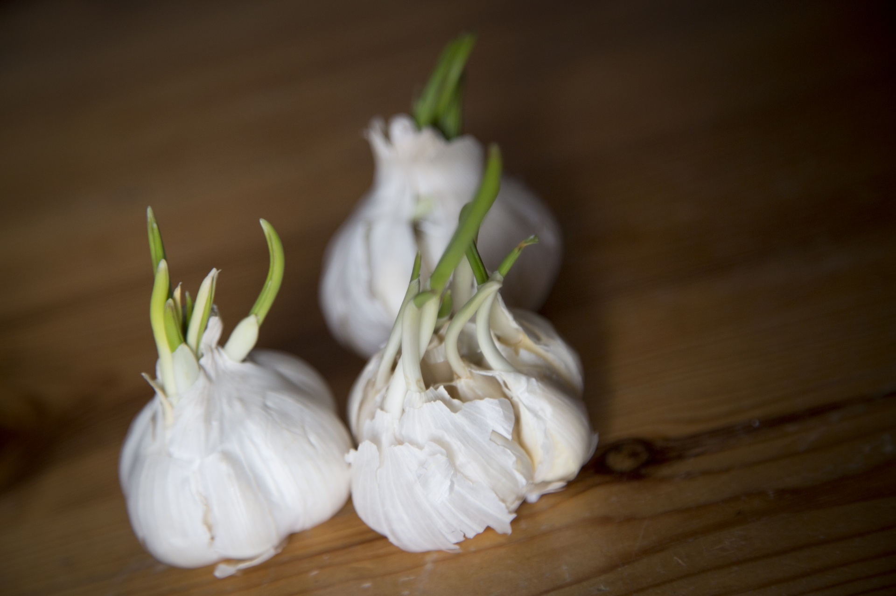

Credits: [George Hodan on publicdomainpictures.net](https://www.publicdomainpictures.net/fr/view-image.php?image=206292&picture=germination-ail)

Thanks to Charles Dowding for sharing his wisdom and knowledge!
I wrote the following notes watching the video published on Charles Dowding’s channel.
You can watch it using [this YouTube link](https://www.youtube.com/shorts/o8ZStwTQUVU).

## Steps

- Use your fingers to clear the soil around the garlic head and see if it is well formed.
- If you can feel the cloves, then it is ready to harvest.

<!-- markdownlint-disable MD033 -->
<iframe class="newsletter-embed" src="https://thetooltip.substack.com/embed" frameborder="0" scrolling="no"></iframe>
