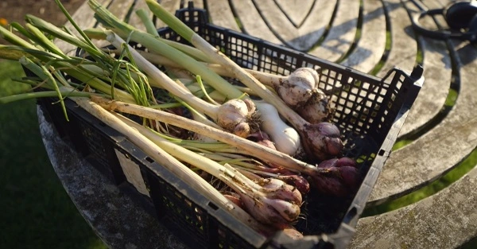
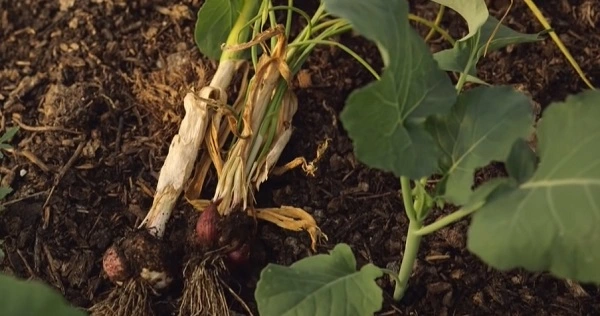
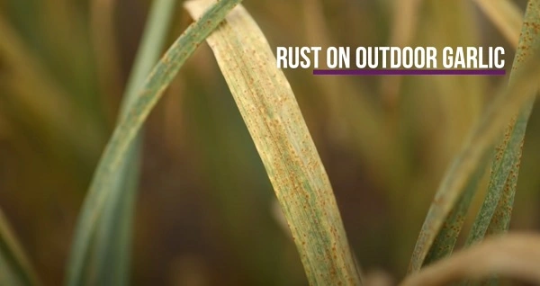

Credits: from Charles Dowding’s vlog.
Thanks to Charles Dowding for sharing his wisdom and knowledge!
The following are the notes I took watching the video published on Charles Dowding’s channel.
You can watch it using [this YouTube link](https://www.youtube.com/watch?v=vr3ZxWexS5c).

## Varieties of garlic

- Elephant garlic
- Hard-neck garlic
- Soft-neck garlic

## Does it work

Yes.

But from Charles’s comments, it seems a hard discount garlic head may give a strange harvest.

:::tip Personal note
Using organic garlic heads may yield better results. I will try a non-organic head from a local farmer’s shop and an organic head from our local organic supermarket Satoriz.
:::

The top image is what you can get from a £1 garlic head.

## Do not leave your garlic in the soil too long?

Once [you checked the garlic head is ready](../2022-09-22-how-to-judge-the-readiness-of-garlic-charles-dowding/README.md), you should not leave it too long in the soil.

Why?

1. the outer skin can decay and the garlic turns bad or the garlic may rot
2. the cloves can start sprouting and you will see a lot of new garlic shoots

Credits: from Charles Dowding’s vlog.

## Diseases of garlic

### Rust

Credits: from Charles Dowding’s vlog.

It is a rampant fungal disease that infects the entire Allium family, including garlic and onions. If left unchecked, the disease can result in smaller-than-usual bulbs and limited growth of a plant.
Garlic infected by rust is still edible and unless the infection was severe, you should get a decently sized bulb at harvest time. There’s no need to prematurely pick your garlic crop unless the entire plant is brown and dead. (Like “dead dead”, not “ready and ripe” dead.)

Source: [article of gardenbetty.com](https://www.gardenbetty.com/grrr-garlic-rust-and-how-to-deal/)

## How to grow garlic

You can plant them between lettuces or tomatoes.

They don’t need any special space.

:::tip Personal note
Maybe it could help with slugs. In fact, when I grew strawberries a few years back, I planted shallots around a patch of strawberries and we almost had no slugs
:::

<!-- markdownlint-disable MD033 -->
<iframe class="newsletter-embed" src="https://thetooltip.substack.com/embed" frameborder="0" scrolling="no"></iframe>
