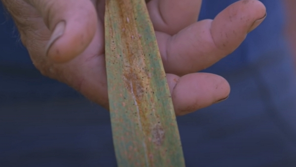
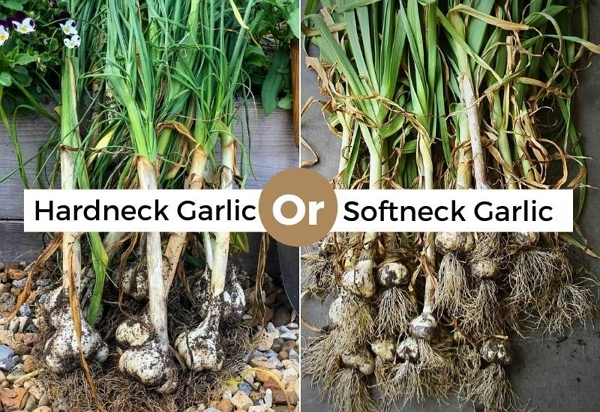
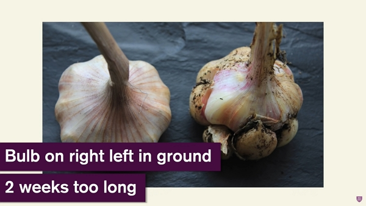

Thanks to Charles Dowding for sharing his wisdom and knowledge!
The following are the notes I took watching the video published on Charles Dowding's channel.
You can watch it using [this YouTube link](https://www.youtube.com/watch?v=ZgYUgc5c70Y).

Garlic is not too difficult to grow and it stores well.

Growing outdoors can bring rust much more than under a polytunnel and greenhouse.
Also, it will grow bigger.

However, there is no real solution to rust.

_Credits: Picture from Charles Dowding's vlog_

## Types of garlic

There are 2 types:

- hardneck
- softneck

_Credits: [Gardening Chores](https://www.gardeningchores.com/hardneck-vs-softneck-garlic/)_

Softneck garlic is harvested about 2-3 weeks earlier than hardneck garlic.

A feature that you may like from the hardneck garlic is the cloves tend to be bigger and therefore easier to peel.

## How to plant

You need to space each plant by 10 cm and row by 30 cm apart.

Planting will happen in October on average, but it can happen from mid-September to the end of December. However, the earlier, the better the crops.

The steps to plant are quite easy:

1. Take the best bulbs from the year before, [try to start from one organic bulb in your local supermarket](../2022-09-22-supermarket-garlic-for-seed-charles-dowding/README.md), preferably organic.
2. Use a wood stick to make a 2-3 cm hole.
3. Sow each clove the same way they were growing in the bulb.
4. Cover over and you are done.

## When to harvest

In the UK, the harvest time around the end of June.

In my area, in Ardèche, it seems to be the same.

When to harvest garlic has nothing to do with how yellow the leaves are. At least half the leaves should still be green **unless a severe case of rust has attacked the plants**.

What you want to feel around the bulb are the protrusions (e.g., where the cloves are forming). This is when the garlic is mature.
You can feel this by uncovering the top of the garlic.

If you leave the garlic too long, you will get the following:

_Credits: Picture from Charles Dowding's vlog_

## How to harvest

1. Take the garlic out by pulling it gently while digging it out gently to keep the stem and / or the remaining leaves. Keeping the stem will help conserving it longer.
2. Cut the roots while fresh.
3. Peel out the first outer skin because it is a lot easier

## How to store garlic

At first, right after harvest, you can leave quite a bite of stem to help the garlic finish ripening.

Don't leave garlic under the direct sun too long. Two days is enough to dry the outer skin, otherwise, it can start deteriorating. Then, put it under cover to dry some more for about 20 days, with enough air.

<!-- markdownlint-disable MD033 -->
<iframe class="newsletter-embed" src="https://thetooltip.substack.com/embed" frameborder="0" scrolling="no"></iframe>
