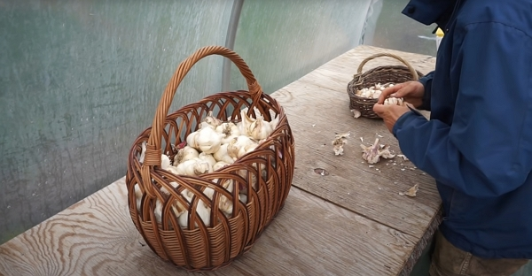
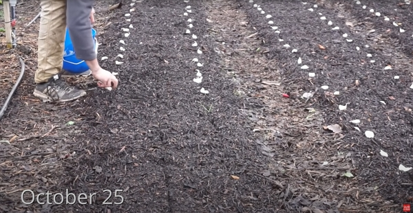
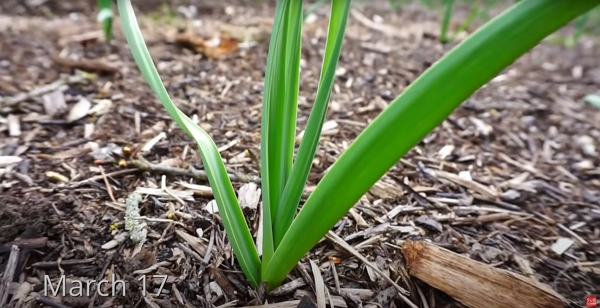
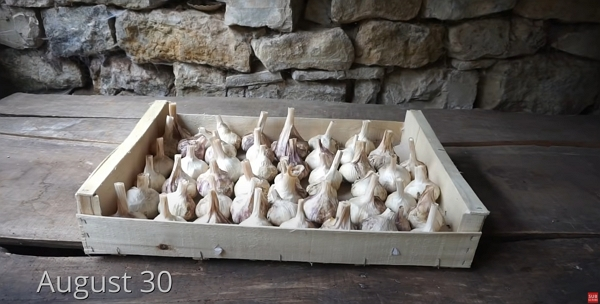

Thanks to The Dutch Farmer for sharing his wisdom and knowledge!
The following are the notes I took watching the video published on The Dutch Farmer's channel.
You can watch it using [this YouTube link](https://www.youtube.com/watch?v=BNR8b4_o2LA).

## Times

### September: preparing the cloves

_Credits: image taken from The Dutch Farmer's vlog._

From your best garlic heads from last harvest (or **[from your organic store](../2022-09-22-supermarket-garlic-for-seed-charles-dowding/README.md)**), break down the garlic into individual cloves.

### October 25: planting

1. Prepare the soil in no dig. Below, bulk compost is used.

   

   _Credits: image taken from The Dutch Farmer's vlog._

2. Space the cloves 5 cm to 10 cm from each other in rows of about 30 cm.

   

   _Credits: image taken from The Dutch Farmer's vlog._

### March 17: new garlic has come out

_Credits: image taken from The Dutch Farmer's vlog._

### May 21st: garlic is at adult size

_Credits: image taken from The Dutch Farmer's vlog._

### June 27th: harvest and set to dry

Around the beginning of the summer (end of June in the northern atmosphere), the garlic should be ready to harvest.

See [how to judge the readiness of garlic](../2022-09-22-how-to-judge-the-readiness-of-garlic-charles-dowding/README.md).

Then, set it put to dry under cover by hanging the garlic:

_Credits: image taken from The Dutch Farmer's vlog._

### August 29th: garlic is ready

About 2 months later, garlic is dried ...

_Credits: image taken from The Dutch Farmer's vlog._

### August 30th: prepare for storage

... and it is ready to be stored for later consumption or soon coming new planting season!

You simply cut off the dried stem.

_Credits: image taken from The Dutch Farmer's vlog._

<!-- markdownlint-disable MD033 -->
<iframe class="newsletter-embed" src="https://thetooltip.substack.com/embed" frameborder="0" scrolling="no"></iframe>
