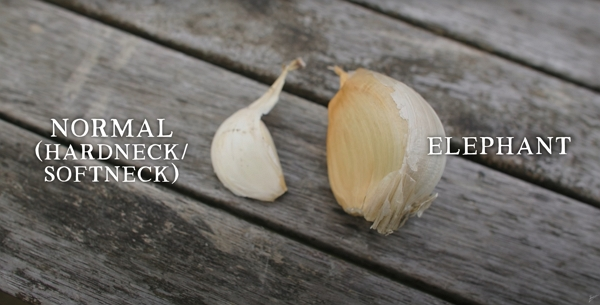
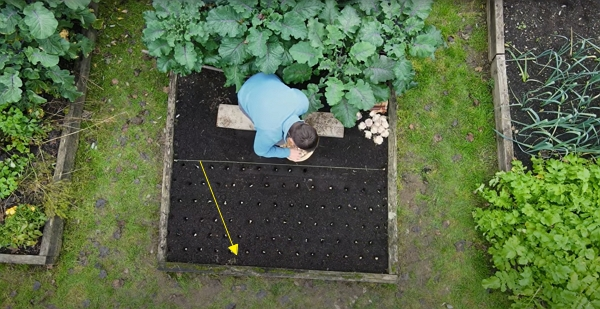
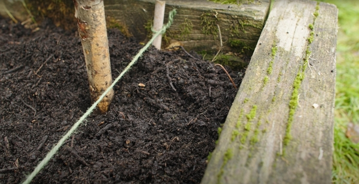
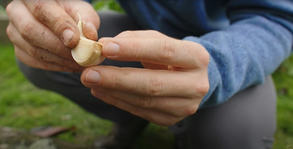
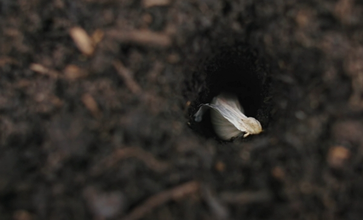
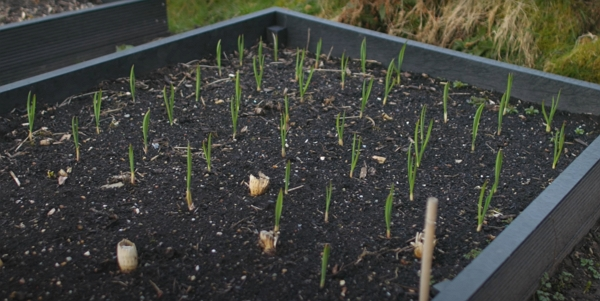
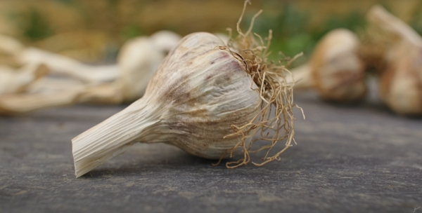
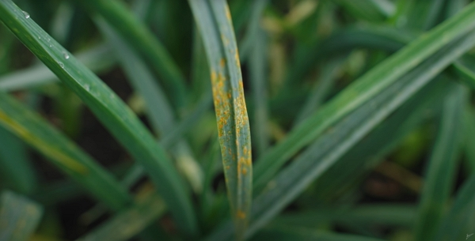

Thanks to Huw Richards for sharing his wisdom and knowledge!
The following are the notes I took watching the video published on Huw Richards's channel.
You can watch it using [this YouTube link](https://www.youtube.com/watch?v=FmCBTd_qCh0).

## 3 things to know before growing garlic

1. Garlic exists in 3 categories: softneck, hardneck and elephant
2. Garlic is very hardy crop demanding very little attention after planting
3. The green stem can be consumed! See below...

### Elephant garlic

It is considered as a perennial crop.

There are massive, compared to the regular soft or hardneck garlic.

_Credits: image taken from The Huw Richard's vlog_

### Hardneck garlic

This category tends to have larger cloves and is said to be tastier than softneck garlic.

However the bulbs don't last as long as softneck garlic.

Also, hardneck garlic is better suited for cold climates.

Finally, hardneck garlic produced some beautiful scapes (the top of the stem that will flower and that you need to cut off and eat!)

### Softneck garlic

Even if they produce smaller bulbs, there are more cloves in one head.

If you live in a warmer climate, softneck garlic is a good choice.

## Planting

### When

It starts from mid-October and mid-December.

Any earlier and you may lose your plants over a really cold winter if they have developed too much.

:::tip Personal thought
That probably means that planting from mid-September (like [Charles Dowding suggested](../2022-09-28-grow-garlic-charles-dowding/README.md)) may be only possible under a polytunnel or greenhouse.
:::

Any later, you risk your bulbs to be underdeveloped.

### Spacing

You can plant each clove quite close to each other, between 7 cm to 10 cm.

Also, to increase the amount of garlic planted, you can use the diagonal method:

_Credits: image taken from The Huw Richard's vlog_

### How

It is easy:

- Prepare the soil with compost.
- Use a large stick.
  
  _Credits: image taken from The Huw Richard's vlog_

- Press down the stick to make a hole 5 cm deep
- Set the clove with the bottom first (where it was attached to the bulb)
  
  _Credits: image taken from The Huw Richard's vlog_
  and the tip up from where the plant will sprout and grow
  
  _Credits: image taken from The Huw Richard's vlog_

Also, plant your garlic in various areas (3-4 locations, if possible) rather than just one place.

## Growing

The most important thing is the plant focuses its energy on the bulb, not the flowering stem (see [above](#hardneck-garlic))

But, mostly, you can forget about garlic for almost 8 months.

_Credits: image taken from The Huw Richard's vlog_

If there is a period in spring and early summer with no rain, give garlic a heavy soaking.

## Harvest

It happens when the bottom 50% of leaves have turned brown (or end of June).

You can also enjoy garlic from late April into may.
This is called _green garlic_ where you can eat not only the bulb but also the stem.

Garlic doesn't have to be dried to eat it.

## Drying and storing

1. Let garlic dry for a full day under the sun
2. Then move it to dry in the airy place, hanging or lying down on a table, for 4 to 6 weeks
3. After the drying, cut off the stem, leaving 5 cm like shown below
   
   _Credits: image taken from The Huw Richard's vlog_
4. Then store it in a dark, cool but airy place for 9 to 12 months for softneck garlic and 4 to 6 months for hardneck garlic.

## Other tips

To grow more food from the same patch of land, planting beans following harvest is a good idea

To store garlic, you can also ferment it with salt and water.
Huw Richards talked about a recipe with honey and garlic that can be kept for a year. I'll look into this.

:::tip Personal experience
I tried it with carrots and it tastes really good, and amazingly, the spicy side of garlic is done after 1 month of fermentation.
:::

## Diseases

### White rot

[White rot](https://www.bing.com/search?q=white%20rot%20disease) affects the Allium family, which the garlic is belonging to.

If you do get this, to avoid it, just don't grow garlic in that same place for 3 to 4 years.

### Rust

This disease is far less of a problem.

_Credits: image taken from The Huw Richard's vlog_

Simply, remove the worst affected leaves. Then when it comes to harvest, remove the outer layer and the garlic will be fine.

As long as you take care of the soil, rust goes away. You can also apply lactic acid bacteria using a spray.

<!-- markdownlint-disable MD033 -->
<iframe class="newsletter-embed" src="https://thetooltip.substack.com/embed" frameborder="0" scrolling="no"></iframe>
