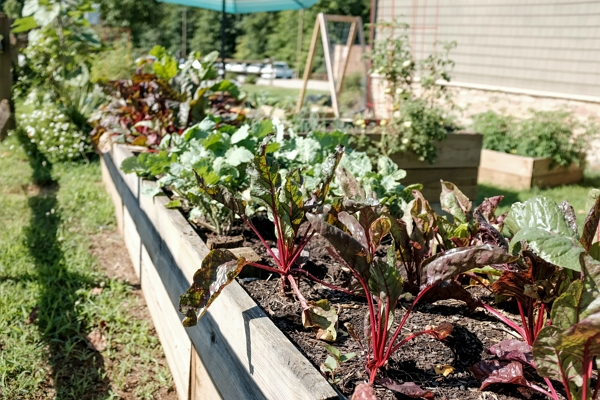
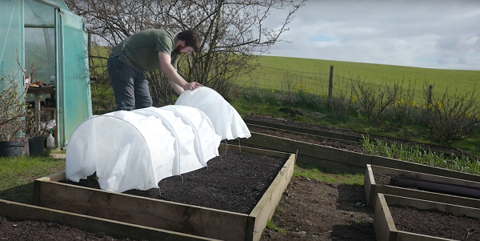
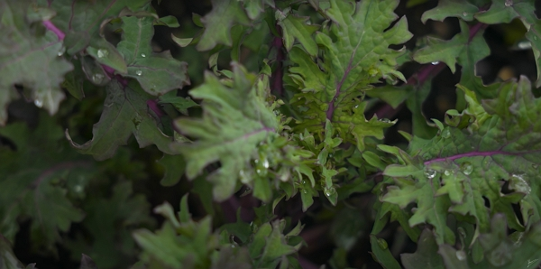

<!-- markdownlint-disable MD033 -->

_Credits: Hero picture by <a href="https://unsplash.com/ja/@funnelhead?utm_source=unsplash&utm_medium=referral&utm_content=creditCopyText">Jonathan Hanna</a> on <a href="https://unsplash.com/s/photos/vegetable-garden?utm_source=unsplash&utm_medium=referral&utm_content=creditCopyText">Unsplash</a>_

Thanks to Huw Richards for sharing his wisdom and knowledge!
The following are the notes I took watching the video published on Huw Richards's channel.
You can watch it using [this YouTube link](https://www.youtube.com/watch?v=8HmQqsTM8co).

## Food self-sufficiency: a definition

It is the goal to grow your own food you need to eat every day.

It is becoming independent and not needing anything from shops.

It requires a lot of careful planning and can become overwhelming if you set yourself goals that are too high.

Also, you will have to make some sacrifices, not only regarding the food you can actually be self-sufficient with, but also the time you have to grow your own food and what you can grow in your garden.

It is about asking oneself the question: what is the ultimate goal of food self-sufficiency?

## How to start

Set small targets to start that are easy to reach and move on to more ambitious ones, without ever going too fast too soon. Otherwise you will crush the goal of self-sufficiency.

Remember: self-sufficiency doesn't happen overnight.

Then, self-sufficiency doesn't mean you have to grow food 365 days a year. Instead, try to perform work to reach part-time self-sufficiency.

Growing some food for a specific period that you know will be more doable in _your situation_ might just be enough.

For example:

1. you can grow salads from April to November and be self-sufficient in salad that period
2. you can grow onions and be self-sufficient through autumn and winter

## What group crops to start with

They are easy to grow and versatile in the kitchen.

### Salads

The _cut and come again_ salads are the best (take what you need in leaves while leaving the plant produce).

_Credits: image taken from The Huw Richard's vlog_

For a couple, you can easily be self-sufficient in salads with a 4 x 4 feet raised bed (equivalent to 1.3 m x 1.3 m, so less than 2 m²) during the growing season.

To go further to reach self-sufficiency throughout the year, you can use:

- some clothes and fleeces to extend the season
  
  _Credits: image taken from The Huw Richard's vlog_
- a small greenhouse
- or a polytunnel

### Potatoes

If you don't have enough garden space, grow them in 25 to 30 liter containers and start harvesting them from mid-June.

They are easy to store through winter. It is done in a dark and cool place.

### Onions

It is really easy to grow and to store them.

The production could give enough to last from late summer to winter.

### Kale

You can start kale in mid-March to April and expect to harvest leaves from mid to late June all the way through winter.

And even in the next year, in March, April and May, you will get a lot of flowers shoots that will give you more food.

There are a lot of varieties to choose from, so if you are not keen with the curly kale, you can try others, like the red Russian kale.

_Credits: image taken from The Huw Richard's vlog_

### Annual herbs

Even if perennial herbs (meaning living for several years) would be easy to pick, we will gain more satisfaction from fresh herbs during the growing season, like:

- dill
- parsley
- coriander.

## How much do I need to grow something

Everyone is different so you are the one who can know how much you and your household eat throughout the year.

First, look at the core staples you eat in your case throughout the year.

Then, estimate:

- how much you need of a staple per week
  - for example 2 bulbs of garlic per week
- how long you need that staple: 1 month, 6 months, all year
  - for example 4 months

So in the example, that gives us 2 bulbs x 4 months (12 weeks) = 24 plants of garlic.

Be aware that you will need to think about storage for some food if you want to have it available for longer.

You need to take into account the potential failures, so add 20 to 25% to the estimate, so in the example, we will need an extra 6 plants of garlic.

:::tip Personal tip
I have started in August 2022 to track the quantity of the food purchases we make.

It is easy today to scan a grocery ticket and convert it using an image to text online tool like [Online OCR](https://www.onlineocr.net/).

While it is not perfect depending on your receipt quality, it helps a lot to build a journal of your purchases week by week and only take a couple of minutes for each ticket.

After a while, you will be able to build a predefined list of produces you buy regularly and you might not need to scan and convert anymore.

You can track your purchases using [this free Google sheet template](https://docs.google.com/spreadsheets/d/1hScfACex3yjX-Nu5FUy4wTN7csYKyGf75TEJKwAem9A/edit?usp=sharing) over a month or a year (you will need to be patient for a year long tracking).

Please feel free to use it as a template.
At the end, it will be very quick to identity how much you need from a given crop.

You will need to adjust the values in the "Constants" tab as you go.

After a while, it will be easy to input your purchase if you buy by the season and if you are regular. Contact me if you have questions on how to use the sheet or if you want me to demo it in a video.
:::

### Conclusion

Test different varieties: some may not work while others can be very successful. Don't beat yourself up if the first try doesn't quite work.

Also embrace seasonality: don't try to push against the natural cycle. Tomatoes are a summer crop, while cabbage and squashes are more a winter one.

What benefits do you get from eating out of season?

- you will have more fresh produce to eat
- you will have to be more creative on how to use the crops you get. See [Huw and Sam's blog for recipes](https://farmerandchef.co.uk/blog).

Look at what is special about every single season and you will become of more self-sufficient.
