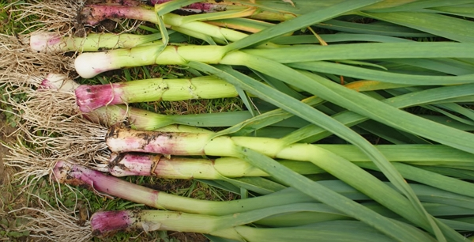
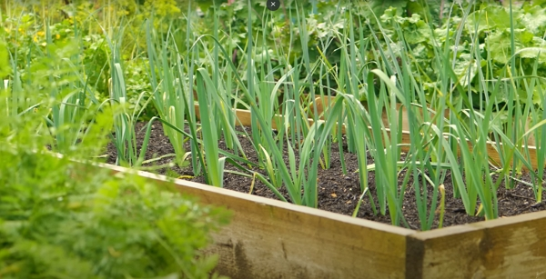
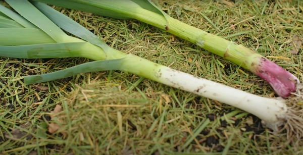

_Credits: Hero image taken from Huw's vlog_

Thanks to Huw Richards for sharing his wisdom and knowledge!
I wrote the following notes watching the video published on Huw Richards's channel.
You can watch it using [this YouTube link](https://www.youtube.com/watch?v=asVqiG3f66M).

## Why

Even if the most common way to harvest garlic is to wait that the bottom has turned brown, there are two other types of garlic harvest:

- Early harvest: when you harvest earlier, the garlic is much juicer and has a better flavor exchange in cooking.
- Green garlic: you can then enjoy garlic up twelve weeks before the usual harvest time

The latter will be the focus of the following notes.

Before moving on, remember that late May is within that [hungry gap](https://en.wikipedia.org/wiki/Hungry_Gap) period: it is the time of the year when you are finishing your winter crops, but the spring crops haven't yet yielded fruits.

During the hungry gap, alongside with green garlic, you can find purple broccoli and asparagus to fill the leanest period of the year.

## What is green garlic

It is similar to a leak.

_Credits: image taken from The Huw Richard's vlog_

You won't only eat the immature bulb but you will also eat the stem.

## When to harvest

It really is up to you. Huw's preference is to pick it up when it is the size of a small leak.

_Credits: image taken from The Huw Richard's vlog_

## Benefits of green garlic

If you forget to sow garlic in the autumn, you can still sow it in the spring and get green garlic, even if you may not get a mature garlic (it is actually harder to "bulb-up" garlic when planted in spring).

Another benefit is to set free garden space for another crop, like shallots. Then you don't have to wait all the way to the end of June / early July to set the new crop.

## Cooking and green garlic

Green garlic is more like a leak, in flavor, but sweeter.

For example, green garlic with potatoes gives an interesting taste, because of the sweetness of garlic when young.

## Growing idea with closer spacing

What about sowing the cloves closer, like every 5 cm instead of every 10 cm, so that, when the green garlic harvest comes, you harvest every other one to leave the other one to grow fully.

Then in the same space, you will get both green and mature garlic.

<!-- markdownlint-disable MD033 -->

<iframe class="newsletter-embed" src="https://iamjeremie.substack.com/embed" frameborder="0" scrolling="no"></iframe>

