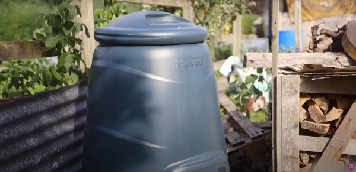
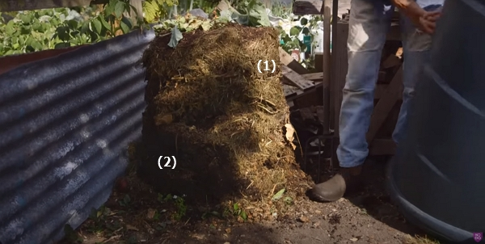
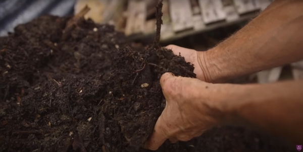

Thanks to Charles Dowding for sharing his wisdom and knowledge!
The following are the notes I took watching the video published on Charles Dowding's channel.
You can watch it using [this YouTube link](https://www.youtube.com/watch?v=2scvQgm6HFw).

_Credits: image taken from Charles Dowding's vlog_

<!-- markdownlint-disable MD033 -->
<iframe class="newsletter-embed" src="https://thetooltip.substack.com/embed" frameborder="0" scrolling="no"></iframe>

Making compost is a really useful to do.

See this article to read about Charles's [three types of heap, see how they work and the compost they make](../2022-04-20-three-types-of-heap-for-compost-charles-dowing/README.md).

In this vlog, we will review more detail about the plastic model.

## When to use one

In small gardens, there may not be space for the 3 bins made of pallets.
So, it can be that the plastic model (of about 300 L depending on the model) is your pick.

## How to get the compost out

Not from the top obviously, since this is where you put your fresh material.

The one showcased in the vlog has a bottom opening, but it is not always very practical to get compost out.

The bin shouldn't have a bottom, so simply pull up the bin to see the composting progress.

_Credits: image taken from Charles Dowding's vlog_

We can see:

- (1) : that the compost of lacking some water as the edges are quite dry.
- (2) : but some good compost of already available (in the vlog, Charles mentions it is 3-4 months old).

  

  _Credits: image taken from Charles Dowding's vlog_

## What is the heap by volume

The [heap](https://www.google.com/search?q=heap+meaning) by volume should be:

- 70-80% of fresh green materials
- 20-30% of woody material, dried leaves, paper and cardboard

## Learn more about composting

I am reviewing [all the vlogs not only from Charles](../2022-09-12-all-my-notes-on-the-videos-of-Charles-Dowding/README.md) but also other YouTubers like:

- [Huw Richards](../2022-09-12-all-my-notes-on-the-videos-of-Huw-Richards/README.md)
- or [Damien Dekarz (in French)](../../fr/articles/2022-09-12-toutes-mes-notes-sur-les-videos-de-Permaculture-agroecologie-etc/README.md) and other French sources.

Also, [Charles provides a book](https://amzn.to/3ELjByW) about his No Dig method, containing much information about composting.

<!-- markdownlint-disable MD033 -->
<iframe class="newsletter-embed" src="https://thetooltip.substack.com/embed" frameborder="0" scrolling="no"></iframe>
