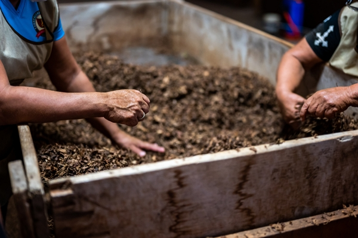

Thanks to Charles Dowding for sharing his wisdom and knowledge!
The following are the notes I took watching the video published on Charles Dowding's channel.
You can watch it using [this YouTube link](https://www.youtube.com/shorts/gVKmSO4LQ0Q).

## Can you put weeds in your compost heap

Yes. Even the ones with seeds.

## What is the catch

To kill the seeds, you will have to heat above 50-55°C to prevent the seeds to germinate.

But the roots or leaves on weeds don't.

## How do you heat a compost

You follow the proper ratio of fresh green and carbon materials with enough water (but not too much) until the compost is ready.

:::tip Tip from Charles
To keep the warmth in a pallet heap, put cardboard around the inside of the heap.
:::

<!-- markdownlint-disable MD033 -->

<i>Credits: Hero image by <a href="https://unsplash.com/@conscious_design?utm_source=unsplash&utm_medium=referral&utm_content=creditCopyText">Conscious Design</a> on <a href="https://unsplash.com/s/photos/compost-heap?utm_source=unsplash&utm_medium=referral&utm_content=creditCopyText">Unsplash</a></i>

<!-- markdownlint-disable MD033 -->
<iframe class="newsletter-embed" src="https://thetooltip.substack.com/embed" frameborder="0" scrolling="no"></iframe>
