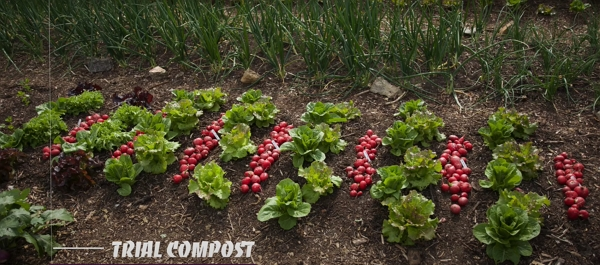

_Credits: image taken from Charles Dowding’s vlog_

Thanks to Charles Dowding for sharing his wisdom and knowledge!
I wrote the following notes watching the video published on Charles Dowding’s channel.
You can watch it using [this YouTube link](https://www.youtube.com/watch?v=XnoZ4jvrY5g).

<!-- markdownlint-disable MD033 -->

<iframe class="newsletter-embed" src="https://thetooltip.substack.com/embed" frameborder="0" scrolling="no"></iframe>

## The five composts of the trial

1. Homemade compost that is 8–10 months old

   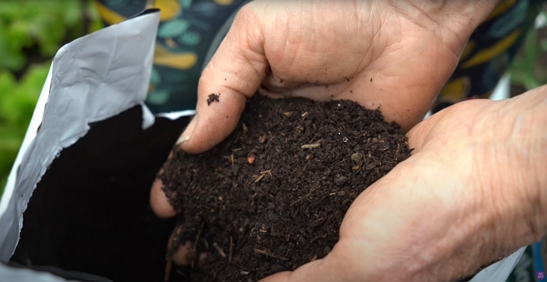

   _Credits: image taken from Charles Dowding’s vlog_

2. Purchased compost from a company called Moorland Gold in Yorkshire, UK, and there are two types: one for seeds, one for potting and container

   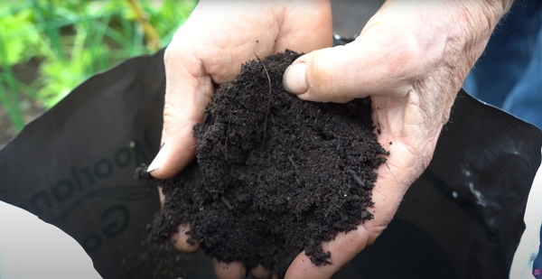

   _Credits: image taken from Charles Dowding’s vlog_

3. Some gifted compost from digestion of plant fibers to produce methane for propagation (I didn’t quite catch the name of the brand...). The compost of the byproduct of digestion.

   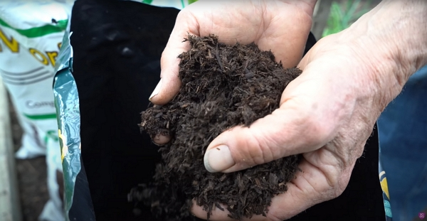

   _Credits: image taken from Charles Dowding’s vlog_

4. Some gifted New Horizon compost

   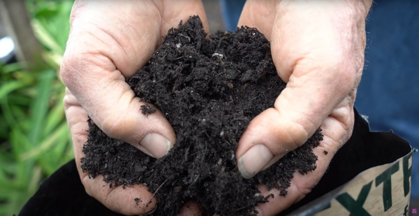

   _Credits: image taken from Charles Dowding’s vlog_

5. Worm compost

   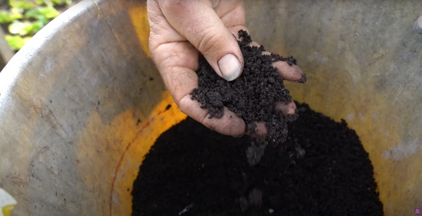

   _Credits: image taken from Charles Dowding’s vlog_

## Method used for the trial

Charles used 15-module trays.

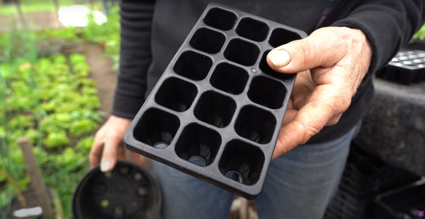

_Credits: image taken from Charles Dowding’s vlog_

I will review the vlogs from Charles about the trays later.

If you can wait, watch them now:

- [My new 60 cells and long life module tray](https://www.youtube.com/watch?v=GmWsM7odmkE)
- [New Charles Dowding module trays of 15 and 30 cells](https://www.youtube.com/watch?v=gK-Gkp_LTPc)

## What is grown in the trial

Charles is doing the trial using radish and lettuce (batavia type).

## Filling the trays

Don’t be afraid to fill them pretty full, e.g., pressing the compost into the modules so it is dense.

Why? Because the modules are small.

## Watering

The initial watering needs to make the trays fully moist.

But after that, you don’t need to water daily. A rule would be to water enough so the compost stays humid.

The seedlings will require more watering later, as the seedlings grow.

## When will the seedlings be ready for transplanting

Radish will be ready first, about 2–3 weeks after sowing them in the trays.

Lettuce will need another week.

## Week 1 updates

Charles received some worm compost so he prepared 2 trays:

- one with this worm compost
- one with the Yorkshire compost to be able to make a proper comparison.

As for the other trays, the progress is already quite significant:

1. Homemade compost

   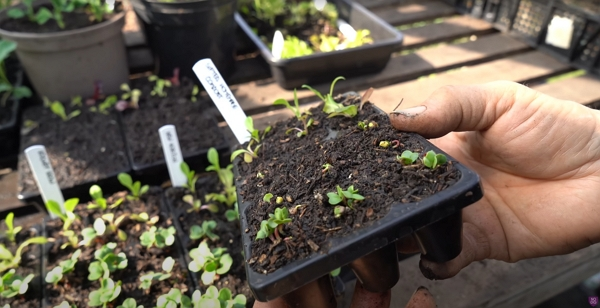

   _Credits: image taken from Charles Dowding’s vlog_

2. Moorland Gold compost

   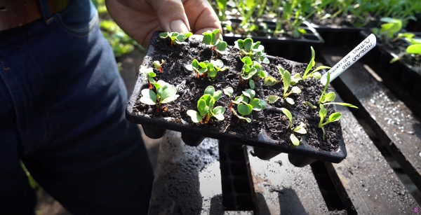

   _Credits: image taken from Charles Dowding’s vlog_

3. Digested compost

   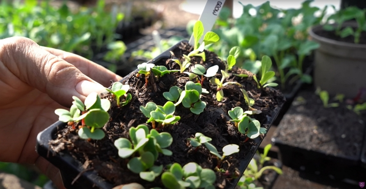

   _Credits: image taken from Charles Dowding’s vlog_

4. New Horizon compost

   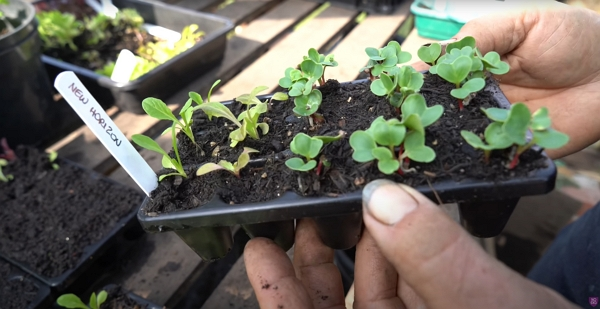

   _Credits: image taken from Charles Dowding’s vlog_

:::tip The take-out

- Not much difference between the Yorkshire digested and New Horizon compost
- The homemade compost isn’t totally successful, probably caused by too much woody material, according to Charles humble opinion. Maybe it is too young.

:::

## Week 3 updates

### Moorland compost vs. worm compost

After 11 days, the Moorland compost has a small advantage.

But both trays show that the radishes are ready to transplant!

## The trial

1. Homemade compost

   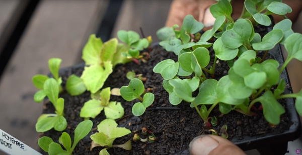

   _Credits: image taken from Charles Dowding’s vlog_

2. Moorland Gold compost

   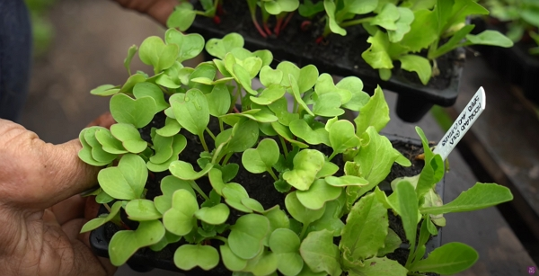

   _Credits: image taken from Charles Dowding’s vlog_

3. Digested compost

   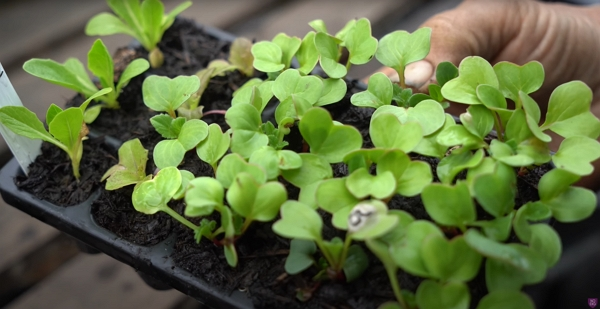

   _Credits: image taken from Charles Dowding’s vlog_

4. New Horizon compost

   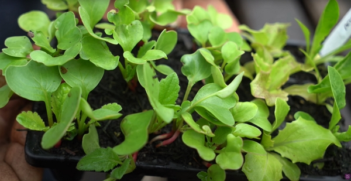

   _Credits: image taken from Charles Dowding’s vlog_

:::tip The take-out

- The homemade compost is caught up, but Charles is not sure what happened to the middle row of radishes, maybe some lack of water.
- The digested compost indeed doesn’t look to have progressed as much and the color isn’t as green as the rest.
- The Moorland Gold compost give out bigger seedlings, while the New Horizon shows more green plants.

:::

## Week 8 updates

Five weeks after transplanting in the bed, here are the results:

### The radishes

| Compost               | Harvest (grams) |
| --------------------- | --------------- |
| Homemade              | 715             |
| Moorland Gold seed    | 1250            |
| Moorland Gold potting | 1100            |
| Digested              | 800             |
| New Horizon           | 1020            |

For the worm compost vs. Moorland compost:

| Compost               | Harvest (grams) |
| --------------------- | --------------- |
| Worm                  | 875             |
| Moorland Gold potting | 750             |

Here are the pictures of the harvest, compost by compost:

1. Homemade compost

   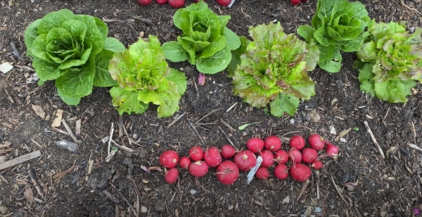

   _Credits: image taken from Charles Dowding’s vlog_

2. Moorland Gold compost

   For the seed compost:
   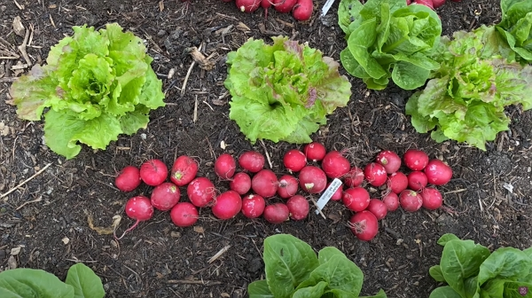

   _Credits: image taken from Charles Dowding’s vlog_

   For the potting compost
   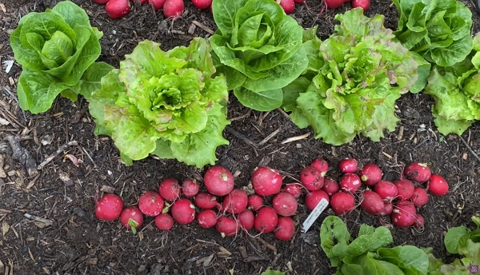

   _Credits: image taken from Charles Dowding’s vlog_

3. Digested compost

   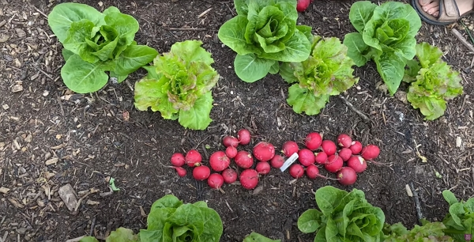

   _Credits: image taken from Charles Dowding’s vlog_

4. New Horizon compost

   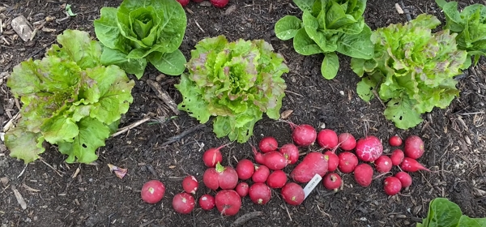

   _Credits: image taken from Charles Dowding’s vlog_

5. Worm compost vs. Moorland Gold potting compost

   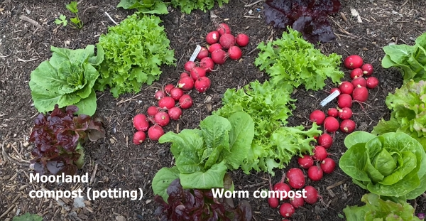

   _Credits: image taken from Charles Dowding’s vlog_

:::tip The take-out

- The worm compost shows less slug damage than the others.
- The Moorland Gold compost is good, followed by the New Horizon compost!
- The homemade compost produced less, probably caused by the initial slow growth of a row of radishes.

:::

### The lettuces

| Compost               | Harvest (grams) |
| --------------------- | --------------- |
| Homemade              | 440             |
| Moorland Gold seed    | 260             |
| Moorland Gold potting | 360             |
| Digested              | 290             |
| New Horizon           | 340             |

For the worm compost vs. Moorland compost:

| Compost               | Harvest (grams) |
| --------------------- | --------------- |
| Worm                  | 220             |
| Moorland Gold potting | 360             |

:::tip The take-out

- The homemade compost produced much better for the lettuces than the radishes, even if the seedlings weren’t looking as big as for the other composts.

:::

## Conclusion

All compost did pretty well, overall.

We can see some differences, with some lettuces lost (not due to compost but more from the seedling used).

Also, remember that the soil of Charles’s garden is quite rich and fertile. I wonder how in proportion he uses his homemade compost versus the Moorland Gold he buys.

## Generic notes

### When to prick lettuce seedlings into modules

Usually, it should be done when it is at the 2-leaf stage.

### How long can we use purchased compost

A compost purchased is good for the year of purchased and the following, from Charles’s experience.

### Sowing compost vs. potting compost

The usual difference between sowing compost and potting compost is that the seed compost usually has some sand in it for better draining.

### Do you really need sowing compost for seedlings

According to Charles’s experience, it doesn’t make a big difference, apart from the
price...

<!-- markdownlint-disable MD033 -->

<iframe class="newsletter-embed" src="https://thetooltip.substack.com/embed" frameborder="0" scrolling="no"></iframe>

