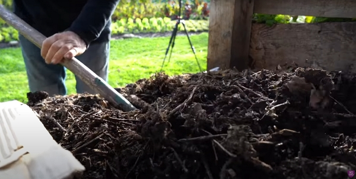
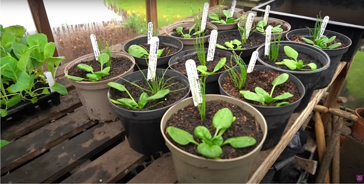

_Credits: image taken from Charles Dowding's vlog_

Thanks to Charles Dowding for sharing his wisdom and knowledge!
The following are the notes I took watching the video published on Charles Dowding's channel.
You can watch it using [this YouTube link](https://www.youtube.com/watch?v=jt4azBLuJrc).

<!-- markdownlint-disable MD033 -->
<iframe class="newsletter-embed" src="https://thetooltip.substack.com/embed" frameborder="0" scrolling="no"></iframe>

## Trial setup

Charles has 12 pots of different mixes of compost with spinach and spring onions.

_Credits: image taken from Charles Dowding's vlog_

There are:

- 3 pots of 9-months old homemade compost of sived at 4 mm
- 3 pots of 2-3 years old woodchips compost of sived at 4 mm
- 3 pots of Moorland Gold compost
- 2 pots of mushroom compost
- 1 pots of just soil

3:36
