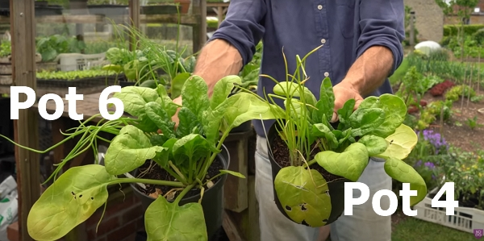

_Credits: image taken from Charles Dowding's vlog_

Thanks to Charles Dowding for sharing his wisdom and knowledge!
The following are the notes I took watching the video published on Charles Dowding's channel.
You can watch it using [this YouTube link](https://www.youtube.com/watch?v=jt4azBLuJrc).

<!-- markdownlint-disable MD033 -->
<iframe class="newsletter-embed" src="https://thetooltip.substack.com/embed" frameborder="0" scrolling="no"></iframe>

## Trial setup

Charles has 12 pots of different mixes of compost with spinach and spring onions.

_Credits: image taken from Charles Dowding's vlog_

There are:

- Pots 1 to 3: 3 pots of 9-months old homemade compost of sived at 4 mm

  - pot 1: the first pot is filled with 100% homemade compost
  - pot 2: the second pot is filled with 25% of worm compost and 75% homemade compost
  - pot 3: the third pot is filled with less worm compost, a little bit of seaweed and homemade compost

- Pot 4 to 6: 3 pots of 2-3 years old woodchips compost of sived at 4 mm

  - pot 4: the first pot is filled with 100% woodchip compost
  - pot 5: the second pot is filled with 30% of worm compost and 70% woodchip compost
  - pot 6: the third pot is filled with 50% of worm compost and 50% woodchip compost

- Pot 7 to 9: 3 pots of Moorland Gold compost

  - pot 7: the first pot is filled with 100% Moorland Gold compost
  - pot 8: the second pot is filled with 30% of woodchip compost and 70% Moorland Gold compost
  - pot 9: the third pot is filled with 25% of worm compost and 75% Moorland Gold compost

- Pots 10 to 11: 2 pots of mushroom compost

  - pot 10: the first pot is filled with 100% mushroom compost
  - pot 11: the second pot is filled with 25% of worm compost and 70% mushroom compost

- Pot 12: 25% worm compost and 75% regular soil
- Pot 13: 100% regular soil

## Day 16 updates

_Credits: image taken from Charles Dowding's vlog_

First, the pots are relatively small for the plants growing, therefore, the nutrients might run low at some stage.
It will be interesting to see how the plants will handle it.

### Pots 13 and 12: pure soil with worm compost

_Credits: image taken from Charles Dowding's vlog_

The spring onion is looking better in the pot 13 compared to the pot 12, even though the latter has 25% worm compost...
Still, the spinach has a darker color in the pot 12.

### Pot 4 to 6: woodchip compost and co

Surprisingly, pot 4 (100% woodchip compost) is doing well, even if, historically, the wood usually takes out more out of the plant.
It even has the best looking onions.

Pot 5 and 6 show a difference in the size of the spinach (larger in pot 6 and the largest so far).

### Pot 10 and 11: mushroom compost

_Credits: image taken from Charles Dowding's vlog_

Apparently, the mushroom compost isn't very successful.

Why? When the mushroom compost was very young, still hot and dry. Also, the compost is holding water much more than the rest, and the roots are probably being axphixied...

### Pot 1 to 3: homemade compost and co

Again, the homemade compost, pure or with mix of worm compost, the results are not as Charles expected.

### Pot 7 to 9: Moorland Gold compost

It is doing pretty well, and actually it does better with less worm compost, probably because the Moorland Gold compost is already pretty rich.

The spinach is the darkest one in pot 7 and 9.

## Day 30 updates

The progress is producing very interesting results:

- In pot 7 (100% Moorland Gold compost), the spinach is getting yellow which mean the nutrients are running low.
- In pot 9 (25% of worm compost and 75% Moorland Gold compost), the onions are much bigger

  

  _Credits: image taken from Charles Dowding's vlog_

- Pot 5 (30% of worm compost and 70% woodchip compost) even outperformed pot 7

  

  _Credits: image taken from Charles Dowding's vlog_

- Pot 12 (Soil with worm compost) outperformed pot 13 (Pure soil)

  

  _Credits: image taken from Charles Dowding's vlog_

- Comparing pot 4 (100% woodchip compost) to pot 6 (50% of worm compost and 50% woodchip compost), the former isn't looking as brilliant as on day 16, with a spinach looking yellow while the onion is OK. However, we clearly see the benefits of added worm compost in pot 6.

  

  _Credits: image taken from Charles Dowding's vlog_

- Pot 5 and pot 6 are interesting to compare because, _to me_, it looks like 50% worm compost seems to produce a worse result than 30% worm compost

  

  _Credits: image taken from Charles Dowding's vlog_

- Pot 10 and 11 are giving a lesson: the plants will struggle at first, but they can come out good. Actually, these pots are the best looking spinach on day 40!

  

  _Credits: image taken from Charles Dowding's vlog_

- Pot 1 is showing another lesson: homemade compost has again won with the best looking spinach in size even if it didn't start out well (the onion is showing the sequels...).

  

  _Credits: image taken from Charles Dowding's vlog_

_21:15_

## General notes

### Do we need to add anything for drainage in the mix to grow vegetables

We are talking about vermiculite or feeds or amendments.

Charles rarely use vermiculite: only for lettuce and basil.

When you are making seedlings, starting from a seed, it could make a difference. But at the stage of growth of the picture below, it won't.

_Credits: image taken from Charles Dowding's vlog_

Also, when the plant is big enough, having more drainage with wash away the nutrients.

Compost is brilliant to retain nutrients.
