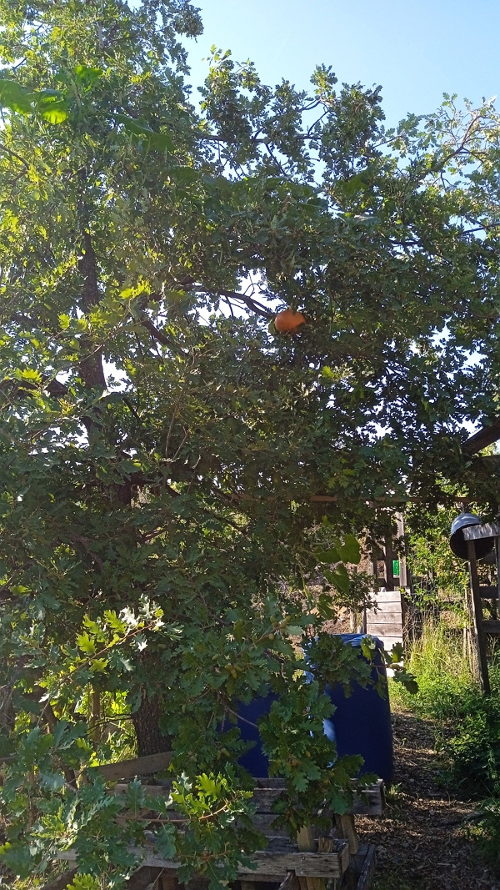
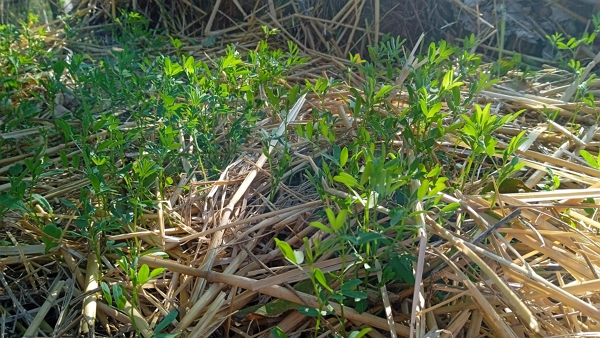

What happened in the garden in 2022? We had a lot of volunteer crops, more badgers and a very dry year overall...

Even if I didn't spend a lot of time planting, there were tasks to do in the garden!

Let's review all of that.

<!-- more -->

## Pumpkins

Only volunteer crops grew up this year, all from last year compost area, where we put lots of autumn leaves and kitchen waste.

The plants grew very well, spreading along the fence and even up the oak tree. We had a couple of _lanterns_ in the tree, as you see above ;)

The harvest was better than 2020 (when we had picked 12.274 kg). This year, we reached 17.686 kg without any planting work.

And the pumpkins were very tasty so far. You can guess we won't have much left before the winter.

## Potatoes

A lot of volunteer crops came up this year. We planted a few in the spring.

We harvested 1150 grams only.

## Lemon wort (_Lemon verbena_)

We harvested 3 times the lemon wort and we washed and dried it immediately using the solar-powered dehydrator.

I think we could have had one more if I harvested the stems earlier in June.

The quantity harvested, however, is enough for a year’s worth of herbal infusions.

## Kiwai (Actinidia arguta)

This year, the spring was mild and no frost hit the flowers of our kiwai vine.

The vine produced 220 g of fruits.

I hope next year will bring more. The vine has grown a little more.

We’re planning to buy another one to plant in the next available area for gardening.

Kiwai are high in Vitamin C, even more than the regular kiwi fruit. I didn't find a technical source, though, only a few web pages stating that fact.

## Raspberries

It was a surprise when I saw over a dozen raspberries stems shoot out from the ground in spring. The winter blanket of dead leaves has probably helped.

The stems grew tall, but we had few fruits, just enough to eat on the spot.

The dry summer burnt almost of them.

The autumn water and nice weather, however, brought them back to life!

## Black currants

We planted three plants this year and it produces a few fruits.

But like the rest, the lack of water almost killed them. However, the rain of late August brought hope and new leaves bloomed.

We can't wait for the plants to grow so we can have fruits and make tincture from the blossom.

## Comfrey

The comfrey was strong again this year.

:::danger To do
Add a picture
:::

Like all the rest, the very dry summer didn't spare the plant, but the very mild autumn so far has helped new leaves to grow.

I transplanted four young comfrey plants near the current compost area. So nice to be able to start reproduction.

## Dandelions

:::danger To do
Add a picture
:::

We had very nice and big dandelions instead of the rocket salad (that has died, I think, after 2 years of crops from the same plants). The leaves were large and lasted a few meals in the spring.

The roots are still there, so they will be back next spring.

## Nettles

:::danger To do
Add a picture
:::

They’re spreading well. It doesn't excite everyone in the family, but the roots are superficial and the top soil rather soft. So it’s easy to move the roots around.

I will probably more of them to the next composting area.

I need to nettles for all sorts of reason: as a natural fertilizer, as food in soup or herbal infusion or even tinctures.

## Tomatoes

I purchased four tomato plants. But it wasn't the year for them.

I only picked a few black cherry tomatoes and a nice pineapple tomato.

I think they lacked water in the summer, near the end of July and the beginning of August, when we weren’t there.

Even if I put in the place the irrigation, the plants had dried up when we came back. What didn't get eaten by the sheep, who made their way in the garden due to my negligence, was pretty weak...

We didn't miss the tomatoes. We didn't eat that much, even from our purchases in the local grocery store.

## Cover crops with flax-seed and green lentils

On August 12, 2022, I sowed some in different places after preparing the places with bought compost.

Then I threw the seeds by hand and recovered with soil from an old raised bed.

On August 17, 2022, I covered the sprouting seeds with hay to keep the moisture.

The lentils growed well. The goal was to enrich the soil with the green waste, but, more importantly, with the nitrogen stored by the lentils.

On August 28, 2022, this is how the lentils looked like:

## Badgers

OK, those beasts have been generating trouble for two years now...

They’re probably looking for food, and they come to the garden to plow the ground, not matter what we planted in it.

Last year, the peas had to be replanted three times!

So this year, I've planted almost nothing because I didn't take time to find a solution to repel them.

Only in September, I installed a rabbit fencing where I think the badgers are coming through. We have fenced all around the garden because of the sheep, but the badgers found a hole big enough to sneak in.

It remains to be seen if I did patch all the holes in the fence...

## Next year's plan

I would love to plant more, to start to grow more vegetables to reach some partial autonomy.

I plan

- to start planting:

  - garlic (from heads purchased at our organic grocery shop),
  - board bean (_Vicia faba L._) to eat but mainly to capture the nitrogen in the air

- then to continue with all I can plant, from lettuce, to spinach, round carrots and beets.

However, the main job is to bring better soil, maybe even purchase a large amount of compost. It’s supposed to cost 115.5 euros for about one ton of 20 mm organic-compatible compost. 75% of the cost goes into transport (renting a truck).

To be continued...

:::center
⏬⏬⏬
:::

<!-- markdownlint-disable MD033 -->

<iframe class="newsletter-embed" src="https://iamjeremie.substack.com/embed" frameborder="0" scrolling="no"></iframe>

