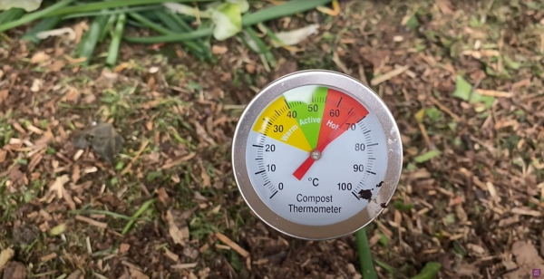

_Credits: image taken from Charles Dowding’s vlog_
Thanks to Charles Dowding for sharing his wisdom and knowledge!
I wrote the following notes watching the video published on Charles Dowding’s channel.
You can watch it using [this YouTube link](https://www.youtube.com/watch?v=VhHshAf2lpM).

<!-- markdownlint-disable MD033 -->

<iframe class="newsletter-embed" src="https://thetooltip.substack.com/embed" frameborder="0" scrolling="no"></iframe>

## Size the heap

You need to size your heap according to your garden area and how much waste you will generate from the garden.

In Charles’s case, it is big because he has a big area and in May, time of the vlog shooting, he has a lot of waste, whether it is from the garden or the mowing.

## Heat in a compost

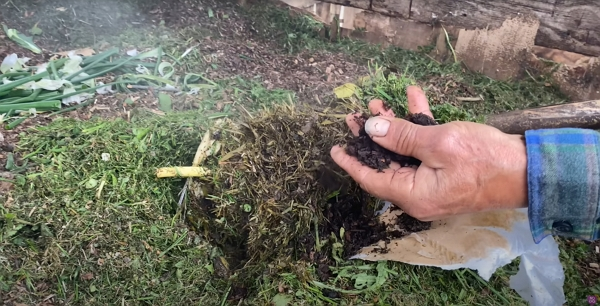

_Credits: image taken from Charles Dowding’s vlog_
Like I wrote in other vlogs, the temperature you want is:

- above 50 °C
- around 60 °C to 70 °C to kill weed seeds

Also, a high temperature will also help producing compost quickly.

To get the heat, you will need green materials, like grass, but not only.

Fresh manure and coffee-grind work as well.

## Turning compost heap

It is mandatory to turn compost from a heap to another.

You can make a good compost without turning.

## When is compost ready

At five months, it is a little bit too young.

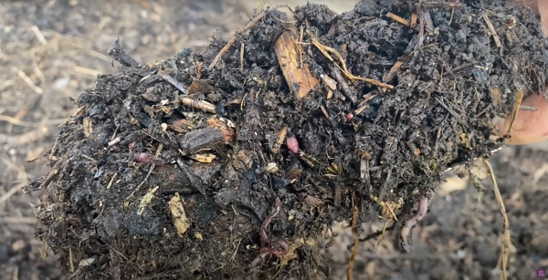

_Credits: image taken from Charles Dowding’s vlog_

In the above picture, the worms you see were not there before. They are _tiger worms_ which eggs are the materials put in to make the compost and they are helping the composting process.

However, Charles starts using compost after 7 months as the decomposition will continue on the soil.

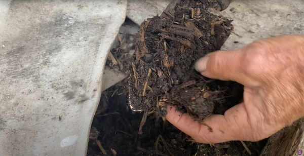

_Credits: image taken from Charles Dowding’s vlog_

## Sifting compost

Charles only uses the 4 mm sifting tray to prepare potting compost and he only uses it for potting plants.

## How much compost and when to spread it

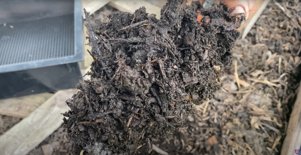

_Credits: image taken from Charles Dowding’s vlog_

Charles covers the garden areas with 2.5 cm **_once a year only_**, anytime of the year.

To make a bed, you will, of course, need a bigger depth to start off.

## Another kind of heap

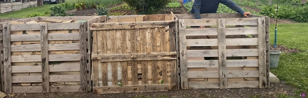

_Credits: image taken from Charles Dowding’s vlog_

You can build them out of pallets with their bottom stripped off, to make the side much lighter.

Each side is attached to the two connecting other sides with a simple wire at the top and the bottom.

The heaps sit on the ground, not tied to anything.

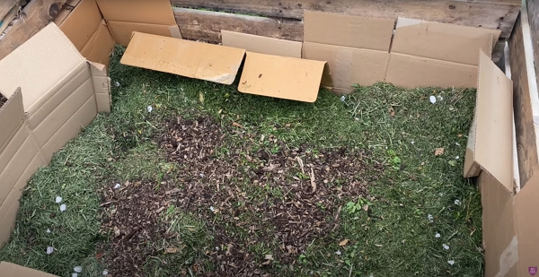

_Credits: image taken from Charles Dowding’s vlog_

Inside, you can use cardboard to keep the moisture (when it is very dry in summer for example).

You can throw simply everything.

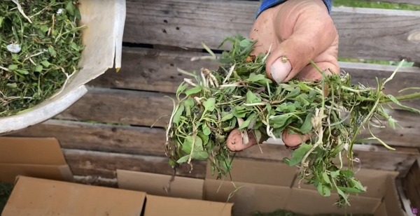

_Credits: image taken from Charles Dowding’s vlog_

Weed root can decompose without heat since you keep adding material on top of them.

A lot can go in, such as:

- vegetable waste
- banana skin
- lemon peel
- cardboard waste, as long as it contains no plastic

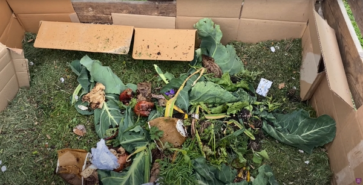

_Credits: image taken from Charles Dowding’s vlog_

For more woody or harder material, like the cauliflower stem below, you should cut it in smaller pieces.

Charles shows below how to cut the stem in the length, which is much easier.

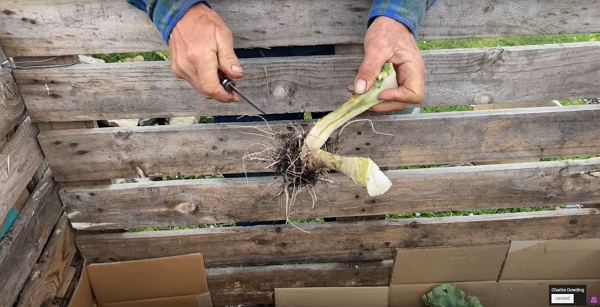

_Credits: image taken from Charles Dowding’s vlog_

Adding woody material is really good to bring more fungal activities, which then helps break down the materials.

## Life in the heaps

Wildlife, like mice, toads, frogs, will be found in the heaps.

Also, worms will multiply and work hard to decompose the compost more and more.

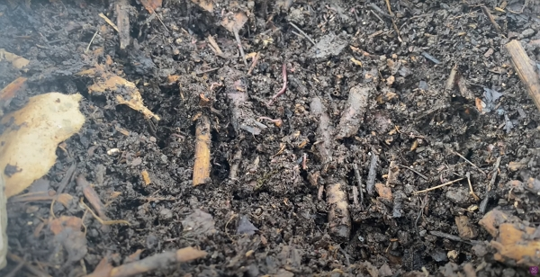

_Credits: image taken from Charles Dowding’s vlog_

## Woodchip composting

It is much harder to decompose woodchips. Charles did another vlog about a solution. Use the tag _woodchip_ to find the notes I will have taken in the near future.

## Worm farm

Charles has a slow worm (_Anguis fragilis_) in a worm farm.

Apparently, it eats slugs!

Charles bought 4 kg of worms but it is necessary.

Worm compost is really good for potting.

Go read the notes I took from the trials Charles did that showed how worm compost in the proper amount helped:

- [Compost Testing and Final Result](../2022-10-23-compost-testing-and-final-result-charles-dowding/README.md)
- [Comparing different composts for propagation](../2022-10-21-comparing-different-composts-for-propagation-charles-dowding/README.md)

<!-- markdownlint-disable MD033 -->

<iframe class="newsletter-embed" src="https://thetooltip.substack.com/embed" frameborder="0" scrolling="no"></iframe>

