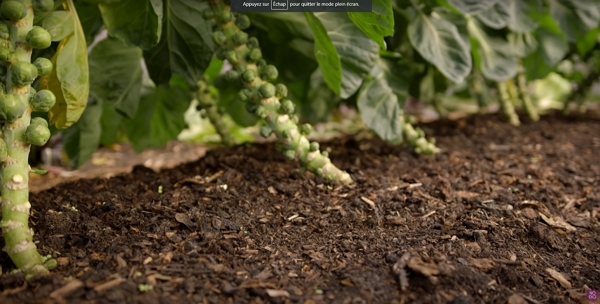
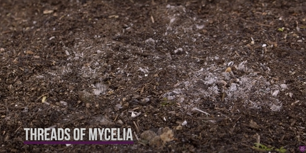
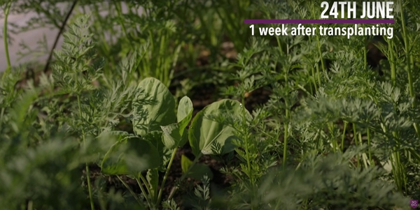
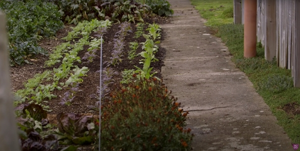
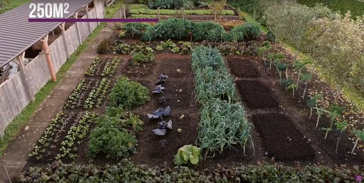
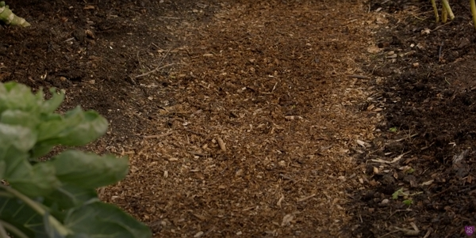
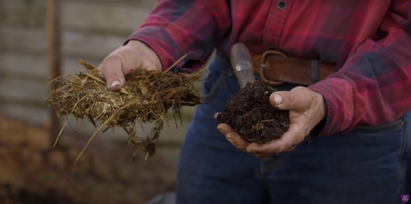
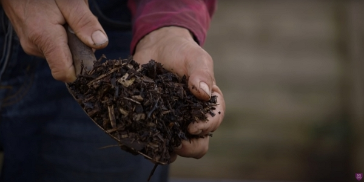

Thanks to Charles Dowding for sharing his wisdom and knowledge!
The following are the notes I took watching the video published on Charles Dowding's channel.
You can watch it using [this YouTube link](https://www.youtube.com/watch?v=s71f18ila1c).

<!-- markdownlint-disable MD033 -->
<iframe class="newsletter-embed" src="https://thetooltip.substack.com/embed" frameborder="0" scrolling="no"></iframe>

We will look into the misunderstandings and questions about compost and spreading it.

## What is the best time to spread compost

This question leads to the misunderstanding that nutrients leach out of compost. They do not.

Compost is not fertilizer.

Compost feeds soil life and helps build the mycelia threads benefical for the soil and plants, like you can see below.

They make available the nutrients which sits there unsoluble in water.

You can spread the compost in autumn to please the soil the most.
And you can apply the compost around existing crops.

## How much compost

Charles put every year 2.5 cm, but it is close to 2 cm.

Putting the compost in the winter also is benefical to grow two different crops a year.

It makes the gardener much easier.

## Why the soil level barely rises

Charles has been doing this for 10 years, with an initial dose of 10 cm.

The compost is eaten all the time, so the levels of the bed are not rising.

Compost is not soil.

## In a 16th of acre, how much compost do you need

You will need 4 cubic meters, which is 2.4 tons.

Charles actually details that you don't spread compost the whole area.

For example, the pathways can be woodchips or tiles.

In the end, it is more about two third of the area.

## What does well rotted compost mean

First, a compost doesn't need to be perfect.

Wood pieces are for fungal life.

## What kind of compost

You will have:

- homemade, of about 1 year old, depending on how much woody parts you have in it.
- green waste, that you need to age to yield a good result.
- manure is food for the soil, but again, try not to use it fresh or use it in a thin layer. It is not technically compost as a fresh product, but becomes one after a year of maturation

  

- woodchip, can become compost, but it will require a lot of time so the wood is well decomposed. _Remember_, the woodchip below will look like wood after being washed by rain.

_14:41_
