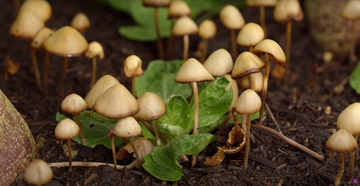

Thanks to Charles Dowding for sharing his wisdom and knowledge!
The following are the notes I took watching the video published on Charles Dowding's channel.
You can watch it using [this YouTube link](https://www.youtube.com/watch?v=BIV4lljN6Aw).

<!-- markdownlint-disable MD033 -->
<iframe class="newsletter-embed" src="https://thetooltip.substack.com/embed" frameborder="0" scrolling="no"></iframe>

Growing vegetables can be all about compost.

So how to make it and use it?

## It doesn't need to be fine and perfect

Compost can contain bits and piece, even some wood, as long as it is not too large.

It will provide the nurishments for fungal life.

You will see tiger or red worms, which are present in the final decomposition phase of the compost. It is a good indicator that your compost nears readiness.

You never see them before the temperature in low enough for them to settle in.

## Do you need solid sides on your heap

Solid seem to work best, according to Charles's experience.
