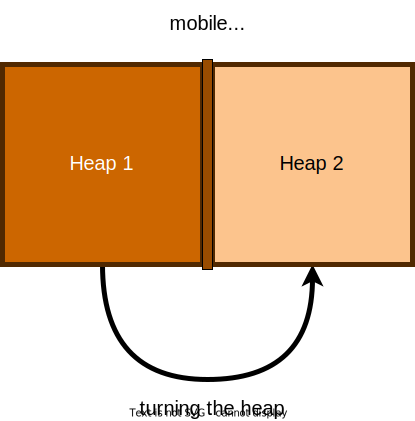

Thanks to Charles Dowding for sharing his wisdom and knowledge!
I wrote the following notes watching the video published on Charles Dowding’s channel.
You can watch it using [this YouTube link](https://www.youtube.com/watch?v=BIV4lljN6Aw).

<!-- markdownlint-disable MD033 -->

<iframe class="newsletter-embed" src="https://iamjeremie.substack.com/embed" frameborder="0" scrolling="no"></iframe>

Growing vegetables can be all about compost.

So how to make it and use it?

## It doesn’t need to be super thin and perfect

Compost can contain pieces, even some wood, as long as it isn’t too big.

It will provide the nourishment for fungal life.

You will see tiger or red worms, which are present in the final decomposition phase of the compost. It’s a good indicator that your compost nears readiness.

You never see them before the temperature in low enough for them to settle in.

## Do you need solid sides on your heap

Solid seem to work best, according to Charles’s experience.

## What wood

Charles uses Douglas wood planks, thick enough to hold the pretty big heaps.

## Do the heaps need to be in the sun or shade

It doesn’t matter at all, as the heat comes from the breaking down of the material in the heap.

It isn’t the sun that will make your compost hot.

The roof on Charles’s large heaps is to keep the rain off.

Why? To make compost, you need air. If the compost is too soggy, no or little air is present in the heap and that will prevent the battery and the life in the compost to do their work.

## How often should I turn my compost heap

Turning isn't necessarily done often. It will help giving the heap some air.

Charles turns it once.

His heaps make it easy to transfer the content of a first heap into its neighbor.

Charles has a mobile divider between the heap so he can transfer the content easily.

## Do you need to layer the content of the heap

Layering helps to make it easier to have a good balance of green and brown material (the 1/3 brown to 2/3 green ratio).

## Can you put on weed root

Yes, you can.

## What about rats

They will like the warmth of the heap, and Charles isn’t overrun by rats so he can’t give much advice about it.

Maybe it’s because cats or wildlife like weasel eat the rats ([see a filmed attack at Homeacres at 8:23](https://youtu.be/BIV4lljN6Aw?t=503)).

It tells us that the ecosystem of the garden isn’t just vegetables and flowers.

## Conclusion

The presentation of Charles’s method is showing us that the goal is to impact the least natural processes.

With the heap, we just accelerate the decomposition in balance with the nature around us.
