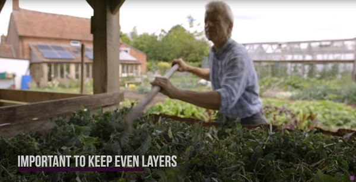

Thanks to Charles Dowding for sharing his wisdom and knowledge!
I wrote the following notes watching the video published on Charles Dowding's channel.
You can watch it using [this YouTube link](https://www.youtube.com/watch?v=ZtMsEylZvqw).

<!-- markdownlint-disable MD033 -->
<iframe class="newsletter-embed" src="https://thetooltip.substack.com/embed" frameborder="0" scrolling="no"></iframe>

Building a heap of composite is an art.

It is difficult to be too scientific about it and the quantity of the materials one is adding vary all the time.

No two gardens are the same. So the materials you will have will not be the same as Charles or I add.

That'll be perhaps broadly similar but you will always find subtle differences. So don't worry too much about being precise.

## Ratio of green and brown

The mix of green and brown should be at least half green and half brown.

But what is green and what is brown?

## Comment about carbon to nitrogen balance

It is often talked about in books.

And it confuses things because the proportion given is two parts of carbon to one part of nitrogen.

So it is more a ratio of 33% green to 66% of brown.

Very few things are pure green and similarly to brown material.

## Definition of green

What is _mostly_ green? Here is a sample list:

- All fresh leaves
- Vegetable peelings
- Kitchen waste
- Weed leaves
- Young tree leaves
- Fresh manure
- Coffee grounds
- Urine

## Definition of brown

What is _mostly_ brown? Here is a sample list:

- Woody materials
- Old stems
- Prunings
- Dry tree leaves
- Soil
- Wood ash
- Paper
- Cardboard

## What is ok to put diseases material on the compost heap

It is ok to put on vegetable leaves with mildew for example.

There is no doubt to Charles that it doesn't cause a problem to the finished product in the end.

He has used blighted potatoes leaves, rust of garlic or leeks and all went in the heap.

For the case of blight, the disease needs living tissues and when the waste green of the plant goes on the heap, the disease will not longer persist.

## Filling the heap

You can put seed on the heap, but put it in the middle where you get the most heat, warranting to kill the seeds.

You can put on thistle in as well.

A lot of myths exist about what can and what can be put in the heap which are generally accepted. Charles doesn't know where it comes from, but he hasn't found out them to be true.

_5:13_
