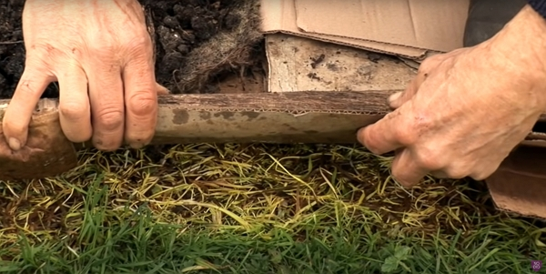
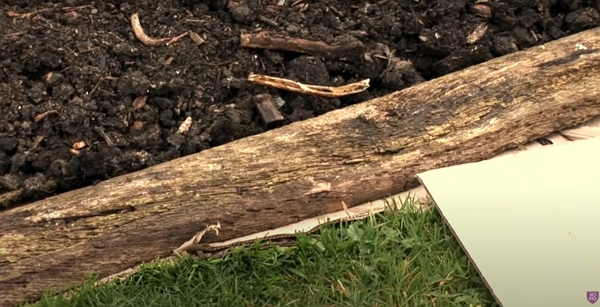

Thanks to Charles Dowding for sharing his wisdom and knowledge!
I wrote the following notes watching the video published on Charles Dowding's channel.
You can watch it using [this YouTube link](https://www.youtube.com/watch?v=0LH6-w57Slw).

<!-- markdownlint-disable MD033 -->
<iframe class="newsletter-embed" src="https://thetooltip.substack.com/embed" frameborder="0" scrolling="no"></iframe>

In this vlog, Charles explains how to start No Dig.

## Definition of mulch

Mulch is anything that covers the surface you apply it to in order to keep the light out.

## Where to start the No Dig bed

It can be a very weedy area, a lawn.

## What do you need

You will need:

- cardboard, because it is the cheapest covering material
- wool
- compost

If you don't have any weed, you are rare lucky person. Most of us will start from a weedy patch of land.

In the following notes, we will see how Charles will free us so much time in our gardening.

Weeding is killer and all the time used to weed is not the time to grow strong and healthy vegetables.

And Charles's method leaves the soil undisturbed, which is essential for a life-riched soil.

The weeds are not pulled, they stay there and eventually, they give up growing.

Charles put it nicely: if you try to dig out the weed, they will be hurt but they will have _the will to grow more_ and you will harm your soil.

### About the cardboard

You can find easily for free. But:

- use a brown cardboard, not the shiny ones that contain plastic
- remove the tape and staples, if any
- avoid cardboard with ink, unless you are sure it is vegetable-based ink.

## How to build a No Dig bed

### The first application

You will need to delimit your bed area and the pathways.

Then apply a layer of cardboard over it, making sure there is no gap. Indeed, the weeds will find their way if you are wary about the cardboard position.

It is really important to make sure the cardboard overlap generously to prevent light to reach the craving weeds underneath.

### What compost to use

Fresh manure is not recommended. Even well rotted cow manure doesn't perform as well as his homemade compost, Charles find.

Remember the goal is to be able to sow in straight away.

You can use:

- Green waste compost: it comes from general garden waste, debris, prunnings, etc.
  - This compost is usually darker and its performance is not quite as good as homemade compost
- Homemade compost: it comes from general garden waste, fibres, prunings, wood, etc.
  - It doesn't look as fine as the green waste compost. Also, you don't need sift it.
- Mushroom compost: it needs to be well decomposed. Charles didn't say much about how it is made, so I ask in the vlog's comments section.

Spread a 10 cm layer of compost on top of the cardboard.

Don't hesitate to firm the compost with your feet. In fact, it does need to be firm, not loose nor compact. But the great thing about compost is that it can't be compact.

To contain the compost in the bedding area, you can use wood framing.

The issue that can arise is getting hold of a lot of compost. It is tricky, but have a read of my other notes I took from Charles's videos on the topic of compost.

You will need to hunt for the materials in your neighborhood. You will be surprised how much waste people will be delighted to give away for free.

### Pathways around the beds

The easiest and cheapest way to do it is to use woodchips, decomposed or not, it will feed the soil life.

They will dig for you but in a much more gentle manner, keeping the carbon dioxyde in the ground, whereas when you dig, you release carbon dioxyde...

### Maintain an edge

An edge is anything that cover about 20 cm extra more space than you bed is taking.

It will help to keep the grass to jump the rich soil of your bed.

You can use small wood beams and cardboard like show below.

### You need up to 3 or 4 cardboard applications

When the weeds start to grow through the first layer of cardboard on the pathways, it is time to pull the weeds, if it is easy, and apply another layer of cardboard.

Always make sure to overlap the piece of cardboard.

Each layer is applied about every 6 weeks, unless the weeds have died.

### Tire out the weeds by removing the small shoots

It is possible to remove all weeds with time and patience.

Patrol around the garden where you put the cardboard, pull out the young shoots of weeds and the parent root will die at one point.

It can take a few years however to tire out some of the strongest weeds like the bindweeds.

It is achievable and you need to be patient.

## Using soil on a new bed

Charles doesn't really use soil when he builds a new bed because vegetables grow much better in compost.

## Use propagation to give the best start to seedlings

Charles recommendes not to sow directly in the ground because it is vulnerable.

Propagation means sowing the seed or multi sown seeds in a module until the seedling is big enough to be transplanted.

Charles has severable vlogs on the topics, check out the _propagation_ tag. [These notes are a good starting point](../2022-10-21-comparing-different-composts-for-propagation-charles-dowding/README.md) from a more recent vlog.

_20:15_
