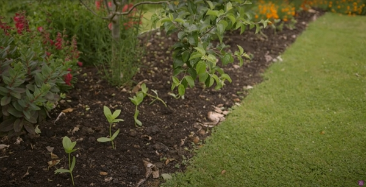

Thanks to Charles Dowding for sharing his wisdom and knowledge!
I wrote the following notes watching the video published on Charles Dowding's channel.
You can watch it using [this YouTube link](https://www.youtube.com/watch?v=IC6OBOyQ0mY).

<!-- markdownlint-disable MD033 -->
<iframe class="newsletter-embed" src="https://thetooltip.substack.com/embed" frameborder="0" scrolling="no"></iframe>

Starting no dig doesn't necessarely means requiring loads of compost.

Compost is a great entry point to grow a lot of vegetables in a small area. Also, compost provides the nutritions to the plants to provide a good harvest.

## No dig around tree

To help the development of apple tree's roots, Charles applied his nO Dig technique around existing apple trees.

Before, it will look like the picture below, with a more narrow.

After, the strip of dirt, covered with compost in larger, allowing to plant flowers and even vegetables.

