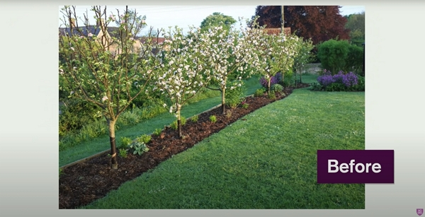

Thanks to Charles Dowding for sharing his wisdom and knowledge!
I wrote the following notes watching the video published on Charles Dowding’s channel.
You can watch it using [this YouTube link](https://www.youtube.com/watch?v=IC6OBOyQ0mY).

<!-- markdownlint-disable MD033 -->
<iframe class="newsletter-embed" src="https://thetooltip.substack.com/embed" frameborder="0" scrolling="no"></iframe>

Starting "No Dig" doesn’t necessarily mean requiring loads of compost.

Compost is a great entry point to grow a lot of vegetables in a small area. Also, compost provides the nutrition to the plants to provide a good harvest.

## No dig around trees

To help the development of the apple tree’s roots, Charles applied his nO Dig technique around apple trees.

Before, it will look like the picture below, with a narrower.

After, the No Dig strip, covered with compost, allows to plant flowers and even vegetables.

As Charles tells us often, you don’t need to wait much before planting.

## No Dig loosens the soil

With the No Dig method and using compost, the soil is already loose.

How? With all the dead weed roots left in the soil, you find out that air is present and the compost in coming feed the life thriving. Your vegetables therefore benefit from all that.

In the scenario that Charles showcased in the vlog, I’d say he uses about 2 to 3 cm of compost on top of the usual cardboard.

When it comes to grow a lot more vegetables, you will need more compost indeed.
However, because you need less ground to grow your vegetables, you will need less compost.

## My plan

I’m planning to purchase about a ton of _green compost_ to go further into the No Dig method.

However, I’ll need to pay 26 euros per ton, but transportation and accessibility to my property require that I rent a truck for 75 euros for half a day…

One ton of that compost will equal to 2000 liters. The equivalent surface area represents 20 m² with a 10 cm layer of compost. It feels like nothing, but a bed of 2 meters by 10 meters provides a lot of places to grow vegetables.

Then remember that the vegetables you grow will produce waste that you can compost to make your own compost.
