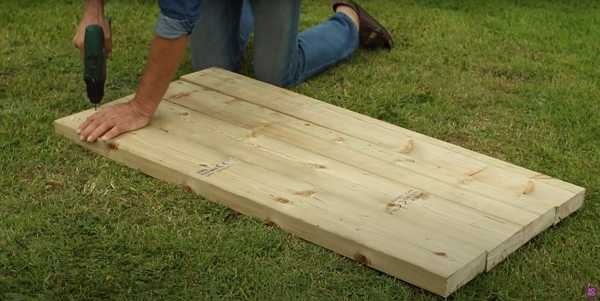
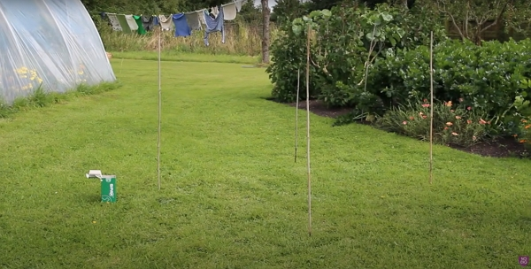
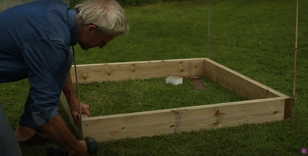
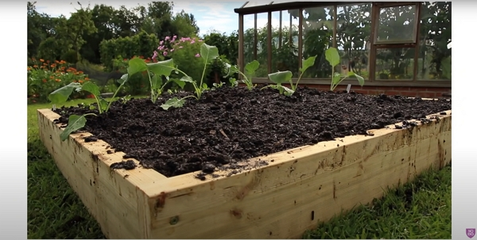
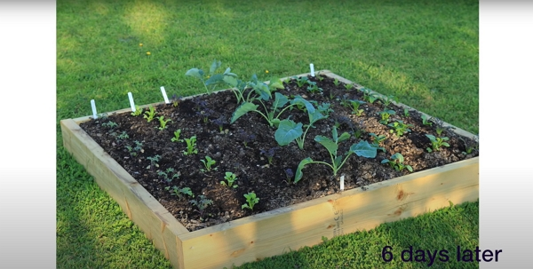
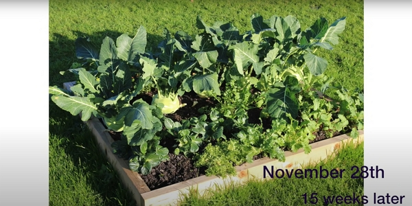

Creating a raised bed with no dig is easy. Let's look how it is done.

Thanks to Charles Dowding for sharing his wisdom and knowledge!
I wrote the following notes watching the video published on Charles Dowding's channel.
You can watch it using [this YouTube link](https://www.youtube.com/watch?v=OIojWdJz0RE).

<!-- markdownlint-disable MD033 -->

<iframe class="newsletter-embed" src="https://thetooltip.substack.com/embed" frameborder="0" scrolling="no"></iframe>

## Materials

You will need to:

- two pieces of wood: 2.4 meters long, 5 cm thick and 15 cm tall.
- eight screws in stainless steel of 80 mm in length.

## Construction instructions

1. Cut in half each piece of piece of wood
2. Drill 2.5cm deep holes on one end only of the 1.2 m long wood pieces.

3. Choose where you will want the bed to be.

4. Screw each piece of wood to each other using two screws peer corner.

5. Fill the bed with the least decomposed compost. It won't fill the bed completely. You will want to firm it up with a shovel.
6. Apply the second layer with a more mature compost (10 month old for Charles's compost). Firm it up again.
7. Finish with the most mature compost (16 month old in the vlog).
8. Plant your seedlings
9. Water the seedlings depending on the season and your climate.

## Tips about planting

For seedlings with long stems, plant them deep.

You can plant carrots and radishes in the same trench.

<!-- markdownlint-disable MD033 -->

<iframe class="newsletter-embed" src="https://thetooltip.substack.com/embed" frameborder="0" scrolling="no"></iframe>

