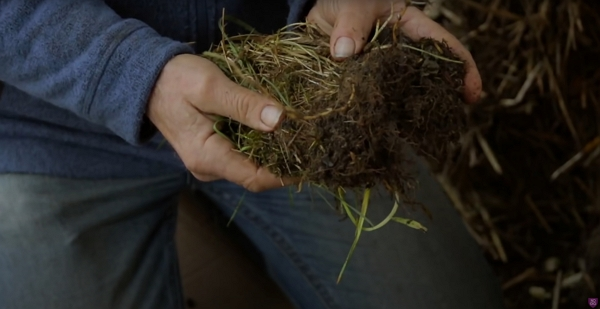
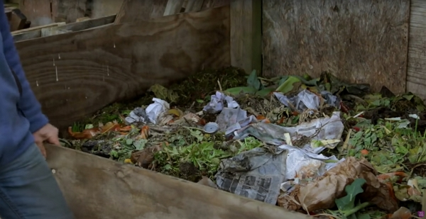
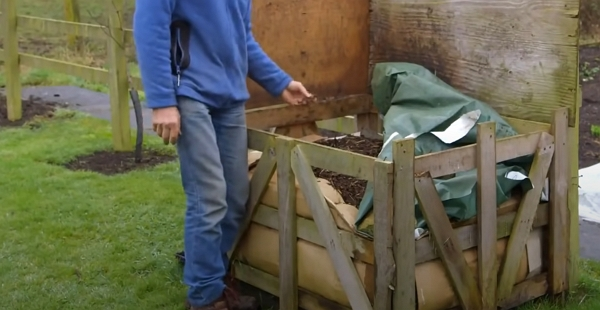
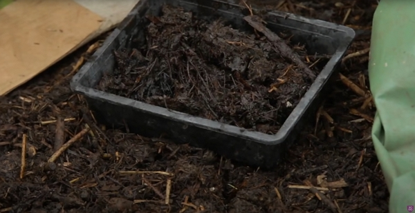

The joy of compost is that you can turn any waster, even other people waste into soil food.

Thanks to Charles Dowding for sharing his wisdom and knowledge!
I wrote the following notes watching the video published on Charles Dowding's channel.
You can watch it using [this YouTube link](https://www.youtube.com/watch?v=Kf6CGj7xpFE).

<!-- markdownlint-disable MD033 -->
<iframe class="newsletter-embed" src="https://thetooltip.substack.com/embed" frameborder="0" scrolling="no"></iframe>

Even in winter, you can do it, so let's look how and what.

## What can you compost

Well, almost anything with no plastic, industrial wax.

Compost heaps are amazing alchemical processes that degrade pretty much everything.

For example:

- Putting on the heap citrus is not very popular or even not recommanded. Charles composts them.
- Kitchen waste is usually more _green_ material than _brown_.
- Wood ash to the contrary is very much a _brown_ material.
  - Charles recommands to put it on the heap rather than directly on the garden beds to use the full potential of the potass as it is transformed in the heap.
- Stacks of vegetables (like cabbage) need to be cut into small pieces.
  - The goal is to maximize the surface area that the bacteria will used to degrade the material.
- Fresh shredded wood is similar and is a woodier material.
- Coffee ground is not compost until you put it on the heap.
  - It is considered a green material.
  - Also, it is not acidic, as some say. In fact, the pH is 6.8 on average.
- Vegetable leaves, especially when they turn yellow.
  - Leaves turning yellow stop contributing to the plant's development and, as they fall, the slugs will get involved. You don't want that to happen.
- Weeds are scary, but when you can compost it.
  - When you pull the weeds, you will get the brown from the soil that will come with it
  - Also, it is often said not to compost perrenial weeds. In fact, if you continually add material to the heap, the roots of weeds you pulled will die.
  - The heat will speed up the process to kill them.
- Straw, if you have an organic

Charles simply say to balance material with half green and half brown.

## Winter compost vs Summer compost

The summer brings more green material.

In the winter, the brown material dominates more.

Charles layers the material on the heap so there is air thanks to the brown material to help the green material to degrade.

## Heat in the compost heap

You can make cool compost, heat is not a requirement but it speeds the transformation of the materials into compost.

Between 55 °C and 70 °C, you have got what it needs to:

- kill weed seeds
- create a good environment for bateria and fungi

## How do you know the heap is finished

Or in other words, when do you know you need to fill up another heap?

You can go on a long time if you don't add a lot frequently.

That's when the sizing of the bay is important: it is better to have a smaller bay that you fill quickly than a bay too large that never gets filled.

Charles's three-quarter of an acre garden provides a lot of materials and his 6 1.5 mm by 1.5 m bays are being filled easily.

One of his bays can contain one ton of compost.

He turns the compost once from the bay that was filled into the its neighbor.

## What options for container

When you can't build a structure as big as Charles or if you don't need so a large structure, use wood pallets.

You just need to cover the sides with cardboard to keep the moisture.

## Consistency of the compost

Also, to keep the rain out, use a farmer plastic cover that sometimes they throw away.

:::danger Very important
You want your compost to be moist, not wet. If it is too wet, air is absent and bacteria can't thrive in anaerobic environment.

**It is often the missing ingredient of a compost heap!**

:::

:::tip How to check moisture
To check:

- Pick up a handful of compost
- Squeeze it really hard

If no more than two drops fall off your hands, the moisture is a good.

**Don't just use the look of the compost to judge the moisture levels**
:::

## What about the color

A dark brown is better than a jet-black in regard to the compost's color.

Green waste compost is often very black because it was very hot and it might not be a good news. The level of microbes and micro-organisms is probably low.

Well-rotted cow manure can make nice compost and it is less dark than the green waste compost.

Finally, the homemade compost with a very good balance of green and brown gives a lighter shade of brown compoared to the cow manure compost

## Turning compost

Its purpose is to introduce new air in the compost and it doesn't need to be done regularly.

For example, when the heap is really full and of a brown color, you can turn it into another heap, like Charles does.

Turning is also the opportunity to break down the lumps.

Turned compost is left alone for another few months.

Sifting the compost is not a must. When you want to use it for your potting, then sifting is necessary for obvious reasons.

## Myths of compost

The following myths are more annoying than anything else:

- Seperating material that are said not to go on the heap (ex: root of perrenial weeds, citrus)
  - Instead, cover them well so they can grow in the heap and you will be fine.
- Diseased vegetable leaves
  - The diseases, like blight, can't survive without a living host
- Heat is a must
  - No, like I wrote above, it is a bonus. You can make great compost with no heat.
