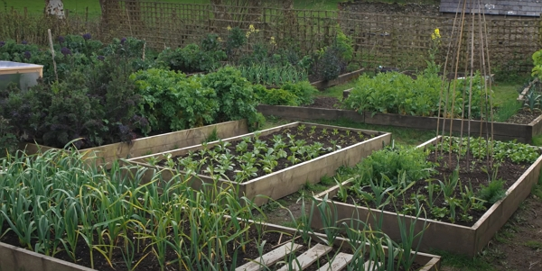
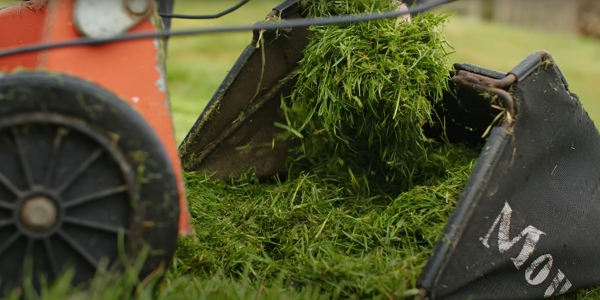

Making your own compost is key to self-sufficiency and Huw will provide us with a few tips.

Thanks to Huw Richards for sharing his wisdom and knowledge!
I wrote the following notes watching the video published on Huw Richards's channel.
You can watch it using [this YouTube link](https://www.youtube.com/watch?v=xbwVlBzAGZU).

<!-- markdownlint-disable MD033 -->
<iframe class="newsletter-embed" src="https://thetooltip.substack.com/embed" frameborder="0" scrolling="no"></iframe>

## Strating disclaimer

No everybody has access to the same resources and amount of each.

Also, we have different amount of spaces to make and store the compost.

In this vlog, Huw showcases \*his method to become selfsufficient in compost.

## Definition of self-sufficiency

It can be different to all of us. To Huw, the goal is to create all the mulching compost he needs for the garden and for transplanting.

However, at the time of the shooting, he still purchases seed compost (e.g. potting compost) because he hasn't perfected his own yet.

Self-sufficiency is a journey, that takes time.

## Types of compost

We find the following:

- standard compost, the one you apply in a layer of 2 to 3 cm each year on your beds.
- inoculated compost
- nutrishous compost
- and the fourth one can be in _The living soil Handbook_ from Jesse Frost.

It is available [in France](https://amzn.to/3EMDfKB), [in the UK](https://amzn.to/3VeWYIq) and the [the US](https://amzn.to/3ENTBmn). It provides of clear and detailed tips to build up life in your soil.

Jesse describes the four types of composts in depth.

## How much compost

Huw's favorite bed size is a 3 m by 1.2 m with a depth of 20 cm (rough estimate from the vlog).

For a mulch layer of 2 cm, it will require 100 liters of compost.

Count the number of beds you have and time that by 100 liters. It will give the compost amount you need for your garden.

Also, take a 20 % extra so you arre sure not to run out.

:::tip Personal note
Of course, not everyone can build a garden with the same rectangular frame.

For instance, my garden has a weird shape, so the beds are not often rectangular.

So make your beds with creativity, using the space efficiently,

Also, using the material you have available for free can dicrease your bill in the end.
:::

## Making compost

Remember: compost is decomposed material, it means that the original materials have been broken down and you will get about one third in volume of what you put in on the heap.

Of course, this ratio is really dependent on what you put on the heap.

When you look at the amount of compost you need to make, you might feel overwhelmed.

So Huw suggests to spread the load.

### Making compost in the alleys

What Huw does is spread all kind of material in the alleys between the beds.

It equals to about 10 to 15 cm layer which he sifts when it is ready.

That way he can get about 200 liters of compost, enough for the two beds.

### Chicken compost

Checkout [EdibleAcres](https://www.youtube.com/c/edibleacres) and [Geoff Lawton](https://www.youtube.com/c/GeoffLawtonOnline) channels that talk about this topic.

The advantage of chicken compost is that the chicken will eat the seeds they find in the bedding.

### Worm compost

This compost is usually very nutrishious, it should be used more as a supplement rather than a sole use for your garden.

### Hot beds

It is more a gardening technique than a compost making technique.

Basically, it is about using the warmth of compost in the making to grow vegetables you wouldn't grow in certain times of the year.

And at the end, you have harvested the crops that grew in those hot beds and you will find yourself with a huge amount of great quality compost.

## Sourcing materials

### Grass clippings

Huw thinks it could work well the previously mentionned deep mulch chicken compost.

:::tip Always be on the lookup
When you make your compost, you will need to be attentive to the material you can gather to make your compost.

People throw a lot of things that can go on the compost heap.

I'm preparing to look around my area to see who would be giving away their grass clippings, saving them time as they don't have to go the local public waste factory.
:::

### Woodchips

_9:52_
