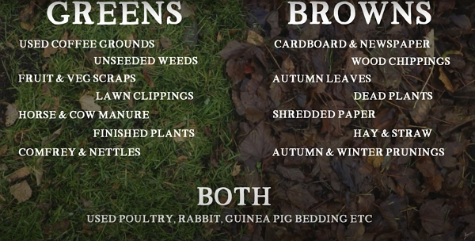

Sometimes, making compost is thought to be complex, but in fact, it is easy to produce high-quality compost simply.

Thanks to Huw Richards for sharing his wisdom and knowledge!
I wrote the following notes watching the video published on Huw Richards's channel.
You can watch it using [this YouTube link](https://www.youtube.com/watch?v=swLkA1cHJ4Y).

<!-- markdownlint-disable MD033 -->

<iframe class="newsletter-embed" src="https://thetooltip.substack.com/embed" frameborder="0" scrolling="no"></iframe>

## What is compost

To start off, let's define compost: it is the breakdown of organic matter into beautiful rich humus.

## The few key things about lazy composting

### You need bins of 1 meter long

Why? It is not going to warm up as easily in the dalek size bin. It needs a larger size bin to be able to build up the warmth.

That warmth and heat really help to breakdown the material.

### The ingredients

You will typically add:

- green material: grass, vegetable waste, coffee ground...
- brown material: dead leaves, wood, cardboard...

:::tip About grass clipping
Apply it in thin layer (2-3 cm maximum) because it can get sludgy if too thick.
:::

:::tip Personal note
I have found that mixing grass clippin with wood dust helps build a thin compost and helps to avoid the sludge.
:::

## Ratio of green and brown

Huw tries to go for a 1 part green for 2 parts brown.

But, with lazy composting, he doesn't really overthink it. **But you will need to _follow one key rule_**.

## You need diversity

Two or three ingredients is not enough.

The more you add diverse sources of material, the more balance the compost will be in term of pH and nutrients.

## When a bin is full

There is only thing to do: press on the material to compact it a little.

Put on some boots, climb in the bin and jump!

:::warning Jumping in compost bin
Do not do it if you didn't build a strong structure 🤣
:::

Finally, cover the compost with cardboard to keep some of the rainfall. You want moisture but you don't anaerobic environment.

## When is lazy compost ready

It will take longer, because it doesn't get as hot.

So instead, 2 to 3 months, it will take between 6 and 8 months.

Huw uses the technique of smelling the compost: if it smells like the forest floor, then it is ready.

Then you can apply it to the beds as a cover for winter.

## What about rats

You will get rats if you put in cooked food, diary and bread in the compost bin.

And would you not prefer having them in the compost bin or your food storage?

## How many compost bins

Three bins is a good target:

- one will be ready
- one is full and is starting to break down
- one is being filled

Therefore you will have compost available most of the time!
