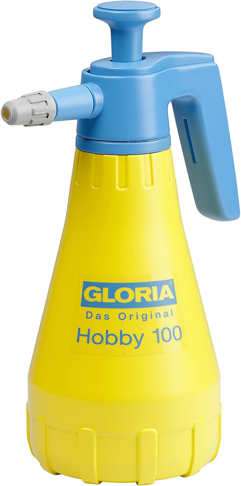

The propagation technique helps the gardener have the strong seedlings for the annual growing season.

Thanks to Huw Richards for sharing his wisdom and knowledge!
I wrote the following notes watching the video published on Huw Richards’s channel.

<!-- more -->

You can watch it using [this YouTube link](https://www.youtube.com/watch?v=JqODyqSnbKk).

<!-- markdownlint-disable MD033 -->

<iframe class="newsletter-embed" src="https://thetooltip.substack.com/embed" frameborder="0" scrolling="no"></iframe>

## A potting bench

The potting bench includes:

- A working area made of a few wood planks where you can empty the compost.
- A table where you will put your tools
  - Module trays of various sizes (deep-rooted for peas and beans, or shallower trays for general-purpose seeds)
  - Labels made from recycled materials

:::tip How to make your labels
Huw mentioned yogurt pots

I use the wood of an old crate.
:::

- A box for unfinished seed packets
  - It’s very rare to sow a full packet of seeds, so keep those in a sturdy box, away from the humidity and sun.

:::tip Seed or multi-purpose compost
Huw had found that seed compost is too expensive for the actual benefits and multi-purpose compost does a good job for propagation.
:::

## Where to put the seed trays

One limitation of growing seedlings is a lack of space.

The simple trick is to use shelves to rest the trays.

If you have mice problem, do like Huw: set your most precious or less attractive-to-mouse seedlings higher!

## Watering seedlings

It’s a good idea to have a small watering can for fragile seedlings like lettuce.

Or if you’re like me, I use a GLORIA Hobby 100 Pressure Sprayer (available [in France](https://amzn.to/3HDhcaX), [in the UK](https://amzn.to/3PtT1xK); [in the US](https://amzn.to/3HGzSH5), this brand doesn’t seem to be available.).

It’s quite handy as you can adjust the spray finely. Also, it’s sturdier than a bigger version sprayer (not the same brand) of 5 liters capacity. It broke twice after a year :( So I recommend a 1 liter like this Gloria model.

If you’re sowing on a warm month, after you have sown the seeds and watered the tray, cover it with a brown cardboard to retain the moisture.

That way the seeds will germinate better (especially true for carrots as [James Prigioni shared](https://www.youtube.com/@jamesprigioni/search?query=carrots)).

You will need to check daily until you see the seedlings come out.

Also, you will need an area where you can take out your seedlings out to water them. On the shelves, it’s often not practical.

The height is also ideal with standard 80 cm pallets.

Checkout [Charles Dowding’s vlogs](https://www.youtube.com/watch?v=OXR92xHfgic&t=988s) where he tells us more about it.

## Preparing the trays

The steps are simple:

1. Fill the trays with compost
2. Press down with your fingers on the compost
3. Fill the trays with some more compost
4. Water the tray on the ground if it’s quite dry
5. Create some holes where you will sow the seeds in each module
6. Sow enough seeds. See [this article from a vlog of Charles Dowding](../2022-11-14-early-summer-at-homeacres-%E2%80%93-harvests-and-speedy-replant--intersow--weed--water-and-make-compost-charles-dowding/README.md##what-can-you-sow-in-the-beginning-of-june-in-the-uk) for a few examples.
7. Gently fill the holes with some more compost

:::tip Why before sowing
Huw likes to do this because once the seed is in the module, the water can displace it.

Also, you won’t need to water again after sowing if the weather is overcast.
:::

## Cold frame

A cold frame is a structure that you have outside with a glass top, like an old window.

It’s the final stage to prepare the seedlings to acclimate to the lower temperatures, yet with no frost risk.

Huw mentioned it rather quickly at the end.

I have got a lot of old wooden windows that I’d like to use to build either a cold frame or a tiny greenhouse.

Stay tuned!

<!-- markdownlint-disable MD033 -->

<iframe class="newsletter-embed" src="https://thetooltip.substack.com/embed" frameborder="0" scrolling="no"></iframe>

