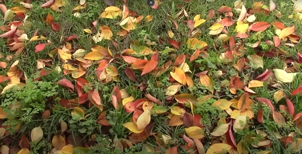

A hot compost means compost ready quicker.

Thanks to Huw Richards for sharing his wisdom and knowledge!
I wrote the following notes watching the video published on Huw Richards's channel.

<!-- more -->

You can watch it using [this YouTube link](https://www.youtube.com/watch?v=9HkfLBgS7mY).

<!-- markdownlint-disable MD033 -->

<iframe class="newsletter-embed" src="https://thetooltip.substack.com/embed" frameborder="0" scrolling="no"></iframe>

Compost represents a good soil amendment. You want to create your own to feed your garden.

To make compost, the recipe is simple:

- 2 parts of brown

- 1 part of green (coffee ground, grass clippings)

In the vlog, a friend of Huw suggests you need air to feed the material degrading.

However, Charles Dowding said that as long as the compost heap remains moist but not wet, there will still be air in the material, coming from the way you pile up the material.

Piling up the material is done in layers and the brown layers allow air in the pile.

When you live in a dry area, especially in summer, you will want to have a water source available to keep the compost moist.

The moisture is what will keep the living organisms breaking down the material of the heap.

In my area, 1000 L of compost cost 150 euros if purchased in bags.

I could get compost in bulk (26 euros for 2000 L organic-graded compost), but I'd need to rent a truck which is over 3 times the price of the compost…

The two methods to get the compost hotter:

- building a 0.7 meter cube compost heap
- turning the compost

## Why a large compost heap

It does retain the moisture better, therefore, the micro-organisms' activity is increased.

However, it will also consume more water as heat in a compost pile means life and life needs water, no matter the form or size.

## Is turning really worth it

Huw suggests that the second way to turn the compost.

Mixing the pile kickstarts the microbial activity.

:::tip Personal note
I’m not sure I'd want to spend the energy turning the compost often just to keep the pile hot.

Charles Dowding's method appeals to me more because you focus your energy to find more material, especially the green materials, to build up the compost pile.

The more green material you add, the more heat you can get and therefore, the faster you will have compost available.
:::

What is true is the following: whether you turn the compost pile or not, you don't want to compact your compost pile.

Air is one of the key ingredients to make compost.

## A third way

As I said in my personal note, adding more nitrogen will increase heat.

Nitrogen means more green material.

Now, what isn't explained in the vlog is how do you get enough green material?

For that, I invite you to [read more on the topic of composting](../../tag/compost/).

As always, don't forget to subscribe! I published one article every week and you support means everything to me.

<!-- markdownlint-disable MD033 -->

<iframe class="newsletter-embed" src="https://thetooltip.substack.com/embed" frameborder="0" scrolling="no"></iframe>

Thanks.
