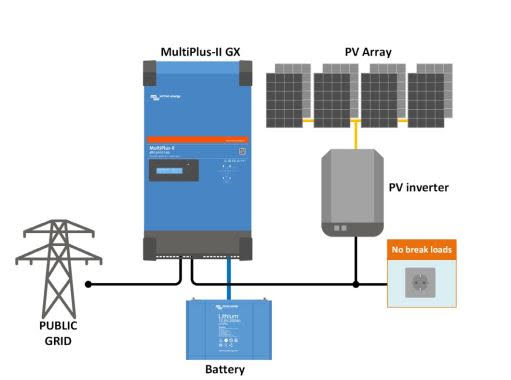

## **Objectif**

Obtenir tous les éléments et conseils d'un professionnel me permettant la réalisation du besoin décrite ci-après pour un budget d'environ 2000 euros.

Je ne saivais pas si j'avais les moyens pour un onduleur Victron Multi plus II (le modèle 24V 3000VA ). De plus, il semblait qu'il nécessite d'avoir un chargeur séparé.

Je n'ai clairement pas les moyens pour des batteries Ni-Fe (vu les prix que Perma-batteries m'a donnés), mais je ne souhaite pas utiliser la techno Gel ou OPZS,

Donc ça laisse uniquement les LiFePO4.

## **Besoin**

Alimenter au minimum un poêle à granulé Ravoli HR70 de fin septembre à début mai qui consomme :

- 480-520W de puissance au démarrage (12 premières minutes)
- puis 25-120W en fonctionnement nominal (pendant environ 17h, au plus froid de l'hiver,
  - la visse sans fin fait monter la puissance à 120W pendant 5 sec toute les 30-40secs,
  - puis la puissance instantannée retombe à 25W),

Soit environ 750W / j.

J'aimerai une autonomie de 1 à 2j.

Donc, si j'ai bien compris, il faut une batterie d’une capacité de 750 x 1.2 (avec une DOD = 80%) = 900Wh / j, soit :

- 2 batteries de 75Ah en 12V
- 2 batteries de 40Ah en 24V

Je n'exclus d'alimenter d'autres appareils, comme :

- les lumières (23 LED de max. 4W) où on en utilise 10 de 4W plus que les 13 autres, soit :
  - 4Wh x 10 x 6h = 240Wh / j
  - 4Wh x 13 x 2h = 104Wh / j
- et une VMI avec filtre (600 Wh / 24h mesurés).

Donc, une batterie de 2KWh (type : Polyntech) de capacité donnerait 1 j à 2 j d'autonomie selon notre usage.

Un bonus non négligeable : permettre le chargement des batteries sur notre surplus solaire (ou une piste pour câbler cela). Cf. schéma de l'installation PV actuelle ci-jointe.

## Mes q**uestions de démarrage**

### **Question 1**

- Pour mon besoin, faut-il privilégier un onduleur hybride (ex : onduleur Victron Multi plus II) séparé du chargeur de batterie ? ou faut-il choisir un onduleur / chargeur (ex : CONVERTISSEUR-CHARGEUR 12V/230V MULTI 1200VA/50-16) ?
  Voir cet article : [https://levanmigrateur.com/comment-choisir-son-convertisseur-12v-230v/](https://levanmigrateur.com/comment-choisir-son-convertisseur-12v-230v/)
  Ou celui-ci : [https://levanmigrateur.com/autonomie-linstallation-electrique-de-notre-fourgon/#Le_branchement_du_multiplus](https://levanmigrateur.com/autonomie-linstallation-electrique-de-notre-fourgon/#Le_branchement_du_multiplus)

### **Question 2**

En dehors de l'avantage "plus la tension est haute = plus le câblage est fin", que faut-il privilégier : 12V, 24V ou 48V ?

### **Question 3**

Que suggérez-vous pour mon besoin pour au moins faire tourner le poêle à granulés pendant minimum 1 jour et jusqu'à 2 jours si possible dans le budget ?

### **Question 4**

Sur le site wattuneed, la fiche produit "Pylontech US2000" dit "Capacité de stockage recommandée". Que cela signifie-t-il ?

### **Question 5**

Combien de Wh puis-je connecter réellement sur l'onduleur ?

### **Question 6**

Comment adapter mon installation PV autoconsommation actuelle (voir schéma ci-joint) ? Que me manque-t-il en équipement / matériel ?

### **Question 7**

La Pylontech indique 90% DOD et plus de 6000 cycles à 80%.

Si j'utilise 80% de la capacité de la batterie chaque jour, cela donne une durée de vie de 16.43 ans ?

Et dans la réalité, qu'en est-il : quels sont les retours d'expérience des utilisateurs de cette batterie depuis 4-5 dernières années ?

### Question 8

Quelle température est idéal pour le fonctionnement d’une batterie ?

### Question 9

- Quelle température minimum faut-il respecter ?
  Voir cet article : [https://levanmigrateur.com/quelle-batterie-choisir-pour-son-fourgon-amenage/](https://levanmigrateur.com/quelle-batterie-choisir-pour-son-fourgon-amenage/)

### Question 10

Il semblerait qu’il faille utiliser certaines battries avec certains convertisseurs / chargeurs

Quel(le)s sont-ils ?

Comment choisir parmi tout le choix de batteries et de convertisseurs / chargeurs disponibles sur le marchée ?

## Comment j’ai procédé

J’ai contacté 3 personnes / entreprises (en dehors des recherches sur Internet) :

- Patrick de la Maison autonome
- Rémi de Nes pieds sur terre
- Eliot, ingénieur chez My Shop Solaire

### Avec Patrick

L’échange téléphonique a été court. Il utilise des batteries Rolls Royce (comme la marque de voiture, mais je ne sais pas s’il y a un lien) de 400Ah en 24v.

Il ne passe pas en dessous de 70%.

Sur [[ce site](https://www.elysun-store.fr/batterie-solaire-rolls-serie-4000-t-12-250.html)](<[https://www.elysun-store.fr/batterie-solaire-rolls-serie-4000-t-12-250.html](https://www.elysun-store.fr/batterie-solaire-rolls-serie-4000-t-12-250.html)>), on voit qu’il y a quasiment le double de cycle en décharge à 50% vs décharge à 80%, 3.28 ans vs 5.48 ans d’espérance de vie.

Son système est trop onéreux pour moi, il faut dire qu’il est autonome et il n’utilise pas beaucoup d’appareils modernes chez lui. Vous pouvez facilement [le retrouver sur Internet](<[https://www.google.com/search?q=la+maison+autonome](https://www.google.com/search?q=la+maison+autonome)>).

### Avec Rémi

J’ai eu un long échange par e-mail début septembre.

Voici ce qui est en resort :

Devenir autonome en électricité n’est pas simple :

- il faut bien connaitre son usage, autant du point de vue équipements à alimenter qu’utilisation au jour le jour.
- Ensuite, il faut des compétences, si l’on cherche à réaliser le projet soi-même, en électricité et comment on peut équilibrer le prix, le dimensionnement et le temps nécessaire pour mener à bien le projet.

Devenir autonome en électricité ne va pas vous permettre d’économiser, du moins à court et moyen terme.

- L’accent doit être mis sur la définition de l’objectif.
- Dans mon cas, ce n’est pas le but.
- Toutefois, je pense que devenir autonome est un projet de long terme pendant lequel vous apprenez en testant, en expérimentant.

Pour résoudre ma problématique :

- L'utilisation d'un onduleur informatique pour sécuriser juste le poêle doit pouvoir fonctionner, mais attention de bien prendre un onduleur pure sinus, ce qui requiert de prendre du haut de gamme et bien calculer la consommation.

Rémi a aussi parlé d’un système ESS de Victron en mode AC Coupling.

De ce que je comprends, il s’agit :

- d’utiliser le réseau pour charger la ou les batteries
- de permettre le fonctionnement de mon installation PV comme si la maison était off-grid
- de faire la bascule automatique du réseau vers les batteries quand le premier coupe.

Toutefois, mon budget était bien en dessous de ce qui est nécessaire pour aller dans cette direction.

L’investissement pour l’onduleur uniquement varie de 1200 à 1800 euros minimum, cela dépendant bien-sûr de la puissance.

Ce qui est sûr : pour un foyer comme le mien, il aurait nécessiter un modèle de 5kVa, des batteries de 48V, car, bien que des batteries en 12V ou 24V existent, des onduleurs 12V ou 24V sont plus rares et donc plus chers. Après, il est toujours possible de tomber sur une bonne affaire.

Finalement, le coût aurait dépassé les 10000 euros… au moins !

Conclusion : il m’a proposé une batterie de 2.5kWh en 24V pour 1000 euros HT, un onduleur chargeur Multiplus 1600/24V à environ 763 euros HT.

Pourquoi une batterie 24V ? Pour faire tourner juste le poêle à granulés, cela suffit et surtout, il n’existe pas vraiment d’onduleur 48V avec une puissance inférieure à 2000VA.

Avec le système de monitoring (Cerbo GX) sans écran touch, on dépassait mon budget avec plus de 2500 euros hors pose que j’aurai dû réaliser moi-même.

Un dernier point hors du sujet de mon projet : pour donner des conseils aux gens sur le sujet, il faut au moins réaliser sa propre installation. Ensuite, il faut se former sur les solutions de sites autonomes et lire sur le sujet de la résilience qui n’est pas seulement énergitique.

J’ai acheté [le livre de Rémi](https://amzn.to/3fwo1iS) où l’on apprend sur tous les domaines pour créer son foyer résilient. Je vous le recommande. Je réaliserai dans le futur un avis sur le livre, mais pour le moment, j’adore !

### Avec Eliot de My Shop Solaire

J’ai un bon échange par e-mail courant septembre.

Voici ce qui est en resort :

## Le choix

Après près de 24h de recherche, échanges par email et sur le forum [https://forum-photovoltaique.fr/](https://forum-photovoltaique.fr/) et réflexions pour déterminer ce qui est vraiment indispensable pour ma famille cet hiver, je n’ai pas sélectionné l’option de Rémi, ni celle proposée par Eliot à cause du dépassement de budget.

en fin de compte, même 2000 euros de budget était plus que ce que je pouvais me permettre.

Mais surtout, dans mon échange sur le forum [https://forum-photovoltaique.fr/](https://forum-photovoltaique.fr/), quelqu’un a mentionné la solution d’Ecoflow.

A la mi-septembre, ils étaient sur le point de lancer leur nouvelle station électrique: le Delta 2. J’avais vu ces stations auparavant, mais elles utilisaient toujours des batteries li-ion que je ne voulais pas utiliser pour les raisons de sécurité et de durée de vie.

L’évolution majeur avec la Delta 2 est bien la chimie de la batterie : ils sont passés à une batterie LiFePo4, permettant de passer de 800 à 3000 cycles et une durée de vie de 10 ans avec un cycle par jour.

Ensuite, les autres autouts que je voyais étaient :

- la recharge AC modulable, car je ne suis pas intéressé par la charge ultra rapide en 80 min.
- la recharge DC via des modules solaires avec les limites de 500W, 15A et 60V en entrée.
- le mode “EPS” pour Emergency Power Source ou Source d'alimentation d'urgence qui permet de passer du réseau à la batterie sous 30 ms. Le constructeur m’a confirmé que 30 ms est transparent pour le poêle.
- le prix de 1200 euros pour 1kWh de capacité
- le fait que la station est démontable comme le montre [cette vidéo](https://www.youtube.com/watch?v=OTUValSLnrQ).

J’ai donc fait l’achat à la sortie. Rémi m’a même confirmé avoir reçu des retours d’expérience positifs sur les stations Ecoflow.

Pour finir, je souhaite rappeler qu’il n’agit pas d’une solution pour passer en off-grid. Mon but final de garantir que mon poêle à granulés hydraulique fonctionne cet hiver, même en cas de coupure.

## Notes

Avec notre installation, même s’il fait mais beau, on aura de la production qui va dans le cumulus d’eau chaude.

Bien sûr, nous sommes toujours couplés au réseau, donc sans réseau, il n’y a rien…

Même s’il fait mauvais, mais des éclaircies, on chauffe l’ECS par le PV uniquement. Toutefois, il semble qu’il soit nécessaire d’avoir 1.5kWh ou 2kWc chaque jour pour subvenir au besoin de la famille (3 personnes).
